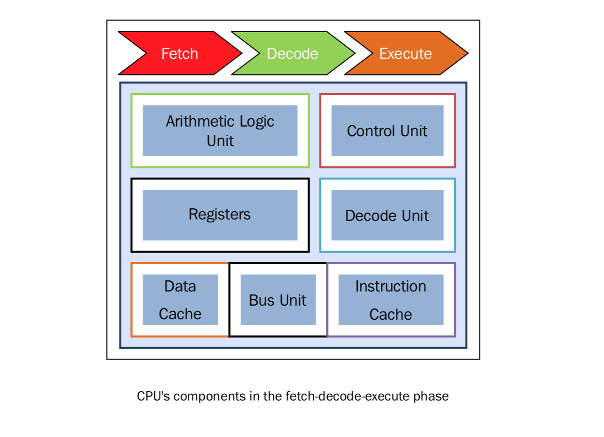
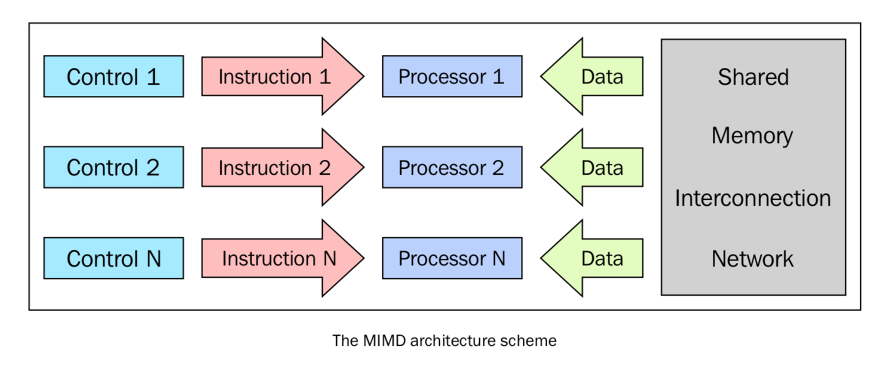

并行计算的内存架构
==================

根据指令的同时执行和数据的同时执行，计算机系统可以分成以下四类：

- 单处理器，单数据 (SISD)
- 单处理器，多数据 (SIMD)
- 多处理器，单数据 (MISD)
- 多处理器，多数据 (MIMD)

这种分类方法叫做“费林分类”:

.. image:: ../images/flynn.png

SISD
----

单处理器单数据就是“单CPU的机器”，它在单一的数据流上执行指令。在SISD中，指令被顺序地执行。

对于每一个“CPU时钟”，CPU按照下面的顺序执行：

- **Fetch**: CPU 从一片内存区域中（寄存器）获得数据和指令
- **Decode**: CPU对指令进行解码
- **Execute**: 该执行在数据上执行，将结果保存在另一个寄存器中

当Execute阶段完成之后，CPU回到步骤1准备执行下一个时钟循环。

.. image:: ../images/SISD-schema.png

运行在这些计算机上的算法是顺序执行的（连续的），不存在任何并行。只有一个CPU的硬件系统就是SISD的例子。

这种架构（冯·诺依曼体系）的主要元素有以下：

- 中心内存单元：存储指令和数据
- CPU：用于从内存单元获得指令/数据，对指令解码并顺序执行它们
- I/O系统：程序的输入和输出流

传统的单处理器计算机都是经典的SISD系统。下图表述了CPU在Fetch、Decode、Execute的步骤中分别用到了哪些单元：

MISD
----

这种模型中，有n个处理器，每一个都有自己的控制单元，共享同一个内存单元。在每一个CPU时钟中，从内存获得的数据会被所有的处理器同时处理，每一个处理器按照自己的控制单元发送的指令处理。在这种情况下，并行实际上是指令层面的并行，多个指令在相同的数据上操作。能够合理利用这种架构的问题模型比较特殊，例如数据加密等。因此，MISD在现实中并没有很多用武之地，更多的是作为一个抽象模型的存在。

.. image:: ../images/MISD.png

SIMD
----

SIMD计算机包括多个独立的处理器，每一个都有自己的局部内存，可以用来存储数据。所有的处理器都在单一指令流下工作；具体说，就是有n个数据流，每个处理器处理一个。所有的处理器同时处理每一步，在不同的数据上执行相同的指令。这是一个数据并行的例子。SIMD架构比MISD架构要实用的多。很多问题都可以用SIMD计算机的架构来解决。这种架构另一个有趣的特性是，这种架构的算法非常好设计，分析和实现。限制是，只有可以被分解成很多个小问题（小问题之间要独立，可以不分先后顺序被相同的指令执行）的问题才可以用这种架构解决。很多超级计算机就是使用这架构设计出来的。例如Connection Machine（1985年的 Thinking Machine)和MPP（NASA-1983）.我们在第六章 GPU Python编程中会接触到高级的现代图形处理器（GPU），这种处理器就是内置了很多个SIMD处理单元，使这种架构在今天应用非常广泛。

MIMD
----

在费林分类中，这种计算机是最广泛使用、也是最强大的一个种类。这种架构有n个处理器，n个指令流，n个数据流。每一个处理器都有自己的控制单元和局部内存，让MIMD架构比SIMD架构的计算能力更强。每一个处理器都在独立的控制单元分配的指令流下工作；因此，处理器可以在不同的数据上运行不同的程序，这样可以解决完全不同的子问题甚至是单一的大问题。在MIMD中，架构是通过线程或进程层面的并行来实现的，这也意味着处理器一般是异步工作的。这种类型的计算机通常用来解决那些没有统一结构、无法用SIMD来解决的问题。如今，很多计算机都应用了这中间架构，例如超级计算机，计算机网络等。然而，有一个问题不得不考虑：异步的算法非常难设计、分析和实现。

