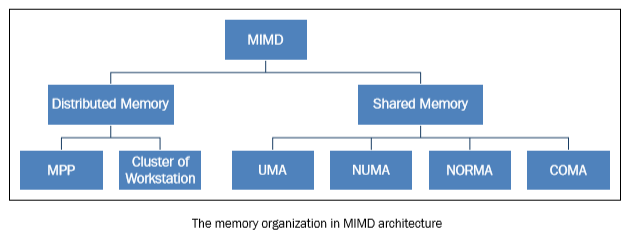
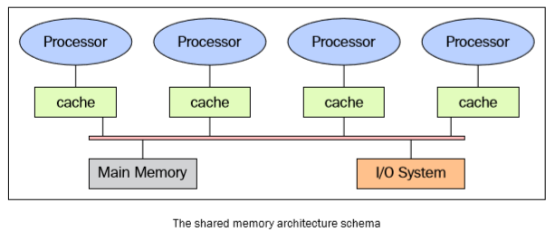
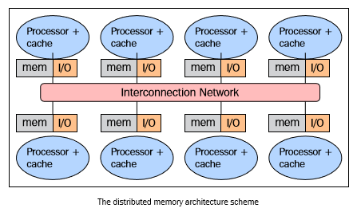
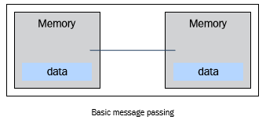
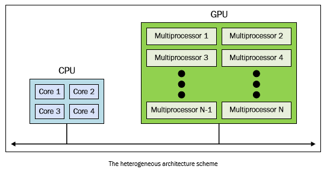

内存管理
========

内存管理是并行架构需要考虑的另一方面，确切来说是获得数据的方式。无论处理单元多快，如果内存提供指令和数据的速度跟不上，系统性能也不会得到提升。制约内存达到处理器速度级别的响应时间的主要因素是内存存取周期。所谓存取周期就是连续启动两次读或写操作所需间隔的最小时间。处理器的周期通常比内存周期短得多。当处理器传送数据到内存或从内存中获取数据时，内存依旧在一个周期中，其他任何设备（I/O控制器，处理器）都不能使用内存，因为内存必须先对上一个请求作出响应。

为了解决 MIMD 架构访问内存的问题，业界提出了两种内存管理系统。第一种就是人们所熟知的共享内存系统，共享内存系统有大量的虚拟内存空间，而且各个处理器对内存中的数据和指令拥有平等的访问权限。另外一种类型是分布式内存模型，在这种内存模型中，每个处理器都有自己专属的内存，其他处理器都不能访问。共享内存和分布式内存的区别以处理器的角度来说就是内存和虚拟内存体系的不同。每个系统的内存都会分为能独立访问的不同部分。共享内存系统和分布式内存系统的处理单元管理内存访问的方式也不相同。 ``load R0,i`` 指令意味着将 ``i`` 内存单元的内容加载进 ``R0`` 寄存器，但内存管理方式的不同，处理器的处理方式也不尽相同。在共享内存的系统中， ``i`` 代表的是内存的全局地址，对系统中的所有处理器来说都指向同一块内存空间。如果两个处理器想同时执行该内存中的指令，它们会向 ``R0`` 寄存器载入相同的内容。在分布式内存系统中， ``i`` 是局部地址。如果两个处理器同时执行向 ``R0`` 载入内容的语句，执行结束之后，不同处理器 ``R0`` 寄存器中的值一般情况下是不一样的，因为每个处理器对应的内存单元中的 ``i`` 代表的全局地址不一样。对于程序员来说，必须准确的区分共享内存和分布式内存，因为在并行编程中需要考量内存管理方式来决定进程或线程间通讯的方式。对于共享内存系统来说，共享内存能够在内存中构建数据结构并在子进程间通过引用直接访问该数据结构。而对于分布式内存系统来说，必须在每个局部内存保存共享数据的副本。一个处理器会向其他处理器发送含有共享数据的消息从而创建数据副本。这使得分布式内存管理有一个显而易见的缺点，那就是，如果要发送的消息太大，发送过程会耗费相对较长的时间。

共享内存
--------

下图展示了共享内存多处理器系统的架构，这里只展示了各部件之间简单的物理连接。总线结构允许任意数量的设备共享一个通道。总线协议最初设计是让单处理器，一个或多个磁盘和磁带控制器通过共享内存进行通讯。可以注意到处理器拥有各自的Cache，Cache中保存着局部内存中有可能被处理器使用的指令或数据。可以想象一下，当一个处理器修改了内存中的数据，同时另外一个处理器正在使用这个数据时，就会出现问题。已修改的值会从处理器的Cache传递到共享内存中，接着，新值会传递到其他处理器的Cache中，其它处理器就不可以使用旧值进行计算。这就是人们所熟知的Cache一致性问题，是内存一致性问题的一种特殊情况，要解决这个问题需要硬件能像多进程编程一样实现处理并发问题 和同步控制  。

共享内存系统的主要特性如下：

- 内存对于所有处理器来说是一样的，例如，所有处理器所对应的相同数据结构都存在于相同的逻辑地址，也就是说可以从相同的内存单元中获得该数据结构。

- 通过控制处理器对共享内存的访问权限可以达到同步控制的效果。实际上，每次只有一个处理器拥有对内存资源的访问权限。

- 当一个任务正在访问共享内存的时候，其它所有任务都不能改变内存单元的内容。

- 共享内存很快，两个任务通讯的时间和读取单个内存单元的时间相等（取决于内存的访问速度）

在共享内存系统中访问内存的方式如下

- 均匀内存访问 (Uniform memory access (UMA) )：这类系统的基本特征是无论对于处理器来说访问任意的内存区域速度是相同的。因此，这些系统也成为对称式多处理器 (symmetric multiprocessor (SMP)) 系统。这类系统实现起来相对简单，但是可扩展性较差，程序员需要通过插入适当的控制、信号量、锁等机制来管理同步，进而在程序中管理资源。

- 非均匀内存访问 (Non-uniform memory access (NUMA))：这类架构将内存分为高速访问区域和低速访问区域。高速访问区域是分配给各个处理器的区域，是用于数据交换的公用区域。这类系统也称为分布式共享内存系统 (Distributed Shared Memory Systems (DSM)) ，这类系统的扩展性很好，但开发难度较高。

- 无远程内存访问 (No remote memory access (NORMA))：对于处理器来说内存在物理上是分布式存在的。每个处理器只能访问其局部私有内存。处理器之间通过消息传递协议进行通讯。

- 仅Cache可访问 (Cache only memory access (COMA))：这类系统中仅有Cache内存。分析 NUMA 架构时，需要注意的是这类系统会把数据的副本保存在Cache中供处理器使用，并且在主存中也保留着重复的数据。COMA 架构可以移除重复的主存数据，而只保留Cache内存。对于处理器来说内存在物理上是分布式存在的。每个处理器只能访问其局部私有内存。处理器之间通过消息传递协议进行通讯。

分布式内存
----------

在使用分布式内存的系统中，各个处理器都有其各自的内存，而且每个处理器只能处理属于自己的内存。某些学者把这类系统称为“多计算机系统”，这个名字很真实地反映了组成这类系统的元素能够独立作为一个具有内存和处理器的微型系统，如下图所示：

这种内存管理方式有几个好处。第一，总线和开关级别的的通讯不会发生冲突。每个处理器都可以无视其他处理器的干扰而充分利用局部内存的带宽；第二，没有通用总线意味着没有处理器数量的限制，系统的规模只局限于连接处理器的网络带宽；第三，没有Cache一致性问题的困扰。每个处理器只需要处理属于自己的数据而无须关心上传数据副本的问题。但最大的缺点是，很难实现处理器之间的通讯。如果一个处理器需要其他处理器的数据，这两个处理器必须要通过消息传递协议来交换消息。这样进行通讯会导致速度降低，原因有两个，首先，从一个处理器创建和发送消息到另外一个处理器需要时间；其次，任何处理器都需要停止工作，处理来自其他处理器的消息。面向分布式内存机器的程序必须按照尽量相互独立的任务来组织，任务之间通过消息进行通讯。

分布式内存系统的特性如下：

- 内存通常分布在不同的处理器之中，局部内存只能由对应的处理器访问。

- 同步控制通过在处理器之间转移数据 (也可以是消息本身) 来实现， 同理通讯的实现方式也一样。

- 局部内存的数据分支会影响机器的性能——有必要精确地进行数据分割最小化 CPU 间的通讯。另外，协调数据的分解合成操作的处理器必须与处理部分数据的处理器高效地通讯。

- 消息传递协议用于 CPU 间通过交换数据包通讯。消息是信息的分解单元，他们经过良好的定义，所以处理器之间能够准确地识别出消息地内容。

大规模并行处理 (Massively parallel processing (MPP))
>>>>>>>>>>>>>>>>>>>>>>>>>>>>>>>>>>>>>>>>>>>>>>>>>>>>

MPP 机器由上百个处理器 (在一些机器中达到成千上万个) 通过通讯网络连接而成。世界上最快的计算机几乎都基于这种架构，采用这种架构的计算机系统有:Earth Simulator， Blue Gene， ASCI White， ASCI Red， ASCI Purple 以及 Red Storm 等。

工作站集群
>>>>>>>>>>

工作站集群是指将传统的计算机通过通讯网络连接起来。在集群架构中，一个节点就是集群中的一个计算单元。对于用户来说，集群是完全透明的，掩盖了软硬件的复杂性，使得数据以及应用仿佛从一个节点中得到的。

在这里，会定义三种集群：

- 故障切换集群 (The fail-over cluster) ：在这类集群中，会持续检测节点的活动状态，当一个节点出现故障，另外一台机器会马上接管故障节点的工作。这类集群通过这种冗余架构可以保证系统的可用性。

- 负载均衡集群 (The load balancing cluster) ：在这类系统中，会将一个作业请求发送给负载较小的节点上执行。这样做可以减少整个处理过程所耗费的时间。

- 高性能计算集群 (The high-performance cluster) :在这类系统中，每个节点都可以提供极高的性能，一个任务依旧分解为若干个子任务交给各个节点处理。任务是并行化的，分配给不同的机器进行处理。

异构架构
>>>>>>>>

在同构的超级计算机中采用GPU加速器改变了之前超级计算机的使用规则。即使GPU能够提供高性能计算，但是不能把它看作一个独立的处理单元，因为GPU必须在CPU的配合下才能顺利完成工作。因此，异构计算的程序设计方法很简单，首先CPU通过多种方式计算和控制任务，将计算密集型和具有高并行性的任务分配给图形加速卡执行。CPU和GPU之间不仅可以通过高速总线通讯，也可以通过共享一块虚拟内存或物理内存通讯。事实上，在这类设备上GPU和CPU都没有独立的内存区域，一般是通过由各种编程框架(如CUDA，OpenCL)提供的库来操作内存。这类架构被称之为异构架构，在这种架构中，应用程序可以在单一的地址空间中创建数据结构，然后将任务分配给合适的硬件执行。通过原子性操作，多个任务可以安全地操控同一个内存区域同时避免数据一致性问题。所以，尽管CPU和GPU看起来不能高效联合工作，但通过新的架构可以优化它们之间的交互和提高并行程序的性能。

