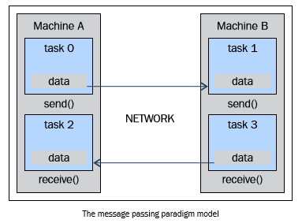
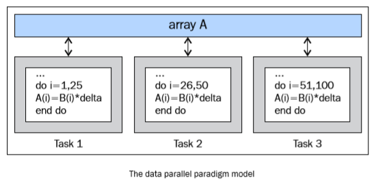

并行编程模型
============

并行编程模型是作为对硬件和内存架构的抽象而存在的。事实上，这些模式不是特定的，而且和机器的类型或内存的架构无关。他们在理论上能在任何类型的机器上实现。相对于前面的架构细分，这些编程模型会在更高的层面上建立，用于表示软件执行并行计算时必须实现的方式。为了访问内存和分解任务，每一个模型都以它独自的方式和其他处理器共享信息。

需要明白的是没有最好的编程模型，模型的效果如何很大程度上取决于实际的问题。使用范围最广的并行编程模型有：

- 共享内存模型

- 多线程模型

- 分布式内存/消息传递模型

- 数据并行模型

在这节中，会描述这些编程模型的概览。在下一章会更加准确的描述这些编程模型，并会介绍Python中实现这些模型的相应模块。

共享内存模型
------------

在这个编程模型中所有任务都共享一个内存空间，对共享资源的读写是 异步的。系统提供一些机制，如锁和信号量，来让程序员控制共享内存的访问权限。使用这个编程模型的优点是，程序员不需要清楚任务之间通讯的细节。但性能方面的一个重要缺点是,了解和管理数据区域变得更加困难;将数据保存在处理器本地才可以节省内存访问，缓存刷新以及多处理器使用相同数据时发生的总线流量。

多线程模型
----------

在这个模型中，单个处理器可以有多个执行流程，例如，创建了一个顺序执行任务之后，会创建一系列可以并行执行的任务。通常情况下，这类模型会应用在共享内存架构中。由于多个线程会对共享内存进行操作，所以进行线程间的同步控制是很重要的，作为程序员必须防止多个线程同时修改相同的内存单元。现代的CPU可以在软件和硬件上实现多线程。POSIX 线程就是典型的在软件层面上实现多线程的例子。Intel 的超线程 (Hyper-threading) 技术则在硬件层面上实现多线程，超线程技术是通过当一个线程在停止或等待I/O状态时切换到另外一个线程实现的。使用这个模型即使是非线性的数据对齐也能实现并行性。

消息传递模型
------------

消息传递模型通常在分布式内存系统（每一个处理器都有独立的内存空间）中应用。更多的任务可以驻留在一台或多台物理机器上。程序员需要确定并行和通过消息产生的数据交换。实现这个数据模型需要在代码中调用特定的库。于是便出现了大量消息传递模型的实现，最早的实现可以追溯到20世纪80年代，但直到90年代中期才有标准化的模型——实现了名为MPI (the Message Passing Interface, 消息传递接口)的事实标准。MPI 模型是专门为分布式内存设计的，但作为一个并行编程模型，也可以在共享内存机器上跨平台使用。

数据并行模型
------------

在这个模型中，有多个任务需要操作同一个数据结构，但每一个任务操作的是数据的不同部分。在共享内存架构中，所有任务都通过共享内存来访问数据；在分布式内存架构中则会将数据分割并且保存到每个任务的局部内存中。为了实现这个模型，程序员必须指定数据的分配方式和对齐方式。现代的GPU在数据已对齐的情况下运行的效率非常高。

