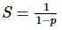

如何评估并行程序的性能
======================

并行编程的发展产生了对性能指标和并行程序评估软件的需求，通过评估性能才能确定该算法是否方便快捷。实际上，并行计算的重点是在相对较短的时间内解决体量较大的问题。为了能够达到这个目的，需要考虑的因素有：使用的硬件类型，问题的可并行程度和采用的编程模型等。为了加速算法评估过程，引进了基本概念分析，也就是将并行算法和原始的顺序执行做对比。通过分析和确定线程数量和/或使用的处理器数量来确定性能。

为了进行分析，在这里介绍几个性能指标：加速比，效率和扩展性。

阿姆德尔定律 (Ahmdal's law) 引入了并行计算的极限，来评估串行算法并行化的效率。古斯塔夫森定律 (Gustafson's law) 也做了相似的评估。

加速比
------

.. |S<p| image:: ../images/C1S6M_5.png 

.. |1-p| image:: ../images/C1S6M_10.png 

加速比用于衡量使用并行方式解决问题的收益。假设使用单个处理单元解决这个问题需要的时间为 |TS| ，使用 |p| 个相同的处理单元解决这个问题的时间为 |TP| ，那么加速比 |S=TS/TP| 。如果 |S=p| ，加速比为线性，也就是说执行速度随着处理器数量的增加而加快。当然，这只是一个理想状态。当 |TS| 为最佳串行算法的执行时间，加速比是绝对的，而当 |TS| 为并行算法在单个处理器上的执行时间，那么加速比是相对的。

下面概括了上述的情况：

-  |S=p| 为线性加速比，也是理想加速比。
-  |S<p| 为真实加速比
-  |S>p| 为超线性加速比

效率
----

在理想状态下，如果一个并行系统有 |p| 个处理单元，那么它能提供的加速比等于 |p| 。然而，这几乎是不可能达到的。处理单元空转和通讯通常会浪费一些时间。效率通常是用于评价处理器在执行任务时是否被充分利用的性能指标，它跟通讯和同步所耗费的时间作比较。

假设效率为 |E| ，可以通过 |E=s/p| 算出。拥有线性加速比的算法的效率 |E=1|；在其它情况下，|E| 会小于1。下面会定义三种情况：

- 当 |E=1|，为线性加速比。

- 当 |E<1|，为真实情况。

- 当 |E<<1|，可以确定这是一个有问题的低效并行算法。

伸缩性
------

伸缩性用于度量并行机器高效运行的能力，代表跟处理器数量成比例的计算能力 (执行速度)。如果问题的规模和处理器的数量同时增加，性能不会下降。在依靠各种因素叠加的可伸缩系统中，可以保持相同的效率或者有更高的效率。

阿姆德尔定律 (Ahmdal's law)
---------------------------

阿姆德尔定律广泛使用于处理器设计和并行算法设计。它指出程序能达到的最大加速比被程序的串行部分限制。|S=1/(1-p)| 中 |1-p| 指程序的串行部分。它的意思是，例如一个程序90%的代码都是并行的，但仍存在10%的串行代码，那么系统中即使由无限个处理器能达到的最大加速比仍为9。

古斯塔夫森定律 (Gustafson's law)
--------------------------------

古斯塔夫森定律在考虑下面的情况之后得出的：

- 当问题的规模增大时，程序的串行部分保持不变。

- 当增加处理器的数量时，每个处理器执行的任务仍然相同。

古斯塔夫森定律指出了加速比 |S(P)=P-a(P-1)| ， |P| 为处理器的数量， |S| 为加速比，|alpha| 是并行处理器中的非并行的部分。作为对比，阿姆德尔定律将单个处理器的执行时间作为定量跟并行执行时间相比。因此阿姆德尔定律是基于固定的问题规模提出的，它假设程序的整体工作量不会随着机器规模 (也就是处理器数量) 而改变。古斯塔夫森定律补充了阿姆德尔定律没有考虑解决问题所需的资源总量的不足。古斯塔夫森定律解决了这个问题， 它表明设定并行解决方案所允许耗费的时间的最佳方式是考虑所有的计算资源和基于这类信息。
