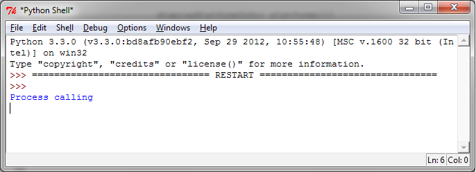
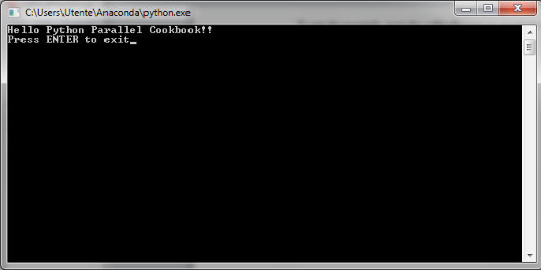

开始在Python中使用进程
======================

在大多数操作系统中，每个程序在一个进程中运行。通常，我们通过双击一个应用程序的图标来启动程序。在本节中，我们简单地展示如何在Python中开启一个进程。进程有自己的地址空间，数据栈和其他的辅助数据来追踪执行过程；系统会管理所有进程的执行，通过调度程序来分配计算资源等。

|ready|
-------

在第一个程序中，你需要先确保安装了Python。

最新的Python可以从 https://www.python.org/ 下载安装。

|how|
-----

执行第一个示例，我们需要敲入下面两个代码文件：

- ``called_Process.py``
- ``calling_Process.py``

你可以使用Python IDE(3.3.0)来编辑下面的文件：

``called_Process`` 的代码如下: ::
    
    print("Hello Python Parallel Cookbook!!")
    closeInput = raw_input("Press ENTER to exit")
    print"Closing calledProcess"

``calling_Process`` 的代码如下： ::

        ## The following modules must be imported
        import os
        import sys

        ## this is the code to execute
        program = "python"
        print("Process calling")
        arguments = ["called_Process.py"]

        ## we call the called_Process.py script
        os.execvp(program, (program,) + tuple(arguments))
        print("Good Bye!!")

运行例子的方法是，用Python IDE打开 ``calling_Process`` 程序然后按下F5.

在Python shell看到的输出如下：

同时，系统的终端将看到如下输出：

我们有两个进程运行，按下Enter可以关闭系统终端。

|how|
-----

在前面的例子中， ``execvp`` 函数开启了一个新的进程，替换了当前的进程。注意”Good Bye”永远不会打印出来。相反，它会在当前的系统路径中搜索 ``called_Process`` ，将第二个参数的内容作为独立的变量传给程序，然后在当前环境上下文中执行。``called_Process``中的 ``input()`` 仅仅用来管理当前系统的闭包。本节展示了基于进程的并行，我们在后面会介绍更多通过进程（multiprocessing模块）管理并行的方法。
