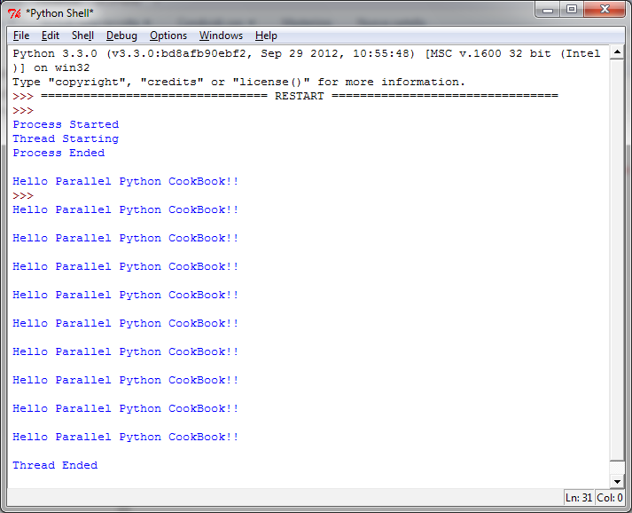

开始在Python中使用线程
======================

如前面章节提到的那样，基于线程的并行是编写并行程序的标准方法。然而，Python解释器并不完全是线程安全的。为了支持多线程的Python程序，CPython使用了一个叫做全局解释器锁（Global Interpreter Lock， GIL）的技术。这意味着同一时间只有一个线程可以执行Python代码；执行某一个线程一小段时间之后，Python会自动切换到下一个线程。GIL并没有完全解决线程安全的问题，如果多个线程试图使用共享数据，还是可能导致未确定的行为。

在本节中，我们将展示如何在Python程序中创建一个线程。

|how|
-----

我们需要 ``helloPythonWithThreads.py`` 来执行第一个例子： ::

        # To use threads you need import Thread using the following code:
        from threading import Thread
        # Also we use the sleep function to make the thread "sleep"
        from time import sleep

        # To create a thread in Python you'll want to make your class work as a thread.
        # For this, you should subclass your class from the Thread class
        class CookBook(Thread):
            def __init__(self):
                Thread.__init__(self)
                self.message = "Hello Parallel Python CookBook!!\n"

            # this method prints only the message
            def print_message(self):
                print(self.message)

            # The run method prints ten times the message
            def run(self):
                print("Thread Starting\n")
                x = 0
                while (x < 10):
                    self.print_message()
                    sleep(2)
                    x += 1
                print("Thread Ended\n")

        # start the main process
        print("Process Started")

        # create an instance of the HelloWorld class
        hello_Python = CookBook()

        # print the message...starting the thread
        hello_Python.start()

        # end the main process
        print("Process Ended")

运行上面的代码，需要用Python IDE打开 ``helloPythonWithThreads.py`` 然后按下 F5.

在Python shell中你将看到以下输出：

|work|
------

主程序执行结束的时候，线程依然会每个两秒钟就打印一次信息。此例子证实了线程是在父进程下执行的一个子任务。

需要注意的一点是，永远不要留下任何线程在后台默默运行。否则在大型程序中这将给你带来无限痛苦。

