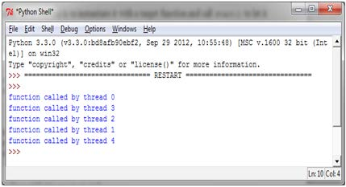

如何定义一个线程
================

使用线程最简单的一个方法是，用一个目标函数实例化一个Thread然后调用 ``start()`` 方法启动它。Python的threading模块提供了 ``Thread()`` 方法在不同的线程中运行函数或处理过程等。 ::

    class threading.Thread(group=None,
                           target=None,
                           name=None,
                           args=(),
                           kwargs={})	    

上面的代码中：

- ``group``: 一般设置为 ``None`` ，这是为以后的一些特性预留的
- ``target``: 当线程启动的时候要执行的函数
- ``name``: 线程的名字，默认会分配一个唯一名字 ``Thread-N`` 
- ``args``: 传递给 ``target`` 的参数，要试用tuple类型
- ``kwargs``: 同上，试用字段类型dict

创建线程的方法非常实用，通过参数和目标告诉线程应该做什么。下面这个例子传递一个数字给线程（这个数字正好等于线程号码），目标函数会打印出这个数字。

|how|
-----

让我们看一下如何通过threading模块创建线程，只需要几行代码就可以了： ::

        import threading

        def function(i):
            print ("function called by thread %i\n" % i)
            return

        threads = []

        for i in range(5):
            t = threading.Thread(target=function , args=(i, ))
            threads.append(t)
            t.start()
            t.join()

上面的代码运行结果如下：

注意，输出的顺序可能和上图不同。事实上，多个线程可能同时向 ``stdout`` 打印结果，所以输出顺序无法事先确定。

|work|
------

导入内置threading模块，简单地使用pyhton命令就可以了： ::

    import threading

在主程序中，我们使用目标函数 ``function`` 初始化了一个线程对象 ``Thread`` 。同时还传入了用于打印的一个参数： ::

    t = threading.Thread(target=function , args=(i, ))

线程被创建之后并不会马上运行，需要手动调用 ``start()`` ， ``join()`` 让调用它的线程一直等待直到执行结束： ::

    t.start()
    t.join()
