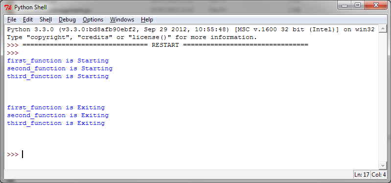

如何确定当前的线程
==================

使用参数来确认或命名线程是笨拙且没有必要的。每一个 ``Thread`` 实例创建的时候都有一个带默认值的名字，并且可以修改。在服务端通常一个服务进程都有多个线程服务，负责不同的操作，这时候命名线程是很实用的。

|how|
-----

为了演示如何确定正在运行的线程，我们创建了三个目标函数，并且引入了 ``time`` 在运行期间挂起2s，让结果更明显。 ::

        import threading
        import time

        def first_function():
            print(threading.currentThread().getName() + str(' is Starting '))
            time.sleep(2)
            print (threading.currentThread().getName() + str(' is Exiting '))
            return

        def second_function():
            print(threading.currentThread().getName() + str(' is Starting '))
            time.sleep(2)
            print (threading.currentThread().getName() + str(' is Exiting '))
            return

        def third_function():
            print(threading.currentThread().getName() + str(' is Starting '))
            time.sleep(2)
            print(threading.currentThread().getName() + str(' is Exiting '))
            return

        if __name__ == "__main__":
            t1 = threading.Thread(name='first_function', target=first_function)
            t2 = threading.Thread(name='second_function', target=second_function)
            t3 = threading.Thread(name='third_function', target=third_function)
            t1.start()
            t2.start()
            t3.start()
 
输出如下图所示：

|work|
------

我们使用目标函数实例化线程。同时，我们传入 ``name`` 参数作为线程的名字，如果不传这个参数，将使用默认的参数： ::

    t1 = threading.Thread(name='first_function', target=first_function)
    t2 = threading.Thread(name='second_function', target=second_function)
    t3 = threading.Thread(target=third_function)

（译者注：这里的代码和上面的不一样，可能作者本意是第三个线程不加参数来测试默认的行为，如果改为这里的代码，那么线程3将会输出的是 ``Thread-1 is Starting`` 以及 ``Thread-1 is Exiting`` ，读者可以自行尝试）

最后调用 ``start()`` 和 ``join()`` 启动它们。 ::

    t1.start()
    t2.start()
    t3.start()
    t1.join()
    t2.join()
    t3.join()
