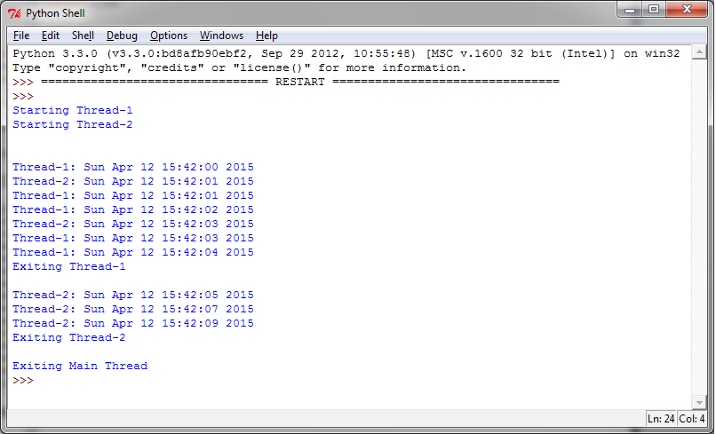

如何实现一个线程
================

使用threading模块实现一个新的线程，需要下面3步：

- 定义一个 ``Thread`` 类的子类
- 重写 ``__init__(self [,args])`` 方法，可以添加额外的参数
- 最后，需要重写 ``run(self, [,args])`` 方法来实现线程要做的事情

当你创建了新的 ``Thread`` 子类的时候，你可以实例化这个类，调用 ``start()`` 方法来启动它。线程启动之后将会执行 ``run()`` 方法。

|how|
-----

为了在子类中实现线程，我们定义了 ``myThread`` 类。其中有两个方法需要手动实现： ::

    import threading
    import time

    exitFlag = 0

    class myThread (threading.Thread):
        def __init__(self, threadID, name, counter):
            threading.Thread.__init__(self)
            self.threadID = threadID
            self.name = name
            self.counter = counter

        def run(self):
            print("Starting " + self.name)
            print_time(self.name, self.counter, 5)
            print("Exiting " + self.name)

    def print_time(threadName, delay, counter):
        while counter:
            if exitFlag:
                # 译者注：原书中使用的thread，但是Python3中已经不能使用thread，以_thread取代，因此应该
                # import _thread
                # _thread.exit()
                thread.exit()
            time.sleep(delay)
            print("%s: %s" % (threadName, time.ctime(time.time())))
            counter -= 1

    # Create new threads
    thread1 = myThread(1, "Thread-1", 1)
    thread2 = myThread(2, "Thread-2", 2)

    # Start new Threads
    thread1.start()
    thread2.start()

    # 以下两行为译者添加，如果要获得和图片相同的结果，
    # 下面两行是必须的。疑似原作者的疏漏
    thread1.join()
    thread2.join()
    print("Exiting Main Thread")

上面的代码输出结果如下：

|work|
------

``threading`` 模块是创建和管理线程的首选形式。每一个线程都通过一个继承 ``Thread`` 类，重写 ``run()`` 方法来实现逻辑，这个方法是线程的入口。在主程序中，我们创建了多个 ``myThread`` 的类型实例，然后执行 ``start()`` 方法启动它们。调用 ``Thread.__init__`` 构造器方法是必须的，通过它我们可以给线程定义一些名字或分组之类的属性。调用 ``start()`` 之后线程变为活跃状态，并且持续直到 ``run()`` 结束，或者中间出现异常。所有的线程都执行完成之后，程序结束。

``join()`` 命令控制主线程的终止。
