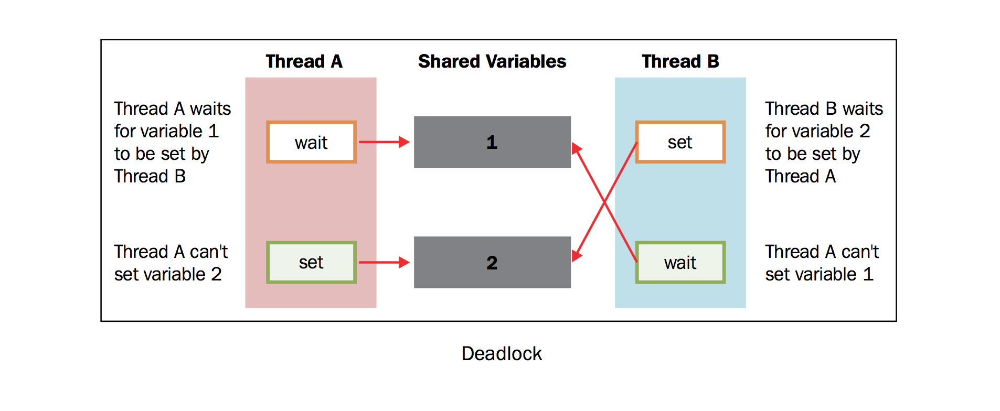
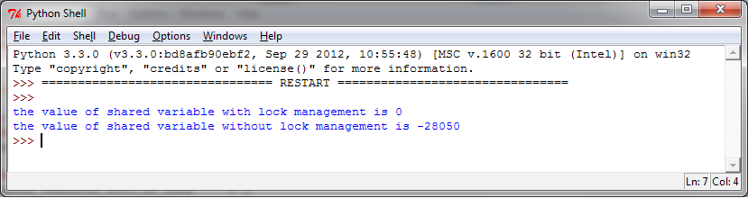

使用Lock进行线程同步
===========================

当两个或以上对共享内存的操作发生在并发线程中，并且至少有一个可以改变数据，又没有同步机制的条件下，就会产生竞争条件，可能会导致执行无效代码、bug、或异常行为。

竞争条件最简单的解决方法是使用锁。锁的操作非常简单，当一个线程需要访问部分共享内存时，它必须先获得锁才能访问。此线程对这部分共享资源使用完成之后，该线程必须释放锁，然后其他线程就可以拿到这个锁并访问这部分资源了。

很显然，避免竞争条件出现是非常重要的，所以我们要保证，在同一时刻只有一个线程允许访问共享内存。

尽管原理很简单，但是这样使用是work的。

然而，在实际使用的过程中，我们发现这个方法经常会导致一种糟糕的死锁现象。当不同的线程要求得到一个锁时，死锁就会发生，这时程序不可能继续执行，因为它们互相拿着对方需要的锁。

为了简化问题，我们设有两个并发的线程（ **线程A** 和 **线程B** )，需要 **资源1** 和 **资源2** .假设 **线程A** 需要 **资源1** ， **线程B** 需要 **资源2** .在这种情况下，两个线程都使用各自的锁，目前为止没有冲突。现在假设，在双方释放锁之前， **线程A** 需要 **资源2** 的锁， **线程B** 需要 **资源1** 的锁，没有资源线程不会继续执行。鉴于目前两个资源的锁都是被占用的，而且在对方的锁释放之前都处于等待且不释放锁的状态。这是死锁的典型情况。所以如上所说，使用锁来解决同步问题是一个可行却存在潜在问题的方案。

本节中，我们描述了Python的线程同步机制， ``lock()`` 。通过它我们可以将共享资源某一时刻的访问限制在单一线程或单一类型的线程上，线程必须得到锁才能使用资源，并且之后必须允许其他线程使用相同的资源。

|how|
-----

下面的例子展示了如何通过 ``lock()`` 管理线程。在下面的代码中，我们有两个函数： ``increment()`` 和 ``decrement()`` 。第一个函数对共享资源执行加1的操作，另一个函数执行减1.两个函数分别使用线程封装。除此之外，每一个函数都有一个循环重复执行操作。我们想要保证，通过对共享资源的管理，执行结果是共享资源最后等于初始值0.

代码如下： ::

        # -*- coding: utf-8 -*-

        import threading

        shared_resource_with_lock = 0
        shared_resource_with_no_lock = 0
        COUNT = 100000
        shared_resource_lock = threading.Lock()

        # 有锁的情况
        def increment_with_lock():
            global shared_resource_with_lock
            for i in range(COUNT):
                shared_resource_lock.acquire()
                shared_resource_with_lock += 1
                shared_resource_lock.release()
         
        def decrement_with_lock():
            global shared_resource_with_lock
            for i in range(COUNT):
                shared_resource_lock.acquire()
                shared_resource_with_lock -= 1
                shared_resource_lock.release()

        # 没有锁的情况
        def increment_without_lock():
            global shared_resource_with_no_lock
            for i in range(COUNT):
                shared_resource_with_no_lock += 1

        def decrement_without_lock():
            global shared_resource_with_no_lock
            for i in range(COUNT):
                shared_resource_with_no_lock -= 1

        if __name__ == "__main__":
            t1 = threading.Thread(target=increment_with_lock)
            t2 = threading.Thread(target=decrement_with_lock)
            t3 = threading.Thread(target=increment_without_lock)
            t4 = threading.Thread(target=decrement_without_lock)
            t1.start()
            t2.start()
            t3.start()
            t4.start()
            t1.join()
            t2.join()
            t3.join()
            t4.join()
            print ("the value of shared variable with lock management is %s" % shared_resource_with_lock)
            print ("the value of shared variable with race condition is %s" % shared_resource_with_no_lock)

代码执行的结果如下：

可以看出，如果有锁来管理线程的话，我们会得到正确的结果。这里要注意，没有锁的情况下并不一定会得到错误的结果，但是重复执行多次，总会出现错误的结果。而有锁的情况结果总会是正确的。

|work|
------

在主程序中，我们有以下步骤： ::

    t1 = threading.Thread(target=increment_with_lock)
    t2 = threading.Thread(target=decrement_with_lock)

启动线程： ::

    t1.start()
    t2.start()

然后阻塞主线程直到所有线程完成：  ::

    t1.join()
    t2.join()
    
在 ``increment_with_lock()`` 函数和 ``decrement_with_lock()`` 函数中，可以看到我们使用了lock语句。当你需要使用资源的时候，调用 ``acquire()`` 拿到锁（如果锁暂时不可用，会一直等待直到拿到），最后调用 ``release()``:  ::

        shared_resource_lock.acquire()
        shared_resource_with_lock -= 1
        shared_resource_lock.release()

让我们总结一下：

- 锁有两种状态： locked（被某一线程拿到）和unlocked（可用状态）
- 我们有两个方法来操作锁： ``acquire()`` 和 ``release()``

需要遵循以下规则：

- 如果状态是unlocked， 可以调用 ``acquire()`` 将状态改为locked
- 如果状态是locked， ``acquire()`` 会被block直到另一线程调用 ``release()`` 释放锁
- 如果状态是unlocked， 调用 ``release()`` 将导致 ``RuntimError`` 异常
- 如果状态是locked， 可以调用 ``release()`` 将状态改为unlocked

|more|
------

尽管理论上行得通，但是锁的策略不仅会导致有害的僵持局面。还会对应用程序的其他方面产生负面影响。这是一种保守的方法，经常会引起不必要的开销，也会限制程序的可扩展性和可读性。更重要的是，有时候需要对多进程共享的内存分配优先级，使用锁可能和这种优先级冲突。最后，从实践的经验来看，使用锁的应用将对debug带来不小的麻烦。所以，最好使用其他可选的方法确保同步读取共享内存，避免竞争条件。
