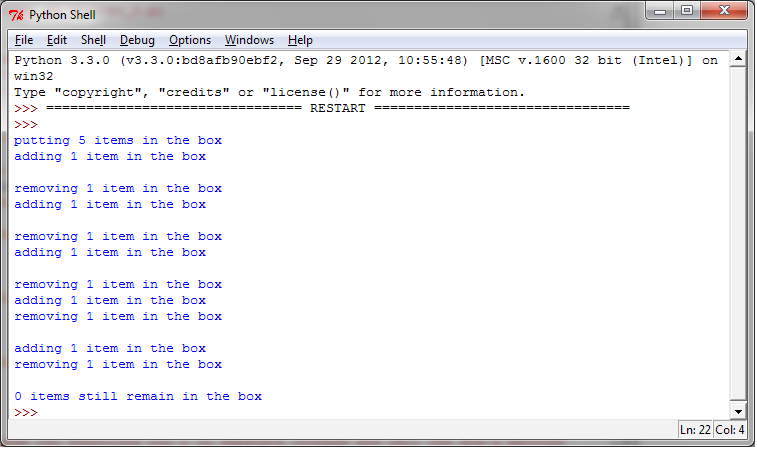

使用RLock进行线程同步
=====================

如果你想让只有拿到锁的线程才能释放该锁，那么应该使用 ``RLock()`` 对象。和 ``Lock()`` 对象一样， ``RLock()`` 对象有两个方法： ``acquire()`` 和 ``release()`` 。当你需要在类外面保证线程安全，又要在类内使用同样方法的时候 ``RLock()`` 就很实用了。

（译者注：RLock原作解释的太模糊了，译者在此擅自添加一段。RLock其实叫做“Reentrant Lock”，就是可以重复进入的锁，也叫做“递归锁”。这种锁对比Lock有是三个特点：1. 谁拿到谁释放。如果线程A拿到锁，线程B无法释放这个锁，只有A可以释放；2. 同一线程可以多次拿到该锁，即可以acquire多次；3. acquire多少次就必须release多少次，只有最后一次release才能改变RLock的状态为unlocked）

|how|
-----

在示例代码中，我们引入了 ``Box`` 类，有 ``add()`` 方法和 ``remove()`` 方法，提供了进入 ``execute()`` 方法的入口。 ``execute()`` 的执行由 ``Rlock()`` 控制： ::

        import threading
        import time

        class Box(object):
            lock = threading.RLock()

            def __init__(self):
                self.total_items = 0

            def execute(self, n):
                Box.lock.acquire()
                self.total_items += n
                Box.lock.release()

            def add(self):
                Box.lock.acquire()
                self.execute(1)
                Box.lock.release()

            def remove(self):
                Box.lock.acquire()
                self.execute(-1)
                Box.lock.release()

        ## These two functions run n in separate
        ## threads and call the Box's methods
        def adder(box, items):
            while items > 0:
                print("adding 1 item in the box")
                box.add()
                time.sleep(1)
                items -= 1

        def remover(box, items):
            while items > 0:
                print("removing 1 item in the box")
                box.remove()
                time.sleep(1)
                items -= 1
         
        ## the main program build some
        ## threads and make sure it works
        if __name__ == "__main__":
            items = 5
            print("putting %s items in the box " % items)
            box = Box()
            t1 = threading.Thread(target=adder, args=(box, items))
            t2 = threading.Thread(target=remover, args=(box, items))
            t1.start()
            t2.start()

            t1.join()
            t2.join()
            print("%s items still remain in the box " % box.total_items)

运行结果如下：

|work|
------

主程序的代码几乎和之前的例子一样。两个线程 ``t1`` 和 ``t2`` 分别分配了 ``adder()`` 函数和 ``remover()``  函数。当item的数量大于0的时候，函数工作。调用 ``RLock()`` 的位置是在 ``Box`` 类内： ::

        class Box(object):
            lock = threading.RLock()

``adder()`` 和 ``remover()`` 两个函数在 ``Box`` 类内操作items，即调用 ``Box`` 类的方法： ``add()`` 和 ``remove()`` 。每一次方法调用，都会有一次拿到资源然后释放资源的过程。至于 ``lock()`` 对象， ``RLock()`` 对象有 ``acquire()`` 和 ``release()`` 方法可以拿到或释放资源；然后每一次方法调用中，我们都有以下操作： ::

    Box.lock.acquire()
    # ...do something
    Box.lock.release()
