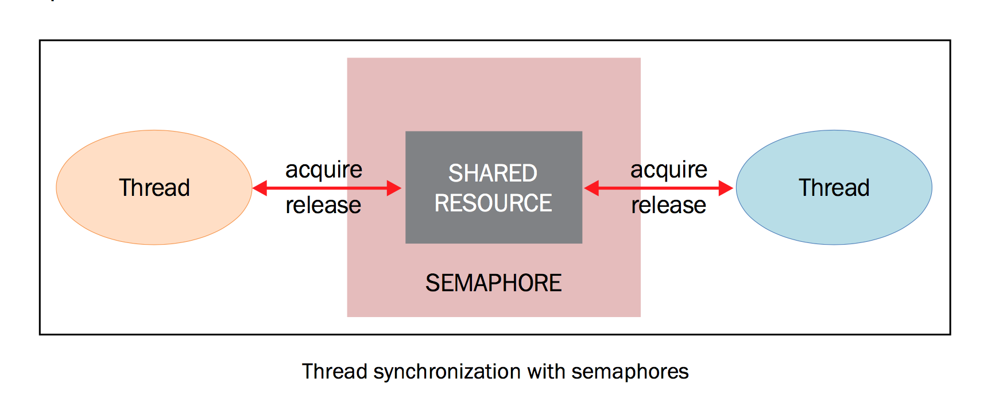
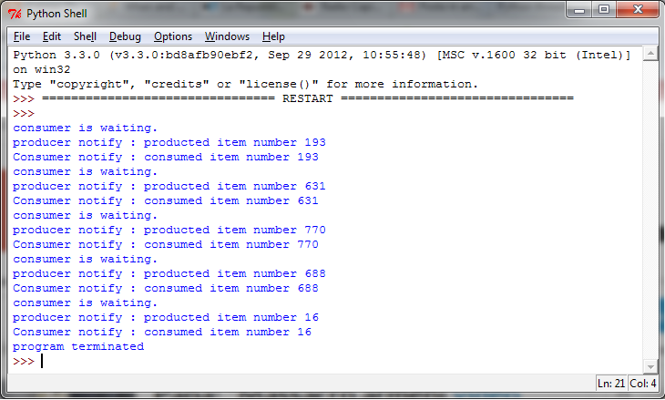

使用信号量进行线程同步
======================

信号量由E.Dijkstra发明并第一次应用在操作系统中，信号量是由操作系统管理的一种抽象数据类型，用于在多线程中同步对共享资源的使用。本质上说，信号量是一个内部数据，用于标明当前的共享资源可以有多少并发读取。

同样的，在threading模块中，信号量的操作有两个函数，即 ``acquire()`` 和 ``release()`` ，解释如下：

- 每当线程想要读取关联了信号量的共享资源时，必须调用 ``acquire()`` ，此操作减少信号量的内部变量, 如果此变量的值非负，那么分配该资源的权限。如果是负值，那么线程被挂起，直到有其他的线程释放资源。
- 当线程不再需要该共享资源，必须通过 ``release()`` 释放。这样，信号量的内部变量增加，在信号量等待队列中排在最前面的线程会拿到共享资源的权限。

虽然表面上看信号量机制没什么明显的问题，如果信号量的等待和通知操作都是原子的，确实没什么问题。但如果不是，或者两个操作有一个终止了，就会导致糟糕的情况。

举个例子，假设有两个并发的线程，都在等待一个信号量，目前信号量的内部值为1。假设第线程A将信号量的值从1减到0，这时候控制权切换到了线程B，线程B将信号量的值从0减到-1，并且在这里被挂起等待，这时控制权回到线程A，信号量已经成为了负值，于是第一个线程也在等待。

这样的话，尽管当时的信号量是可以让线程访问资源的，但是因为非原子操作导致了所有的线程都在等待状态。

|ready|
-------

下面的代码展示了信号量的使用，我们有两个线程， ``producer()`` 和 ``consumer()`` ，它们使用共同的资源，即item。 ``producer()`` 的任务是生产item， ``consumer()`` 的任务是消费item。

当item还没有被生产出来， ``consumer()`` 一直等待，当item生产出来， ``producer()`` 线程通知消费者资源可以使用了。

|how|
-----

在以下的代码中，我们使用生产者-消费者模型展示通过信号量的同步。当生产者生产出item，便释放信号量。然后消费者拿到资源进行消费。 ::
 
		# -*- coding: utf-8 -*-

		"""Using a Semaphore to synchronize threads"""
		import threading
		import time
		import random

		# The optional argument gives the initial value for the internal
		# counter;
		# it defaults to 1.
		# If the value given is less than 0, ValueError is raised.
		semaphore = threading.Semaphore(0)

		def consumer():
			print("consumer is waiting.")
			# Acquire a semaphore
			semaphore.acquire()
			# The consumer have access to the shared resource
			print("Consumer notify : consumed item number %s " % item)

		def producer():
			global item
			time.sleep(10)
			# create a random item
			item = random.randint(0, 1000)
			print("producer notify : produced item number %s" % item)
			 # Release a semaphore, incrementing the internal counter by one.
			# When it is zero on entry and another thread is waiting for it
			# to become larger than zero again, wake up that thread.
			semaphore.release()

		if __name__ == '__main__':
			for i in range (0,5) :
				t1 = threading.Thread(target=producer)
				t2 = threading.Thread(target=consumer)
				t1.start()
				t2.start()
				t1.join()
				t2.join()
			print("program terminated")
		 
程序会运行5轮，结果如下： 

|work|
------

信号量被初始化为0，此信号量唯一的目的是同步两个或多个线程。在这里，我们的线程必须并行运行，所以需要信号量同步： ::

        semaphore = threading.Semaphore(0)

这个操作和lock中的机制非常相似， ``producer()`` 完成创建item之后，释放资源： ::

    semaphore.release()
   
信号量的 ``release()`` 可以提高计数器然后通知其他的线程。同样的， ``consumer()`` 方法可以通过下面的方法拿到资源： ::

    semaphore.acquire()

如果信号量的计数器到了0，就会阻塞 ``acquire()`` 方法，直到得到另一个线程的通知。如果信号量的计数器大于0，就会对这个值-1然后分配资源。

最后，拿到数据并打印输出： ::

    print("Consumer notify : consumed item number %s " % item)

|more|
------

信号量的一个特殊用法是互斥量。互斥量是初始值为1的信号量，可以实现数据、资源的互斥访问。

信号量在支持多线程的编程语言中依然应用很广，然而这可能导致死锁的情况。例如，现在有一个线程t1先等待信号量s1，然后等待信号量s2，而线程t2会先等待信号量s2，然后再等待信号量s1，这样就可能会发生死锁，导致t1等待s2，但是t2在等待s1。
