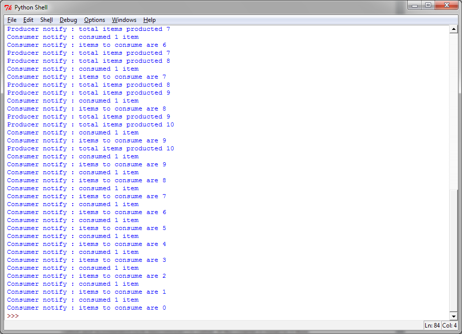
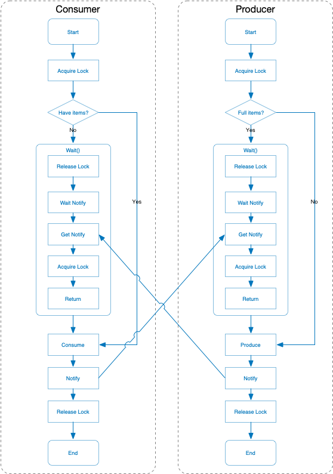

使用条件进行线程同步
====================

条件指的是应用程序状态的改变。这是另一种同步机制，其中某些线程在等待某一条件发生，其他的线程会在该条件发生的时候进行通知。一旦条件发生，线程会拿到共享资源的唯一权限。

|ready|
-------

解释条件机制最好的例子还是生产者-消费者问题。在本例中，只要缓存不满，生产者一直向缓存生产；只要缓存不空，消费者一直从缓存取出（之后销毁）。当缓冲队列不为空的时候，生产者将通知消费者；当缓冲队列不满的时候，消费者将通知生产者。

|how|
-----

为了演示条件机制，我们将再一次使用生产者-消费者的例子： ::

        from threading import Thread, Condition
        import time

        items = []
        condition = Condition()

        class consumer(Thread):

            def __init__(self):
                Thread.__init__(self)

            def consume(self):
                global condition
                global items
                condition.acquire()
                if len(items) == 0:
                    condition.wait()
                    print("Consumer notify : no item to consume")
                items.pop()
                print("Consumer notify : consumed 1 item")
                print("Consumer notify : items to consume are " + str(len(items)))

                condition.notify()
                condition.release()

            def run(self):
                for i in range(0, 20):
                    time.sleep(2)
                    self.consume()

        class producer(Thread):

            def __init__(self):
                Thread.__init__(self)

            def produce(self):
                global condition
                global items
                condition.acquire()
                if len(items) == 10:
                    condition.wait()
                    print("Producer notify : items producted are " + str(len(items)))
                    print("Producer notify : stop the production!!")
                items.append(1)
                print("Producer notify : total items producted " + str(len(items)))
                condition.notify()
                condition.release()

            def run(self):
                for i in range(0, 20):
                    time.sleep(1)
                    self.produce()

        if __name__ == "__main__":
            producer = producer()
            consumer = consumer()
            producer.start()
            consumer.start()
            producer.join()
            consumer.join()

运行的结果如下：

|work|
------

(译者在这里添加一段。乍一看这段代码好像会死锁，因为 ``condition.acquire()`` 之后就在 ``.wait()`` 了，好像会一直持有锁。其实 ``.wait()`` 会将锁释放，然后等待其他线程 ``.notify()`` 之后会重新尝试获得锁。但是要注意 ``.notify()`` 并不会自动释放锁，所以代码中有两行，先 ``.notify()`` 然后再 ``.release()`` 。

译者画了一张图，方便大家理解。这里的过程应该是这样子的（注意 ``wait()`` 里面实际有一个释放锁重新获得锁的过程）：

译者的私货完毕，建议看一下官方文档： https://docs.python.org/3/library/threading.html )

消费者通过拿到锁来修改共享的资源 ``items[]`` ： ::

        condition.acquire()

如果list的长度为0，那么消费者就进入等待状态： ::

        if len(items) == 0:
            condition.wait()

否则就通过 ``pop`` 操作消费一个item： ::            

        items.pop()

然后，消费者的状态被通知给生产者，同时共享资源释放： ::

        condition.notify()
        condition.release()

生产者拿到共享资源，然后确认缓冲队列是否已满（在我们的这个例子中，最大可以存放10个item），如果已经满了，那么生产者进入等待状态，直到被唤醒： ::

        condition.acquire()
        if len(items) == 10:
            condition.wait()
    
如果队列没有满，就生产1个item，通知状态并释放资源： ::

        condition.notify()
        condition.release()

|more|
------

Python对条件同步的实现很有趣。如果没有已经存在的锁传给构造器的话，内部的 ``_Condition`` 会创建一个 ``RLock()`` 对象。同时，这个RLock也会通过 ``acquire()`` 和 ``release()`` 管理： ::

    class _Condition(_Verbose):
        def __init__(self, lock=None, verbose=None):
            _Verbose.__init__(self, verbose)
            if lock is None:
               lock = RLock()
            self.__lock = lock

(以下又是笔者的私货，最近看到一道面试题是这样的，开3个线程按照顺序打印ABC 10次。正好是 Condition 的使用场景。我把我写的代码贴在这里供大家参考。 ::

   # -*- coding: utf-8 -*-

   """
   Three threads print A B C in order.
   """

   from threading import Thread, Condition

   condition = Condition()
   current = "A"

   class ThreadA(Thread):
       def run(self):
           global current
           for _ in range(10):
               with condition:
                   while current != "A":
                       condition.wait()
                   print("A")
                   current = "B"
                   condition.notify_all()

   class ThreadB(Thread):
       def run(self):
           global current
           for _ in range(10):
               with condition:
                   while current != "B":
                       condition.wait()
                   print("B")
                   current = "C"
                   condition.notify_all()

   class ThreadC(Thread):
       def run(self):
           global current
           for _ in range(10):
               with condition:
                   while current != "C":
                       condition.wait()
                   print("C")
                   current = "A"
                   condition.notify_all()

   a = ThreadA()
   b = ThreadB()
   c = ThreadC()

   a.start()
   b.start()
   c.start()

   a.join()
   b.join()
   c.join()

原理很简单，就是线程拿到锁先检查是不是自己渴望的状态。比如打印“B”的线程，渴望的状态 ``current = 'B'`` 然后打印出B，将状态改成 ``C`` ，这样就成了打印“C”的线程渴望的状态。

但是这里不能唤醒指定的线程，只好唤醒所有的线程，让他们自己再检查一遍状态了。）
