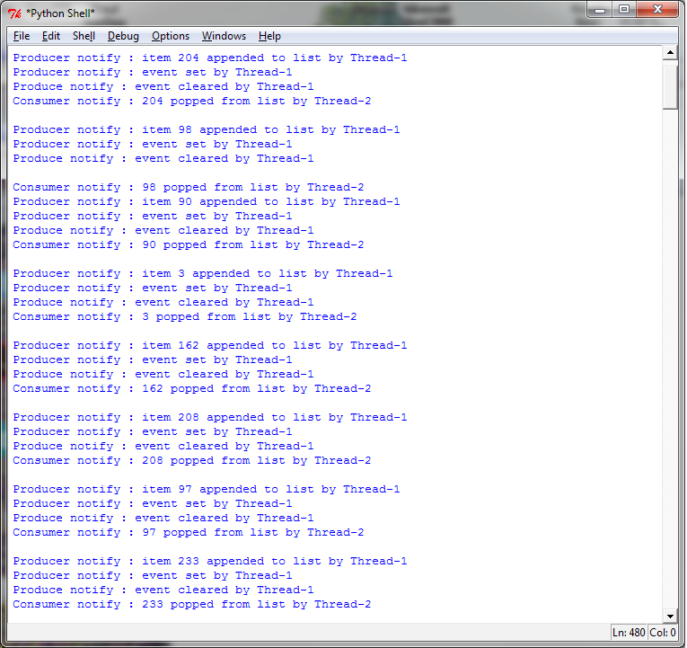
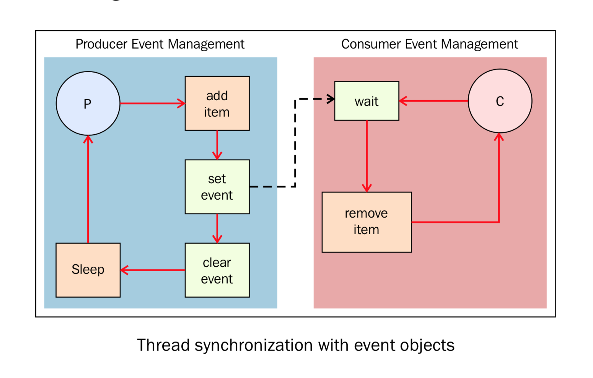

使用事件进行线程同步
====================

事件是线程之间用于通讯的对象。有的线程等待信号，有的线程发出信号。基本上事件对象都会维护一个内部变量，可以通过 ``set()`` 方法设置为 ``true`` ，也可以通过 ``clear()`` 方法设置为 ``false`` 。 ``wait()`` 方法将会阻塞线程，直到内部变量为 ``true`` 。

|how|
-----

为了理解通过事件对象实现的线程同步，让我们再一次回到生产者-消费者问题上： ::

        # -*- coding: utf-8 -*-

        import time
        from threading import Thread, Event
        import random
        items = []
        event = Event()

        class consumer(Thread):
            def __init__(self, items, event):
                Thread.__init__(self)
                self.items = items
                self.event = event

            def run(self):
                while True:
                    time.sleep(2)
                    self.event.wait()
                    item = self.items.pop()
                    print('Consumer notify : %d popped from list by %s' % (item, self.name))
         
        class producer(Thread):
            def __init__(self, items, event):
                Thread.__init__(self)
                self.items = items
                self.event = event

            def run(self):
                global item
                for i in range(100):
                    time.sleep(2)
                    item = random.randint(0, 256)
                    self.items.append(item)
                    print('Producer notify : item N° %d appended to list by %s' % (item, self.name))
                    print('Producer notify : event set by %s' % self.name)
                    self.event.set()
                    print('Produce notify : event cleared by %s '% self.name)
                    self.event.clear()

        if __name__ == '__main__':
            t1 = producer(items, event)
            t2 = consumer(items, event)
            t1.start()
            t2.start()
            t1.join()
            t2.join()

下图是我运行程序时候的运行结果。 线程t1在list最后添加值，然后设置event来通知消费者。消费者通过 ``wait()`` 阻塞，直到收到信号的时候从list中取出元素消费。

|work|
------

``producer`` 类初始化时定义了item的list和 ``Event`` ，与条件对象时候的例子不同，这里的list并不是全局的，而是通过参数传入的： ::

        class consumer(Thread):
            def __init__(self, items, event):
                Thread.__init__(self)
                self.items = items
                self.event = event

在run方法中，每当item创建， ``producer`` 类将新item添加到list末尾然后发出事件通知。使用事件有两步，第一步： ::

            self.event.set()

第二步： ::            

            self.event.clear()

``consumer`` 类初始化时也定义了item的list和 ``Event()`` 。当item进来的时候，它将其取出： ::

    def run(self):
        while True:
            time.sleep(2)
            self.event.wait()
            item = self.items.pop()
            print('Consumer notify : %d popped from list by %s' % (item, self.name))
 
下图可以帮我们认识 ``producer`` 和 ``consumer`` ： 

