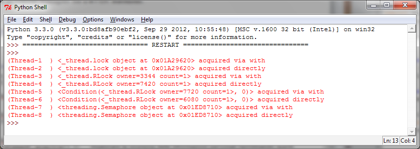

使用with语法
============

Python从2.5版本开始引入了 ``with`` 语法。此语法非常实用，在有两个相关的操作需要在一部分代码块前后分别执行的时候，可以使用 ``with`` 语法自动完成。同事，使用 ``with`` 语法可以在特定的地方分配和释放资源，因此， ``with`` 语法也叫做“上下文管理器”。在threading模块中，所有带有 ``acquire()`` 方法和 ``release()`` 方法的对象都可以使用上下文管理器。

也就是说，下面的对象可以使用 ``with`` 语法：

- Lock
- RLock
- Condition
- Semaphore

|ready|
-------

在本节中，我们将使用 ``with`` 语法简单地尝试这四个对象。

|how|
-----

下面的例子展示了 ``with`` 语法的基本用法，我们有一系列的同步原语，下面尝试用 ``with`` 来使用它们： ::

    import threading
    import logging
    logging.basicConfig(level=logging.DEBUG, format='(%(threadName)-10s) %(message)s',)

    def threading_with(statement):
        with statement:
            logging.debug('%s acquired via with' % statement)

    def threading_not_with(statement):
        statement.acquire()
        try:
            logging.debug('%s acquired directly' % statement )
        finally:
            statement.release()

    if __name__ == '__main__':
        # let's create a test battery
        lock = threading.Lock()
        rlock = threading.RLock()
        condition = threading.Condition()
        mutex = threading.Semaphore(1)
        threading_synchronization_list = [lock, rlock, condition, mutex]
        # in the for cycle we call the threading_with e threading_no_with function
        for statement in threading_synchronization_list :
           t1 = threading.Thread(target=threading_with, args=(statement,))
           t2 = threading.Thread(target=threading_not_with, args=(statement,))
           t1.start()
           t2.start()
           t1.join()
           t2.join()

下图展示了使用 ``with`` 的每一个函数以及用在了什么地方：

|work|
------

在主程序中，我们定义了一个list， ``threading_synchronization_list`` ，包含要测试的线程同步使用的对象： ::

    lock = threading.Lock()
    rlock = threading.RLock()
    condition = threading.Condition()
    mutex = threading.Semaphore(1)
    threading_synchronization_list = [lock, rlock, condition, mutex]

定义之后，我们可以在 ``for`` 循环中测试每一个对象： ::

    for statement in threading_synchronization_list :
       t1 = threading.Thread(target=threading_with, args=(statement,))
       t2 = threading.Thread(target=threading_not_with, args=(statement,))

最后，我们有两个目标函数，其中 ``threading_with`` 测试了 ``with`` 语法： ::

    def threading_with(statement):
        with statement:
            logging.debug('%s acquired via with' % statement)

|more|
------

在本例中，我们使用了Python的logging模块进行输出： ::

    logging.basicConfig(level=logging.DEBUG, format='(%(threadName)-10s) %(message)s',)

使用 ``% (threadName)`` 可以在每次输出的信息都加上线程的名字。logging模块是线程安全的。这样我们可以区分出不同线程的输出。

译者注：译者在博客上写过一篇有关Python的with语句的文章，可以参考一下：https://www.kawabangga.com/posts/2010
