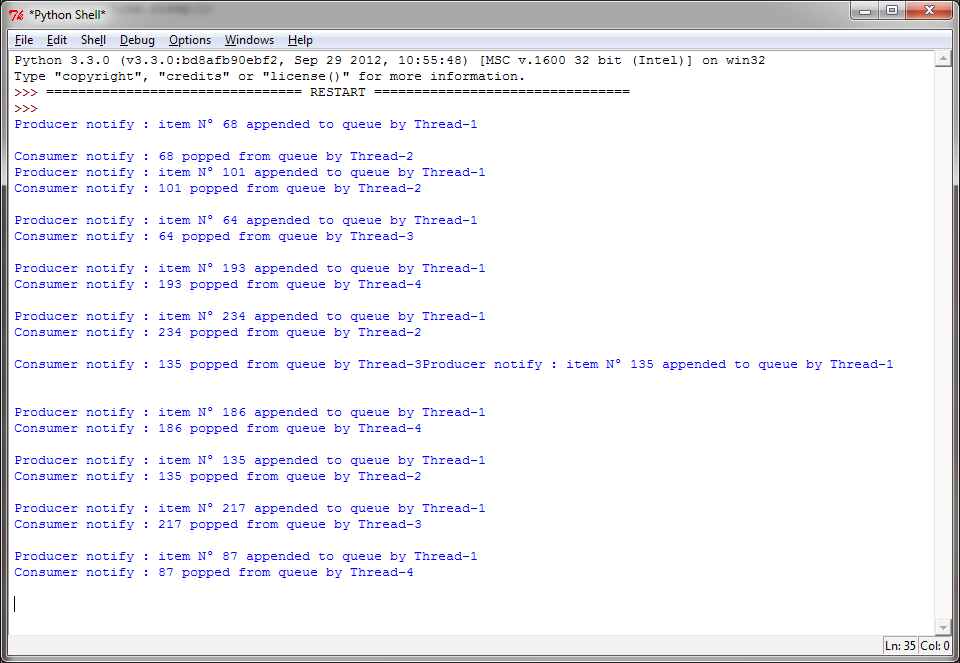
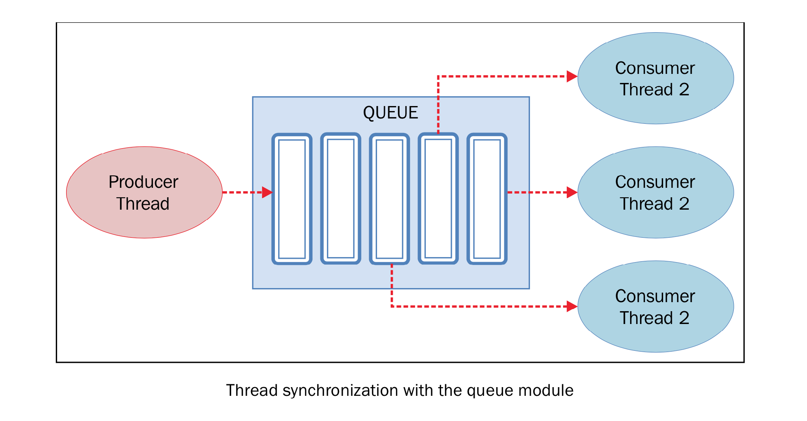

使用 ``queue`` 进行线程通信
============================

前面我们已经讨论到，当线程之间如果要共享资源或数据的时候，可能变的非常复杂。如你所见，Python的threading模块提供了很多同步原语，包括信号量，条件变量，事件和锁。如果可以使用这些原语的话，应该优先考虑使用这些，而不是使用queue（队列）模块。队列操作起来更容易，也使多线程编程更安全，因为队列可以将资源的使用通过单线程进行完全控制，并且允许使用更加整洁和可读性更高的设计模式。

Queue常用的方法有以下四个：

- ``put()``: 往queue中放一个item
- ``get()``: 从queue删除一个item，并返回删除的这个item
- ``task_done()``: 每次item被处理的时候需要调用这个方法
- ``join()``: 所有item都被处理之前一直阻塞

|how|
-----

在本例中，我们将学习如何在threading模块中使用queue。同样，本例中将会有两个实体试图共享临界资源，一个队列。代码如下： ::

        from threading import Thread, Event
        from queue import Queue
        import time
        import random
        class producer(Thread):
            def __init__(self, queue):
                Thread.__init__(self)
                self.queue = queue

            def run(self) :
                for i in range(10):
                    item = random.randint(0, 256)
                    self.queue.put(item)
                    print('Producer notify: item N° %d appended to queue by %s' % (item, self.name))
                    time.sleep(1)

        class consumer(Thread):
            def __init__(self, queue):
                Thread.__init__(self)
                self.queue = queue

            def run(self):
                while True:
                    item = self.queue.get()
                    print('Consumer notify : %d popped from queue by %s' % (item, self.name))
                    self.queue.task_done()

        if __name__ == '__main__':
            queue = Queue()
            t1 = producer(queue)
            t2 = consumer(queue)
            t3 = consumer(queue)
            t4 = consumer(queue)
            t1.start()
            t2.start()
            t3.start()
            t4.start()
            t1.join()
            t2.join()
            t3.join()
            t4.join()

代码的运行结果如下：

|work|
------

首先，我们创建一个生产者类。由于我们使用队列存放数字，所以不需要用来存放数字的list了。 ::

        class producer(Thread):
            def __init__(self, queue):
                Thread.__init__(self)
                self.queue = queue

``producer`` 类生产整数，然后通过一个 ``for`` 循环将整数放到队列中： ::

    def run(self) :
        for i in range(10):
            item = random.randint(0, 256)
            self.queue.put(item)
            print('Producer notify: item N° %d appended to queue by %s' % (item, self.name))
            time.sleep(1)

生产者使用 ``Queue.put(item [,block[, timeout]])`` 来往queue中插入数据。Queue是同步的，在插入数据之前内部有一个内置的锁机制。

可能发生两种情况：

- 如果 ``block`` 为 ``True`` ， ``timeout`` 为 ``None`` （这也是默认的选项，本例中使用默认选项），那么可能会阻塞掉，直到出现可用的位置。如果 ``timeout`` 是正整数，那么阻塞直到这个时间，就会抛出一个异常。
- 如果 ``block`` 为 ``False`` ，如果队列有闲置那么会立即插入，否则就立即抛出异常（ ``timeout`` 将会被忽略）。本例中， ``put()`` 检查队列是否已满，然后调用 ``wait()`` 开始等待。

消费者从队列中取出整数然后用 ``task_done()`` 方法将其标为任务已处理。

消费者使用 ``Queue.get([block[, timeout]])`` 从队列中取回数据，queue内部也会经过锁的处理。如果队列为空，消费者阻塞。

最后，在主程序中，我们创建线程t作为生产者，t1, t2, t3作为消费者： ::

        if __name__ == '__main__':
            queue = Queue()
            t1 = producer(queue)
            t2 = consumer(queue)
            t3 = consumer(queue)
            t4 = consumer(queue)
            t1.start()
            t2.start()
            t3.start()
            t4.start()
            t1.join()
            t2.join()
            t3.join()
            t4.join()

生产者和消费者之间的操作可以用下图来描述：

