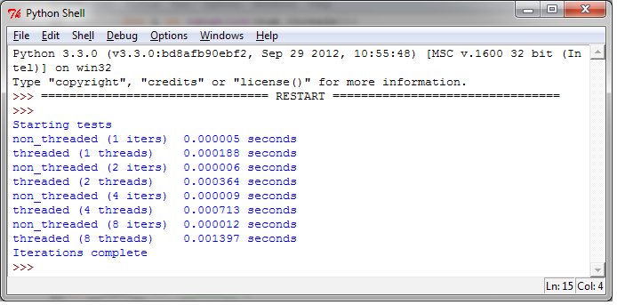
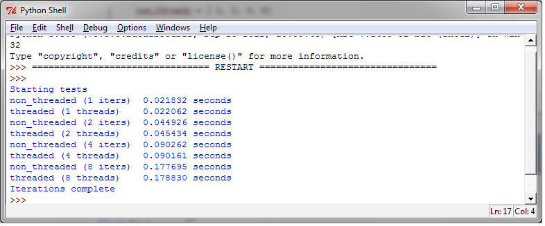
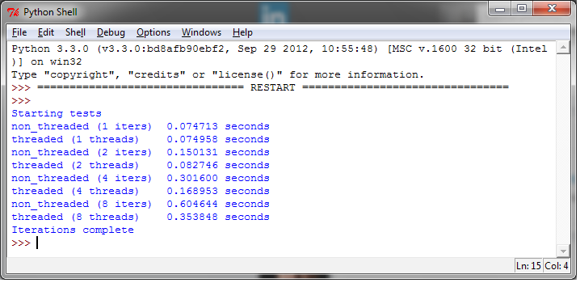

评估多线程应用的性能
====================

在本节中，我们将验证GIL的影响，评估多线程应用的性能。前文已经介绍过，GIL是CPython解释器引入的锁，GIL在解释器层面组织了真正的并行运行。解释器在执行任何线程之前，必须等待当前正在运行的线程释放GIL。事实上，解释器会强迫想要运行的线程必须拿到GIL才能访问解释器的任何资源，例如栈或Python对象等。这也正是GIL的目的——阻止不同的线程并发访问Python对象。这样GIL局可以保护解释器的内存，让垃圾回收工作正常。但事实上，这却造成了程序员无法通过并行执行多线程来提高程序的性能。如果我们去掉CPython的GIL，就可以让多线程真正并行执行。GIL并没有影响多处理器并行的线程，只是限制了一个解释器只能有一个线程在运行。

|how|
-----

下面的代码是用来评估多线程应用性能的简单工具。下面的每一个测试都循环调用函数100次，重复执行多次，取速度最快的一次。在 ``for`` 循环中，我们调用 ``non_threaded`` 和 ``threaded`` 函数，同时，我们重复执行这个测试，增加调用的次数和线程的数量。在线程的测试用，我们阻塞运行这些数量的线程，在非线程的测试中，我们顺序调用这些次数的函数。为了保持简单，度量的指标使用Python的内建模块timer。

代码如下： ::

    from threading import Thread

    class threads_object(Thread):
        def run(self):
            function_to_run()

    class nothreads_object(object):
        def run(self):
            function_to_run()

    def non_threaded(num_iter):
        funcs = []
        for i in range(int(num_iter)):
            funcs.append(nothreads_object())
        for i in funcs:
            i.run()

    def threaded(num_threads):
        funcs = []
        for i in range(int(num_threads)):
            funcs.append(threads_object())
        for i in funcs:
            i.start()
        for i in funcs:
            i.join()

    def function_to_run():
        pass

    def show_results(func_name, results):
        print("%-23s %4.6f seconds" % (func_name, results))

    if __name__ == "__main__":
        import sys
        from timeit import Timer
        repeat = 100
        number = 1
        num_threads = [1, 2, 4, 8]
        print('Starting tests')
        for i in num_threads:
            t = Timer("non_threaded(%s)" % i, "from __main__ import non_threaded")
            best_result = min(t.repeat(repeat=repeat, number=number))
            show_results("non_threaded (%s iters)" % i, best_result)
            t = Timer("threaded(%s)" % i, "from __main__ import threaded")
            best_result = min(t.repeat(repeat=repeat, number=number))
            show_results("threaded (%s threads)" % i, best_result)
            print('Iterations complete')

|work|
------

我们一共进行了三次测试，每一次都会使用不同的function进行测试，只要改变 ``function_to_run()`` 就可以了。

测试用的机器是 Core 2 Duo CPU – 2.33Ghz。

第一次测试
''''''''''

在第一次测试中，我们使用了一个简单的空函数： ::

    def function_to_run():
        pass

下图展示了我们测试的每个机制的运行速度：

通过结果可以发现，使用线程的开销要比不使用线程的开销大的多。特别的，我们发现随着线程的数量增加，带来的开销是成比例的。4个线程的运行时间是0.0007143秒，8个线程的运行时间是0.001397秒。

第二次测试
''''''''''

多线程比较常用的一个用途是处理数字，下面的测试计算斐波那契数列，注意这个例子中没有共享的资源，只是测试生成数字数列：  ::

    def function_to_run():
        a, b = 0, 1
        for i in range(10000):
            a, b = b, a + b

输出如下：

在输出中可以看到，提高线程的数量并没有带来收益。因为GIL和线程管理代码的开销，多线程运行永远不可能比函数顺序执行更快。再次提醒一下：GIL只允许解释器一次执行一个线程。

第三次测试
''''''''''

下面的测试是读1kb的数据1000次，测试用的函数如下： ::

    def function_to_run():
        fh=open("C:\\CookBookFileExamples\\test.dat","rb")
        size = 1024
        for i in range(1000):
            fh.read(size)

测试的结果如下：

