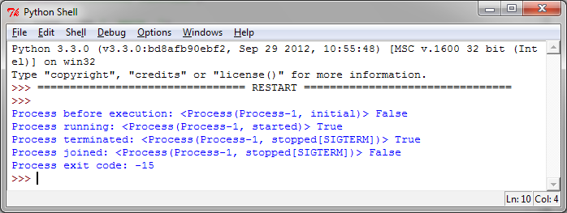

如何杀掉一个进程
================

我们可以使用 ``terminate()`` 方法立即杀死一个进程。另外，我们可以使用 ``is_alive()`` 方法来判断一个进程是否还存活。

|how|
-----

在本例中，创建一个目标函数为 ``foo()`` 的进程。启动之后，我们通过 ``terminate()`` 方法杀死它。 ::

	# 杀死一个进程
	import multiprocessing
	import time

	def foo():
		print('Starting function')
		time.sleep(0.1)
		print('Finished function')

	if __name__ == '__main__':
		p = multiprocessing.Process(target=foo)
		print('Process before execution:', p, p.is_alive())
		p.start()
		print('Process running:', p, p.is_alive())
		p.terminate()
		print('Process terminated:', p, p.is_alive())
		p.join()
		print('Process joined:', p, p.is_alive())
		print('Process exit code:', p.exitcode)

输出如下：

|work|
------

我们创建了一个线程，然后用 ``is_alive()`` 方法监控它的声明周期。然后通过调用 ``terminate()`` 方法结束进程。

最后，我们通过读进程的 ``ExitCode`` 状态码（status code）验证进程已经结束， ``ExitCode`` 可能的值如下：

- == 0: 没有错误正常退出
- > 0: 进程有错误，并以此状态码退出
- < 0: 进程被 ``-1 *`` 的信号杀死并以此作为 ExitCode 退出

在我们的例子中，输出的 ``ExitCode`` 是 ``-15`` 。负数表示子进程被数字为15的信号杀死。
