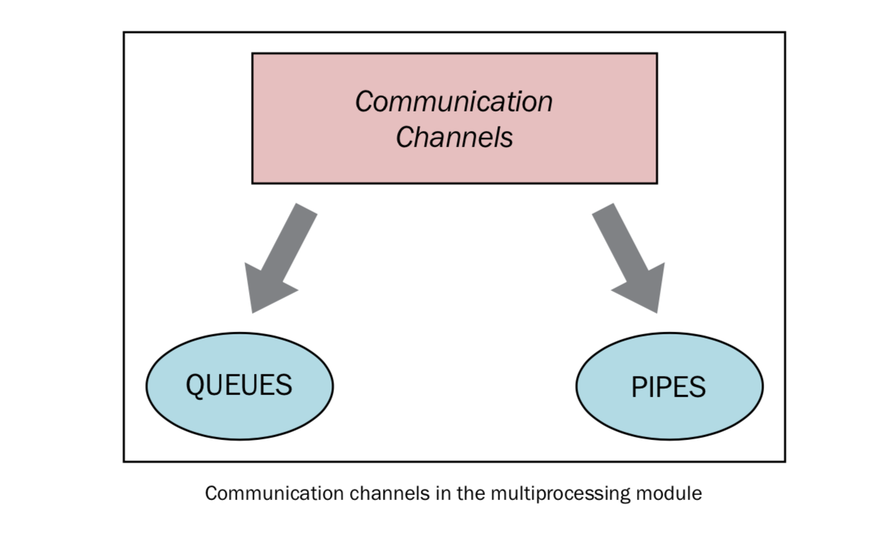
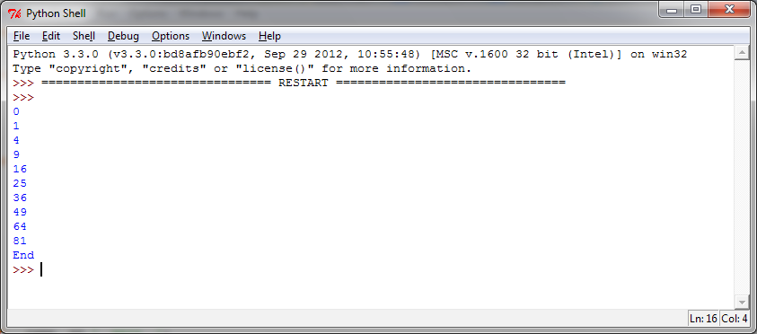

如何在进程之间交换对象
======================

并行应用常常需要在进程之间交换数据。Multiprocessing库有两个Communication Channel可以交换对象：队列(queue)和管道（pipe）。

使用队列交换对象
----------------

我们可以通过队列数据结构来共享对象。

``Queue`` 返回一个进程共享的队列，是线程安全的，也是进程安全的。任何可序列化的对象（Python通过 ``pickable`` 模块序列化对象）都可以通过它进行交换。

|how|
-----

在下面的例子中，我们将展示如何使用队列来实现生产者-消费者问题。 ``Producer`` 类生产item放到队列中，然后 ``Consumer`` 类从队列中移除它们。 ::

        import multiprocessing
        import random
        import time

        class Producer(multiprocessing.Process):
            def __init__(self, queue):
                multiprocessing.Process.__init__(self)
                self.queue = queue

            def run(self):
                for i in range(10):
                    item = random.randint(0, 256)
                    self.queue.put(item)
                    print("Process Producer : item %d appended to queue %s" % (item, self.name))
                    time.sleep(1)
                    print("The size of queue is %s" % self.queue.qsize())

        class Consumer(multiprocessing.Process):
            def __init__(self, queue):
                multiprocessing.Process.__init__(self)
                self.queue = queue

            def run(self):
                while True:
                    if self.queue.empty():
                        print("the queue is empty")
                        break
                    else:
                        time.sleep(2)
                        item = self.queue.get()
                        print('Process Consumer : item %d popped from by %s \n' % (item, self.name))
                        time.sleep(1)

        if __name__ == '__main__':
            queue = multiprocessing.Queue()
            process_producer = Producer(queue)
            process_consumer = Consumer(queue)
            process_producer.start()
            process_consumer.start()
            process_producer.join()
            process_consumer.join()

运行结果如下（译者注：macOS High Sierra运行失败，错误是 ``NotImplementedError`` 可能是因为 ``self._sem._semlock._get_value()`` 没有实现）： ::

		C:\Python CookBook\Chapter 3 - Process Based Parallelism\Example Codes
		Chapter 3>python using_queue.py
		Process Producer : item 69 appended to queue producer-1
		The size of queue is 1
		Process Producer : item 168 appended to queue producer-1
		The size of queue is 2
		Process Consumer : item 69 popped from by consumer-2
		Process Producer : item 235 appended to queue producer-1
		The size of queue is 2
		Process Producer : item 152 appended to queue producer-1
		The size of queue is 3
		Process Producer : item 213 appended to queue producer-1
		Process Consumer : item 168 popped from by consumer-2
		The size of queue is 3
		Process Producer : item 35 appended to queue producer-1
		The size of queue is 4
		Process Producer : item 218 appended to queue producer-1
		The size of queue is 5
		Process Producer : item 175 appended to queue producer-1
		Process Consumer : item 235 popped from by consumer-2
		The size of queue is 5
		Process Producer : item 140 appended to queue producer-1
		The size of queue is 6
		Process Producer : item 241 appended to queue producer-1
		The size of queue is 7
		Process Consumer : item 152 popped from by consumer-2
		Process Consumer : item 213 popped from by consumer-2
		Process Consumer : item 35 popped from by consumer-2
		Process Consumer : item 218 popped from by consumer-2
		Process Consumer : item 175 popped from by consumer-2
		Process Consumer : item 140 popped from by consumer-2
		Process Consumer : item 241 popped from by consumer-2
		the queue is empty

|how|
-----

我们使用 ``multiprocessing`` 类在主程序中创建了 ``Queue`` 的实例： ::

        if __name__ == '__main__':
            queue = multiprocessing.Queue()

然后我们创建了两个进程，生产者和消费者， ``Queue`` 对象作为一个属性。 ::

    process_producer = Producer(queue)
    process_consumer = Consumer(queue)

生产者类负责使用 ``put()`` 方法放入10个item： ::

        for i in range(10):
            item = random.randint(0, 256)
            self.queue.put(item)

消费者进程负责使用 ``get()`` 方法从队列中移除item，并且确认队列是否为空，如果为空，就执行 ``break`` 跳出 ``while`` 循环： ::

    def run(self):
        while True:
            if self.queue.empty():
                print("the queue is empty")
                break
            else:
                time.sleep(2)
                item = self.queue.get()
                print('Process Consumer : item %d popped from by %s \n' % (item, self.name))
                time.sleep(1)

|more|
------

队列还有一个 ``JoinableQueue`` 子类，它有以下两个额外的方法：

- ``task_done()``: 此方法意味着之前入队的一个任务已经完成，比如， ``get()`` 方法从队列取回item之后调用。所以此方法只能被队列的消费者调用。
- ``join()``: 此方法将进程阻塞，直到队列中的item全部被取出并执行。

（ `Microndgt <https://github.com/laixintao/python-parallel-programming-cookbook-cn/issues/17#issuecomment-335668371>`_ 注：因为使用队列进行通信是一个单向的，不确定的过程，所以你不知道什么时候队列的元素被取出来了，所以使用task_done来表示队列里的一个任务已经完成。

这个方法一般和join一起使用，当队列的所有任务都处理之后，也就是说put到队列的每个任务都调用了task_done方法后，join才会完成阻塞。）

使用管道交换对象
----------------

第二种Communication Channel是管道。

一个管道可以做以下事情：

- 返回一对被管道连接的连接对象
- 然后对象就有了 send/receive 方法可以在进程之间通信

|how|
-----

下面是管道用法的一个简单示例。这里有一个进程管道从0到9发出数字，另一个进程接收数字并进行平方计算。 ::

        import multiprocessing

        def create_items(pipe):
            output_pipe, _ = pipe
            for item in range(10):
                output_pipe.send(item)
            output_pipe.close()

        def multiply_items(pipe_1, pipe_2):
            close, input_pipe = pipe_1
            close.close()
            output_pipe, _ = pipe_2
            try:
                while True:
                    item = input_pipe.recv()
                    output_pipe.send(item * item)
            except EOFError:
                output_pipe.close()

        if __name__== '__main__':
            # 第一个进程管道发出数字
            pipe_1 = multiprocessing.Pipe(True)
            process_pipe_1 = multiprocessing.Process(target=create_items, args=(pipe_1,))
            process_pipe_1.start()
            # 第二个进程管道接收数字并计算
            pipe_2 = multiprocessing.Pipe(True)
            process_pipe_2 = multiprocessing.Process(target=multiply_items, args=(pipe_1, pipe_2,))
            process_pipe_2.start()
            pipe_1[0].close()
            pipe_2[0].close()
            try:
                while True:
                    print(pipe_2[1].recv())
            except EOFError:
                print("End")

程序的输出如下：

|work|
------

``Pipe()`` 函数返回一对通过双向管道连接起来的对象。在本例中， ``out_pipe`` 包含数字0-9，通过目标函数 ``create_items()`` 产生: ::

        def create_items(pipe):
            output_pipe, _ = pipe
            for item in range(10):
                output_pipe.send(item)
            output_pipe.close()

在第二个进程中，我们有两个管道，输入管道和包含结果的输出管道： ::

    process_pipe_2 = multiprocessing.Process(target=multiply_items, args=(pipe_1, pipe_2,))

最后打印出结果: ::    

    try:
        while True:
            print(pipe_2[1].recv())
    except EOFError:
        print("End")
