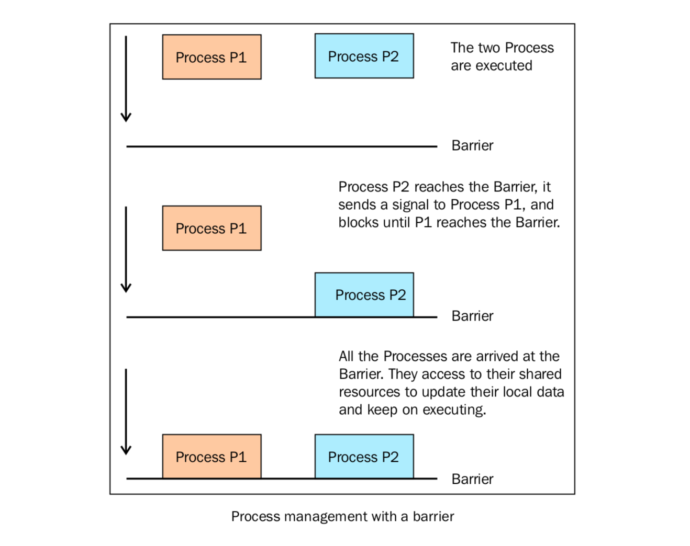

进程如何同步
============

多个进程可以协同工作来完成一项任务。通常需要共享数据。所以在多进程之间保持数据的一致性就很重要了。需要共享数据协同的进程必须以适当的策略来读写数据。相关的同步原语和线程的库很类似。

进程的同步原语如下：

- **Lock**: 这个对象可以有两种装填：锁住的（locked）和没锁住的（unlocked）。一个Lock对象有两个方法， ``acquire()`` 和 ``release()`` ，来控制共享数据的读写权限。
- **Event**: 实现了进程间的简单通讯，一个进程发事件的信号，另一个进程等待事件的信号。 ``Event`` 对象有两个方法， ``set()`` 和 ``clear()`` ，来管理自己内部的变量。
- **Condition**: 此对象用来同步部分工作流程，在并行的进程中，有两个基本的方法： ``wait()`` 用来等待进程， ``notify_all()`` 用来通知所有等待此条件的进程。
- **Semaphore**: 用来共享资源，例如，支持固定数量的共享连接。
- **Rlock**: 递归锁对象。其用途和方法同 ``Threading`` 模块一样。
- **Barrier**: 将程序分成几个阶段，适用于有些进程必须在某些特定进程之后执行。处于障碍（Barrier）之后的代码不能同处于障碍之前的代码并行。  

|how|
-----

下面的代码展示了如何使用 ``barrier()`` 函数来同步两个进程。我们有4个进程，进程1和进程2由barrier语句管理，进程3和进程4没有同步策略。 ::

        import multiprocessing
        from multiprocessing import Barrier, Lock, Process
        from time import time
        from datetime import datetime

        def test_with_barrier(synchronizer, serializer):
            name = multiprocessing.current_process().name
            synchronizer.wait()
            now = time()
            with serializer:
                print("process %s ----> %s" % (name, datetime.fromtimestamp(now)))

        def test_without_barrier():
            name = multiprocessing.current_process().name
            now = time()
            print("process %s ----> %s" % (name, datetime.fromtimestamp(now)))

        if __name__ == '__main__':
            synchronizer = Barrier(2)
            serializer = Lock()
            Process(name='p1 - test_with_barrier', target=test_with_barrier, args=(synchronizer,serializer)).start()
            Process(name='p2 - test_with_barrier', target=test_with_barrier, args=(synchronizer,serializer)).start()
            Process(name='p3 - test_without_barrier', target=test_without_barrier).start()
            Process(name='p4 - test_without_barrier', target=test_without_barrier).start()

运行下面的代码，将看到进程1和进程2在同一时间打印： ::

        $ python process_barrier.py
        process p1 - test_with_barrier ----> 2015-05-09 11:11:33.291229
        process p2 - test_with_barrier ----> 2015-05-09 11:11:33.291229
        process p3 - test_without_barrier ----> 2015-05-09 11:11:33.310230
        process p4 - test_without_barrier ----> 2015-05-09 11:11:33.333231

（译者注：译者在实际运行了10次，没有一次时间是相同的，感觉这个地方同一时间打印出来的影响因素很多。只能看到 ``with_barrier`` 的进程1和2比 ``without_barrier`` 的进程3和4时间差的小很多。）

|work|
------

在主程序中，我们创建了四个进程，然后我们需要一个锁和一个barrier来进程同步。barrier声明的第二个参数代表要管理的进程总数： ::

        if __name__ == '__main__':
            synchronizer = Barrier(2)
            serializer = Lock()
            Process(name='p1 - test_with_barrier', target=test_with_barrier, args=(synchronizer,serializer)).start()
            Process(name='p2 - test_with_barrier', target=test_with_barrier, args=(synchronizer,serializer)).start()
            Process(name='p3 - test_without_barrier', target=test_without_barrier).start()
            Process(name='p4 - test_without_barrier', target=test_without_barrier).start()

``test_with_barrier`` 函数调用了barrier的 ``wait()`` 方法： ::

        def test_with_barrier(synchronizer, serializer):
            name = multiprocessing.current_process().name
            synchronizer.wait()

当两个进程都调用 ``wait()`` 方法的时候，它们会一起继续执行： ::

    now = time()
    with serializer:
        print("process %s ----> %s" % (name, datetime.fromtimestamp(now)))

下面这幅图表示了barrier如何同步两个进程：

