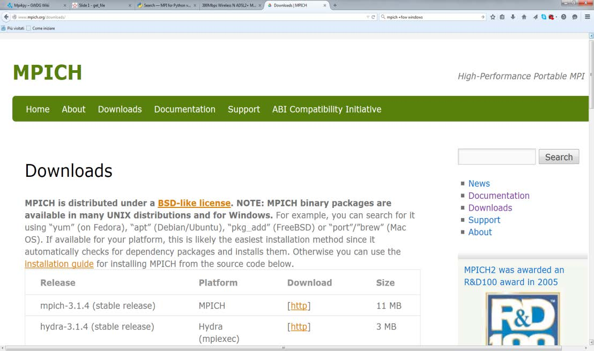
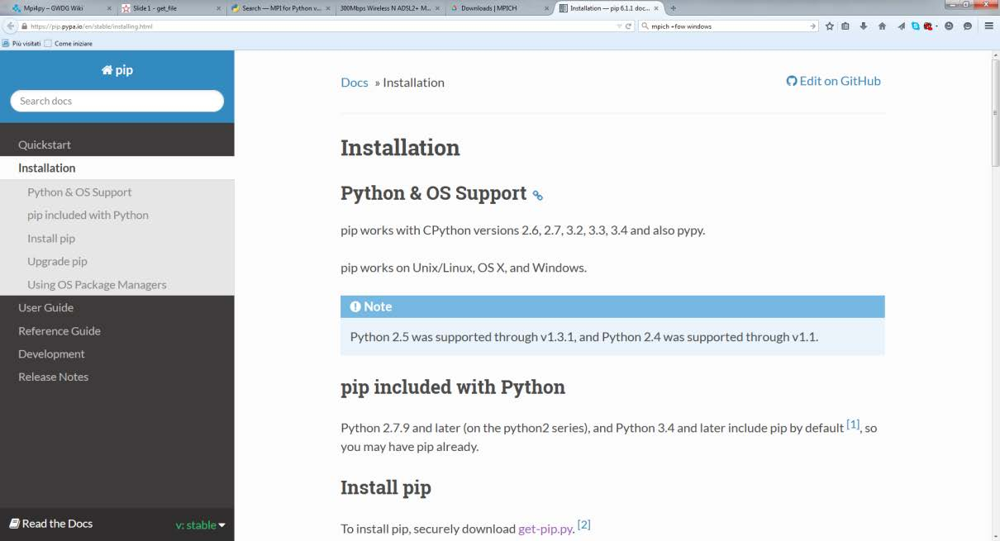
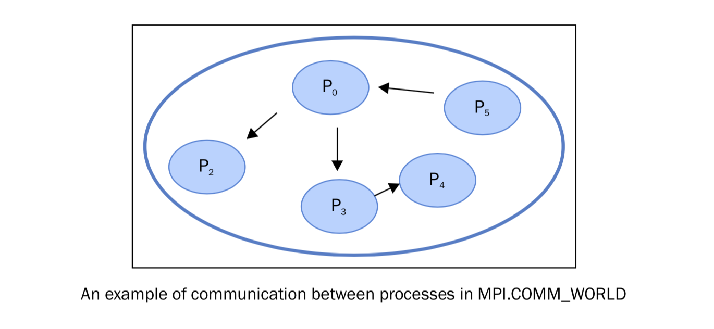

使用Python的mpi4py模块
======================

Python 提供了很多MPI模块写并行程序。其中 ``mpi4py`` 是一个又有意思的库。它在MPI-1/2顶层构建，提供了面向对象的接口，紧跟C++绑定的 MPI-2。MPI的C语言用户可以无需学习新的接口就可以上手这个库。所以，它成为了Python中最广泛使用的MPI库。

此模块包含的主要应用有：

- 点对点通讯
- 集体通讯
- 拓扑

|ready|
-------

在Windows中安装 ``mpi4py`` 的过程如下（其他操作系统可以参考 http://mpi4py.scipy.org/docs/usrman/install.html ）:

1. 从MPI软件库( http://www.mpich.org/downloads/ )下载 ``mpich`` 。

2. 右键图标，选择“以管理员身份运行”。
3. 以管理员身份运行 ``msiexec /i mpich_installation_file.msi`` 安装MPICH2。
4. 安装的时候，选择 “为所有用户安装” 。
5. 运行 ``wmpiconfig`` 存储用户名密码，使用你的windows登录的用户名和密码。
6. 添加 ``C:\Program Files\MPICH2\bin`` 到系统路径，无需重启。
7. 使用 ``smpd- status`` 检查 ``smpd`` ，应该返回 ``smpd running on $hostname$`` 。
8. 到 ``$MPICHROOT\examples`` 文件夹使用 ``mpiexec -n 4 cpi`` 运行 ``cpi.exe`` 检查运行环境。
9. 从 https://pip.pypa.io/en/stable/installing.html 下载Python包管理工具 ``pip`` 。它会在你的Python环境生成一个 ``pip.exe`` 。

10. 在命令行安装 ``mpi4py`` ：
    
    C:> pip install mpi4py

|how|
-----

让我们通过打印“Hello world”来开始MPI之旅： ::

    # hello.py
    from mpi4py import MPI
    comm = MPI.COMM_WORLD
    rank = comm.Get_rank()
    print("hello world from process ", rank)

通过下面的命令执行代码： ::

        C:> mpiexec  -n 5 python  helloWorld_MPI.py

执行结果将得到如下的输出： ::

        ('hello world from process ', 1)
        ('hello world from process ', 0)
        ('hello world from process ', 2)
        ('hello world from process ', 3)
        ('hello world from process ', 4)

|work|
------

在MPI中，并行程序中不同进程用一个非负的整数来区别，叫做rank。如果我们有p个进程，那么rank会从 ``0`` 到 ``p-1`` 分配。MPI中拿到rank的函数如下： ::

        rank = comm.Get_rank()

这个函数返回调用它的进程的rank。 ``comm`` 叫做交流者（Communicator），用于区别不同的进程集合： ::

        comm = MPI.COMM_WORLD

|more|
------

需要注意是，插图中的输出顺序并不是确定的，你不一定能得到插图的输出结果。多进程在同一时间启动，操作系统会决定运行的顺序。但是从中我们可以看出，MPI在每个进程中运行相同的二进制代码，每一个进程都执行相同的指令。
