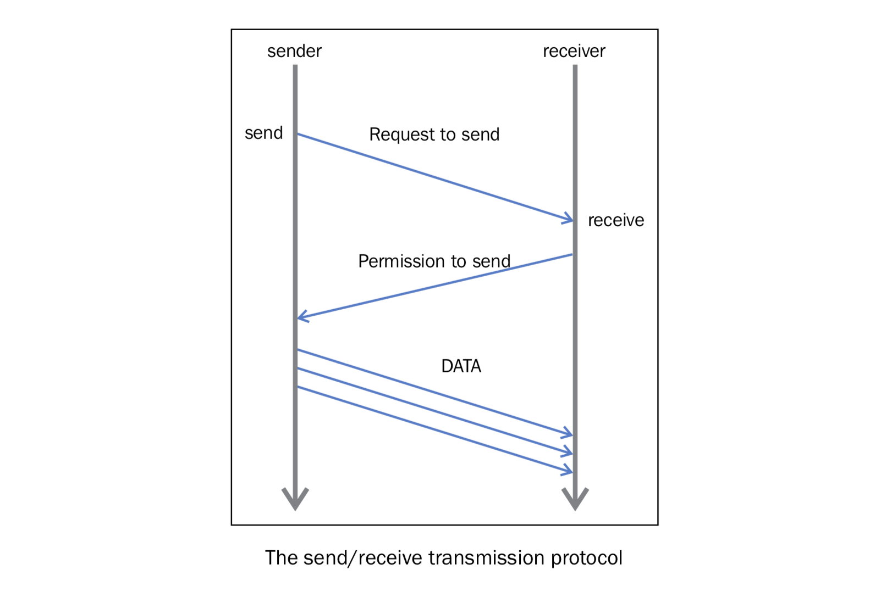

点对点通讯
==========

MPI提供的最实用的一个特性是点对点通讯。两个不同的进程之间可以通过点对点通讯交换数据：一个进程是接收者，一个进程是发送者。

Python的 ``mpi4py`` 通过下面两个函数提供了点对点通讯功能：

- ``Comm.Send(data, process_destination)``: 通过它在交流组中的排名来区分发送给不同进程的数据
- ``Comm.Recv(process_source)``: 接收来自源进程的数据，也是通过在交流组中的排名来区分的

``Comm`` 变量表示交流者，定义了可以互相通讯的进程组： ::

    comm = MKPI.COMM_WORLD

|how|
-----

下面的例子展示了如何使用 ``comm.send`` 和 ``comm.recv`` 指令在不同的进程之间交换信息。 ::

        from mpi4py import MPI
        comm = MPI.COMM_WORLD
        rank = comm.rank
        print("my rank is : " , rank)

        if rank == 0:
            data = 10000000
            destination_process = 4
            comm.send(data,dest=destination_process)
            print("sending data % s " % data + "to process % d" % destination_process)

        if rank == 1:
            destination_process = 8
            data = "hello"
            comm.send(data,dest=destination_process)
            print("sending data % s :" % data + "to process % d" % destination_process)

        if rank == 4:
           data = comm.recv(source = 0)
           print("data received is = % s" % data)

        if rank == 8:
           data1 = comm.recv(source = 1)
           print("data1 received is = % s" % data1)

运行脚本的命令如下： ::

    $ mpiexec -n 9 python pointToPointCommunication.py

得到的输出如下： ::

    ('my rank is : ', 5)
    ('my rank is : ', 1)
    sending data hello :to process 8
    ('my rank is : ', 3)
    ('my rank is : ', 0)
    sending data 10000000 to process 4
    ('my rank is : ', 2)
    ('my rank is : ', 7)
    ('my rank is : ', 4)
    data received is = 10000000
    ('my rank is : ', 8)
    data1 received is = hello
    ('my rank is : ', 6)

|work|
------

我们将最大进程数设置为9来运行程序。所以在交流者组 ``comm`` 中，我们可以有9个互相通讯的进程。： ::

    comm = MPI.COMM_WORLD

同时，我们使用 ``rand`` 值来区分每个进程： ::

    rank = comm.rand

我们有两个发送者进程和两个接受者进程。rank值为0的进程会发送数据给rank值为4的接受者：  ::

        if rank==0:
            data= 10000000
            destination_process = 4
            comm.send(data,dest=destination_process)

同样的，我们可以必须指定rank值为4的进程为接收者。然后我们指定rank变量来调用 ``comm.recv`` 命令。 ::

    ...
    if rank == 4:
        data = comm.recv(source=0)

对于另外一组发送者和接收者，我们指定rank为1的作为发送者，rank为8的作为接收者。与上一组只有一点不同，这一组发送的数据类型是String。  ::

        if rank==1:
               destination_process = 8
               data= "hello"
               comm.send(data,dest=destination_process)

对于接收者来说，需要指定发送者的rank。 ::

        if rank==8:
               data1=comm.recv(source=1)

下图展示了 ``mpi4py`` 的点对点通讯协议:

整个过程分为两部分，发送者发送数据，接收者接收数据，二者必须都指定发送方/接收方。

|more|
------

``comm.send()`` 和 ``comm.recv()`` 函数都是阻塞的函数。他们会一直阻塞调用者，知道数据使用完成。同时在MPI中，有两种方式发送和接收数据：

- buffer模式
- 同步模式

在buffer模式中，只要需要发送的数据被拷贝到buffer中，执行权就会交回到主程序，此时数据并非已经发送/接收完成。在同步模式中，只有函数真正的结束发送/接收任务之后才会返回。
