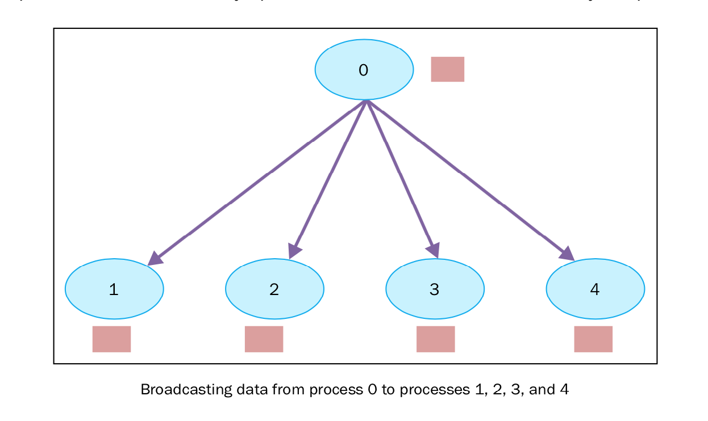

集体通讯：使用broadcast通讯
===========================

在并行代码的开发中，我们会经常发现需要在多个进程间共享某个变量运行时的值，或操作多个进程提供的变量（可能具有不同的值)。

为了解决这个问题，使用了通讯数。举例说，如果进程0要发送信息给进程1和进程2，同时也会发送信息给进程3，4，5，6，即使这些进程并不需要这些信息。

另外，MPI库提供了在多个进程之间交换信息的方法，针对执行的机器做了优化。

将所有进程变成通讯者的这种方法叫做集体交流。因此，一个集体交流通常是2个以上的进程。我们也可以叫它广播——一个进程发送消息给其他的进程。 ``mpi4py`` 模块通过以下的方式提供广播的功能： ::

    buf = comm.bcast(data_to_share, rank_of_root_process)

这个函数将root消息中包含的信息发送给属于 ``comm`` 通讯组其他的进程，每个进程必须通过相同的 ``root`` 和 ``comm`` 来调用它。

|how|
-----

下面来通过一个例子理解广播函数。我们有一个root进程， ``rank`` 等于0，保存自己的数据 ``variable_to_share`` ，以及其他定义在通讯组中的进程。  ::
    
    from mpi4py import MPI
    comm = MPI.COMM_WORLD
    rank = comm.Get_rank()
    if rank == 0:
        variable_to_share = 100
    else:
        variable_to_share = None
    variable_to_share = comm.bcast(variable_to_share, root=0)
    print("process = %d" %rank + " variable shared  = %d " %variable_to_share)

和一个拥有10个进程的通讯组的执行输出结果如下： ::

        C:\>mpiexec -n 10 python broadcast.py
        process = 0 variable shared  = 100
        process = 8 variable shared  = 100
        process = 2 variable shared  = 100
        process = 3 variable shared  = 100
        process = 4 variable shared  = 100
        process = 5 variable shared  = 100
        process = 9 variable shared  = 100
        process = 6 variable shared  = 100
        process = 1 variable shared  = 100
        process = 7 variable shared  = 100

|work|
------

``rank`` 等于0的root进程初始化了一个变量， ``variable_to_share`` ，值为100.这个变量将通过通讯组发送给其他进程。::

    if rank == 0:
        variable_to_share = 100

为了发送消息，我们声明了一个广播： ::

    variable_to_share = comm.bcast(variable_to_share, root=0)

这里，函数的变量是要发送的数据和发送者的进程。当我们执行代码的时候，在我们的例子中，我们有一个10个进程的通讯组， ``variable_to_share`` 变量将发送给组中的其他进程。最后 ``print`` 函数打印出来运行的进程和它们的变量： ::

    print("process = %d" %rank + " variable shared  = %d " %variable_to_share)

|more|
------

集体通讯允许组中的多个进程同时进行数据交流。在 ``mpi4py`` 模块中，只提供了阻塞版本的集体通讯（阻塞调用者，直到缓存中的数据全部安全发送。）

广泛应用的集体通讯应该是：

1. 组中的进程提供通讯的屏障
2. 通讯方式包括：

   - 将一个进程的数据广播到组中其他进程中
   - 从其他进程收集数据发给一个进程
   - 从一个进程散播数据散播到其他进程中
3. 减少操作
