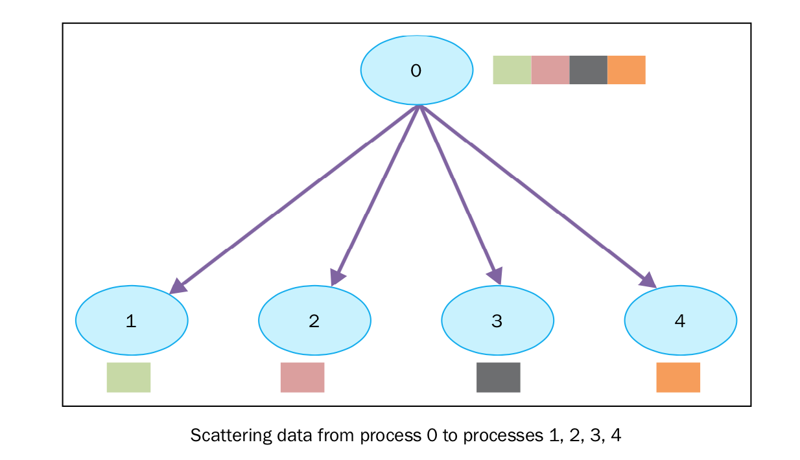

集体通讯：使用scatter通讯
=========================

scatter函数和广播很像，但是有一个很大的不同， ``comm.bcast`` 将相同的数据发送给所有在监听的进程， ``comm.scatter`` 可以将数据放在数组中，发送给不同的进程。下图展示了scatter的功能：

``comm.scatter`` 函数接收一个array，根据进程的rank将其中的元素发送给不同的进程。比如第一个元素将发送给进程0，第二个元素将发送给进程1，等等。 ``mpi4py`` 中的函数原型如下： ::

        recvbuf  = comm.scatter(sendbuf, rank_of_root_process)

|how|
-----

在下面的例子中，我们将观察数据是如何通过 ``scatter`` 发送给不同的进程的： ::

    from mpi4py import MPI
    comm = MPI.COMM_WORLD
    rank = comm.Get_rank()
    if rank == 0:
        array_to_share = [1, 2, 3, 4 ,5 ,6 ,7, 8 ,9 ,10]
    else:
        array_to_share = None
    recvbuf = comm.scatter(array_to_share, root=0)
    print("process = %d" %rank + " recvbuf = %d " %recvbuf)

运行代码的输出如下： ::

        C:\>mpiexec -n 10 python scatter.py
        process = 0 variable shared  = 1
        process = 4 variable shared  = 5
        process = 6 variable shared  = 7
        process = 2 variable shared  = 3
        process = 5 variable shared  = 6
        process = 3 variable shared  = 4
        process = 7 variable shared  = 8
        process = 1 variable shared  = 2
        process = 8 variable shared  = 9
        process = 9 variable shared  = 10

|work|
------

rank为0的进程将 ``array_to_share`` 的数据发送给其他进程： ::

        array_to_share = [1, 2, 3, 4 ,5 ,6 ,7, 8 ,9 ,10]

``recvbuf`` 参数表示第i个变量将会通过 ``comm.scatter`` 发送给第i个进程： ::

    recvbuf = comm.scatter(array_to_share, root=0)

这里需要注意， ``comm.scatter`` 有一个限制，发送数据的列表中元素的个数必须和接收的进程数相等。举个例子，如果列表中的个数比进程数多，就会看到如下错误： ::

		C:\> mpiexec -n 3 python scatter.py
		Traceback (most recent call last):
		   File "scatter.py", line 13, in <module>
		     recvbuf = comm.scatter(array_to_share, root=0)
		   File "Comm.pyx", line 874, in mpi4py.MPI.Comm.scatter (c:\users\utente\appdata\local\temp\pip-build-h14iaj\mpi4py\src\mpi4py.MPI.c:73400)
		   File "pickled.pxi", line 658, in mpi4py.MPI.PyMPI_scatter (c:\users\utente\appdata\local\temp\pip-build-h14iaj\mpi4py\src\mpi4py.MPI.c:34035)
           File "pickled.pxi", line 129, in mpi4py.MPI._p_Pickle.dumpv (c:\users\utente\appdata\local\temp\pip-build-h14iaj\mpi4py\src\mpi4py.MPI.c:28325)
		   ValueError: expecting 3 items, got 10 mpiexec aborting job...
		   job aborted:
		   rank: node: exit code[: error message]
		   0: Utente-PC: 123: mpiexec aborting job
		   1: Utente-PC: 123
		   2: Utente-PC: 123

|more|
------

``mpi4py`` 还提供了两个其他的函数来散布数据：

- ``comm.scatter(sendbuf, recvbuf, root=0)``: 在communicator中从一个进程向其他的进程发送数据。
- ``comm.scatterv(sendbuf, recvbuf, root=0)``: 将数据从一个进程发送到组中的其他进程，在发送端提供不同数量的数据和偏移。

``sendbuf`` 和 ``recvbuf`` 参数必须以list的形式给出（用于点对点的 ``comm.send`` 函数）： ::

    buf = [data, data_size, data_type]

``data`` 必须是一个buffer-like的对象，size等于 ``data_size`` ，类型是 ``data_type`` 。
