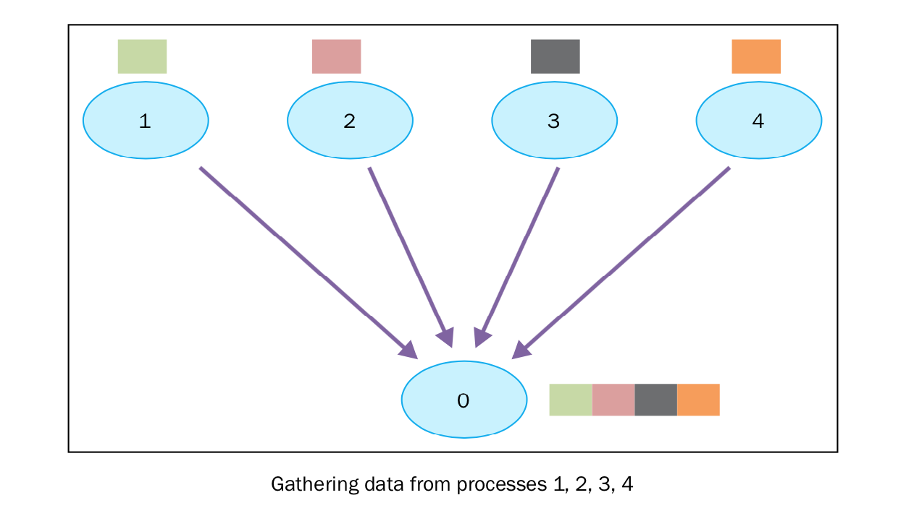

集体通讯：使用gather通讯
========================

``gather`` 函数基本上是反向的 ``scatter`` ，即手机所有进程发送向root进程的数据。 ``mpi4py`` 实现的 ``gather`` 函数如下： ::

    recvbuf = comm.gather(sendbuf, rank_of_root_process)

这里， ``sendbuf`` 是要发送的数据， ``rank_of_root_process`` 代表要接收数据进程。

|how|
-----

在接下来的例子中，我们想实现上图表示的过程。每一个进程都构建自己的数据，发送给root进程（rank为0）。 ::

        from mpi4py import MPI
        comm = MPI.COMM_WORLD
        size = comm.Get_size()
        rank = comm.Get_rank()
        data = (rank+1)**2
        data = comm.gather(data, root=0)
        if rank == 0:
            print ("rank = %s " %rank + "...receiving data to other process")
            for i in range(1, size):
                data[i] = (i+1)**2
                value = data[i]
                print(" process %s receiving %s from process %s" % (rank , value , i))

最后，我们用5个进程来演示： ::

        C:\>mpiexec -n 5 python gather.py
        rank = 0 ...receiving data to other process
        process 0 receiving 4 from process 1
        process 0 receiving 9 from process 2
        process 0 receiving 16 from process 3
        process 0 receiving 25 from process 4

结果正如图中一样，root进程收到了其他四个进程的数据。

|work|
------

首先，我们有n个进程发送各自的数据： ::

        data = (rank+1)**2

如果rank是0，就在array中收集数据： ::        

        if rank == 0:
            print ("rank = %s " %rank + "...receiving data to other process")
            for i in range(1, size):
                data[i] = (i+1)**2
                value = data[i]
                print(" process %s receiving %s from process %s" % (rank , value , i)) 

数据由下面的函数产生: ::

    data = (rank+1)**2

|more|
------

``mpi4py`` 提供了下面的函数收集数据：

- **gathering to one task**: ``comm.Gather``, ``comm.Gatherv``, 和 ``comm.gather``
- **gathering to all tasks**: ``comm.Allgather``, ``comm.Allgatherv``, 和 ``comm.allgather``
