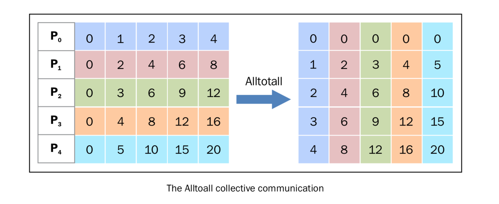

使用Alltoall通讯
================

``Alltoall`` 集体通讯结合了 ``scatter`` 和 ``gather`` 的功能。在 ``mpi4py`` 中，有以下三种类型的 ``Alltoall`` 集体通讯。

- ``comm.Alltoall(sendbuf, recvbuf)`` : 
- ``comm.Alltoallv(sendbuf, recvbuf)`` :
- ``comm.Alltoallw(sendbuf, recvbuf)`` :

|how|
-----

在下面的例子中，我们将看到 ``mpi4py`` 是如何实现 ``comm.Alltoall`` 的。我们定义了进程的通讯者组，进程可以在组中接收或发送数据，格式为数字数据的数组。 ::
    
    from mpi4py import MPI
    import numpy

    comm = MPI.COMM_WORLD
    size = comm.Get_size()
    rank = comm.Get_rank()
    a_size = 1

    senddata = (rank+1)*numpy.arange(size,dtype=int)
    recvdata = numpy.empty(size*a_size,dtype=int)

    comm.Alltoall(senddata,recvdata)
    print(" process %s sending %s receiving %s" % (rank , senddata , recvdata))

运行代码，设定通讯者组的进程数为5，输出如下： ::

    C:\>mpiexec -n 5 python alltoall.py
    process 0 sending [0 1 2 3 4] receiving [0 0 0 0 0]
    process 1 sending [0 2 4 6 8] receiving [1 2 3 4 5]
    process 2 sending [0 3 6 9 12] receiving [2 4 6 8 10]
    process 3 sending [0 4 8 12 16] receiving [3 6 9 12 15]
    process 4 sending [0 5 10 15 20] receiving [4 8 12 16 20]

|how|
-----

``comm.alltoall`` 方法将 task ``j`` 的中 ``sendbuf`` 的第i个对象拷贝到 task ``i`` 中 ``recvbuf`` 的第j个对象（接收者收到的对象和发送者一一对应，发送者发送的对象和接收者一一对应，译者注）。

下图可以表示这个发送过程。

从图中我们可以观察到：

- **P0** 包含数据 [0 1 2 3 4]，它将 **0** 赋值给自己， **1** 传给进程 **P1** ， **2** 传给进程 **P2** ， **3** 传给进程 **P3** ， **4** 传给进程 **P4** 。
- 以此类推……

|more|
------

All-to-all 定制通讯也叫做全部交换。这种操作经常用于各种并行算法中，比如快速傅里叶变换，矩阵变换，样本排序以及一些数据库的 Join 操作。
