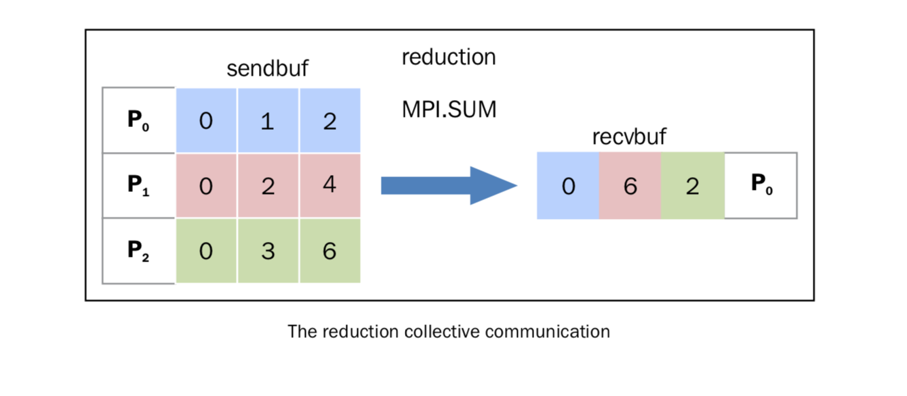

简化操作
========

同 ``comm.gather`` 一样， ``comm.reduce`` 接收一个数组，每一个元素是一个进程的输入，然后返回一个数组，每一个元素是进程的输出，返回给 root 进程。输出的元素中包含了简化的结果。

在 ``mpi4py`` 中，我们将简化操作定义如下： ::

    comm.Reduce(sendbuf, recvbuf, rank_of_root_process, op = type_of_reduction_operation)

这里需要注意的是，这里有个参数 ``op`` 和 ``comm.gather`` 不同，它代表你想应用在数据上的操作， ``mpi4py`` 模块代表定义了一系列的简化操作，其中一些如下：

- ``MPI.MAX`` : 返回最大的元素
- ``MPI.MIN`` : 返回最小的元素
- ``MPI.SUM`` : 对所有元素相加
- ``MPI.PROD`` : 对所有元素相乘
- ``MPI.LAND`` : 对所有元素进行逻辑操作
- ``MPI.MAXLOC`` : 返回最大值，以及拥有它的进程
- ``MPI.MINLOC`` : 返回最小值，以及拥有它的进程

|how|
-----

现在，我们用 ``MPI.SUM`` 实验一下对结果进行相加的操作。每一个进程维护一个大小为 3 的数组，我们用 ``numpy`` 来操作这些数组： ::

    import numpy
    import numpy as np
    from mpi4py import MPI
    comm = MPI.COMM_WORLD
    size = comm.size
    rank = comm.rank
    array_size = 3
    recvdata = numpy.zeros(array_size, dtype=numpy.int)
    senddata = (rank+1)*numpy.arange(size,dtype=numpy.int)
    print("process %s sending %s " % (rank , senddata))
    comm.Reduce(senddata, recvdata, root=0, op=MPI.SUM)
    print('on task', rank, 'after Reduce:    data = ', recvdata)

我们用通讯组进程数为 3 来运行，等于维护的数组的大小。输出的结果如下： ::

       C:\>mpiexec -n 3 python reduction2.py
        process 2 sending [0 3 6]
       on task 2 after Reduce:    data =  [0 0 0]
        process 1 sending [0 2 4]
       on task 1 after Reduce:    data =  [0 0 0]
        process 0 sending [0 1 2]
       on task 0 after Reduce:    data =  [ 0  6 12]

|work|
------

为了演示相加简化操作，我们使用 ``comm.Reduce`` 语句，并将含有 ``recvbuf`` 的 rank 设置为 0, ``recvdata`` 代表了最后的计算结果： ::

    comm.Reduce(senddata, recvdata, root=0, op=MPI.SUM)

我们的 ``op = MPI.SUM`` 选项，将在所有的列上面应用求和操作。下图表示了这个步骤：

操作的过程如下：

- 进程 **P0** 发出数据数组 [0 1 2] 
- 进程 **P1** 发出数据数组 [0 2 4] 
- 进程 **P2** 发出数据数组 [0 3 6] 

简化操作将每个 task 的第 i 个元素相加，然后放回到 **P0** 进程的第 i 个元素中。在接收操作中， **P0** 收到数据 [0 6 12]。

（译注：“简化”翻译的可能不太合适）
