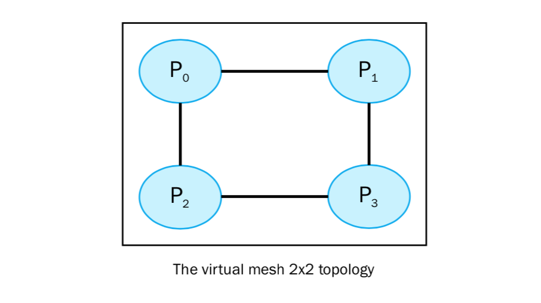
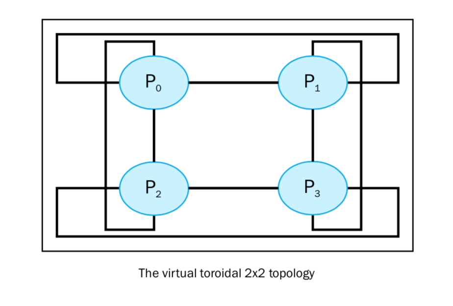

如何优化通讯
============

拓扑是 MPI 提供的一个有趣功能。如前所述，所有通信功能（点对点或集体）都是指一组进程。我们一直使用包含所有进程的 ``MPI_COMM_WORLD`` 组。它为大小为n的通信组的每个进程分配 0 - n-1 的一个rank。但是，MPI允许我们为通信器分配虚拟拓扑。它为不同的进程定义了特定的标签分配。这种机制可以提高执行性能。实际上，如果构建虚拟拓扑，那么每个节点将只与其虚拟邻居进行通信，从而优化性能。

例如，如果排名是随机分配的，则消息可能会在到达目的地之前被迫传递给许多其他节点。除了性能问题之外，虚拟拓扑还可确保代码更清晰可读。 MPI提供两种建筑拓扑。第一个构造创建笛卡尔拓扑，而后者可以创建任何类型的拓扑。具体来说，在第二种情况下，我们必须提供要构建的图形的邻接矩阵。我们将只处理笛卡尔拓扑，通过它可以构建多种广泛使用的结构：网格，环形，环形等等。用于创建笛卡尔拓扑的函数如下所示： ::

    comm.Create_cart((number_of_rows,number_of_columns))

这里， ``number_of_rows`` 和 ``number_of_columns`` 指定了栅格的行列数。

|how|
-----

在下面的例子中，我们将展示如何实现一个 M x N 的笛卡尔拓扑。同时，我们也定义了一系列坐标展示进程是如何操作的： ::

    from mpi4py import MPI
    import numpy as np
    UP = 0
    DOWN = 1
    LEFT = 2
    RIGHT = 3
    neighbour_processes = [0,0,0,0]

    if __name__ == "__main__":
        comm = MPI.COMM_WORLD
        rank = comm.rank
        size = comm.size
        grid_rows = int(np.floor(np.sqrt(comm.size)))
        grid_column = comm.size // grid_rows
        if grid_rows*grid_column > size:
            grid_column -= 1
        if grid_rows*grid_column > size:
            grid_rows -= 1
        if (rank == 0) :
            print("Building a %d x %d grid topology:" % (grid_rows, grid_column) )
        cartesian_communicator = comm.Create_cart( (grid_rows, grid_column), periods=(True, True), reorder=True)
        my_mpi_row, my_mpi_col = cartesian_communicator.Get_coords( cartesian_communicator.rank )
        neighbour_processes[UP], neighbour_processes[DOWN] = cartesian_communicator.Shift(0, 1)
        neighbour_processes[LEFT], neighbour_processes[RIGHT] =  cartesian_communicator.Shift(1, 1)
        print ("Process = %s row = %s column = %s ----> neighbour_processes[UP] = %s neighbour_processes[DOWN] = %s neighbour_processes[LEFT] =%s neighbour_processes[RIGHT]=%s" % (
        rank, my_mpi_row, my_mpi_col,neighbour_processes[UP],
        neighbour_processes[DOWN], neighbour_processes[LEFT],
        neighbour_processes[RIGHT]))

运行以上代码得到的结果如下： ::

    C:\>mpiexec -n 4 python virtualTopology.py
    Building a 2 x 2 grid topology:
    Process = 0 row = 0 column = 0 ---->
    neighbour_processes[UP] = -1
    neighbour_processes[DOWN] = 2
    neighbour_processes[LEFT] =-1
    neighbour_processes[RIGHT]=1
    Process = 1 row = 0 column = 1 ---->
    neighbour_processes[UP] = -1
    neighbour_processes[DOWN] = 3
    neighbour_processes[LEFT] =0
    neighbour_processes[RIGHT]=-1
    Process = 2 row = 1 column = 0 ---->
    neighbour_processes[UP] = 0
    neighbour_processes[DOWN] = -1
    neighbour_processes[LEFT] =-1
    neighbour_processes[RIGHT]=3
    Process = 3 row = 1 column = 1 ---->
    neighbour_processes[UP] = 1
    neighbour_processes[DOWN] = -1
    neighbour_processes[LEFT] =2
    neighbour_processes[RIGHT]=-1

对于每一个进程，输出结果都是：如果 ``neighbour_processes = -1`` ，那么没有临近的拓扑，否则， ``neighbour_processes`` 显示最近的进程。

|work|
------

最后的拓扑是 2x2 的网状结构，大小为4，和进程数一样： ::

        grid_rows = int(np.floor(np.sqrt(comm.size)))
        grid_column = comm.size // grid_rows
        if grid_rows*grid_column > size:
            grid_column -= 1
        if grid_rows*grid_column > size:
            grid_rows -= 1

然后，建立笛卡尔拓扑： ::

        cartesian_communicator = comm.Create_cart( (grid_rows, grid_column), periods=(True, True), reorder=True)

通过 ``Get_coords()`` 方法，我们可以确定一个进程的坐标: ::

        my_mpi_row, my_mpi_col = cartesian_communicator.Get_coords( cartesian_communicator.rank )

上面的拓扑可以用下图表示：

|more|
------

如果要得到一个 M x N 的环形拓扑，我们需要如下代码： ::

    cartesian_communicator = comm.Create_cart( (grid_rows, grid_column), periods=(True, True), reorder=True)

输入将如下所示： ::

    C:\>mpiexec -n 4 python VirtualTopology.py
    Building a 2 x 2 grid topology:
    Process = 0 row = 0 column = 0 ---->
    neighbour_processes[UP] = 2
    neighbour_processes[DOWN] = 2
    neighbour_processes[LEFT] =1
    neighbour_processes[RIGHT]=1
    Process = 1 row = 0 column = 1 ---->
    neighbour_processes[UP] = 3
    neighbour_processes[DOWN] = 3
    neighbour_processes[LEFT] =0
    neighbour_processes[RIGHT]=0
    Process = 2 row = 1 column = 0 ---->
    neighbour_processes[UP] = 0
    neighbour_processes[DOWN] = 0
    neighbour_processes[LEFT] =3 neighbour_processes[RIGHT]=3
    Process = 3 row = 1 column = 1 ---->
    neighbour_processes[UP] = 1
    neighbour_processes[DOWN] = 1
    neighbour_processes[LEFT] =2
    neighbour_processes[RIGHT]=2
 
拓扑图形如下所示:

