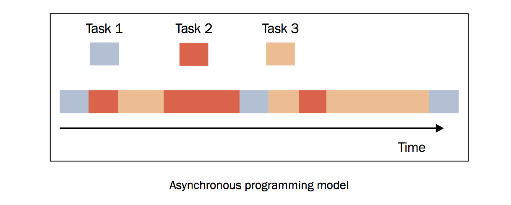

介绍
====

除了顺序执行和并行执行的模型之外，还有第三种模型，叫做异步模型，这是事件驱动模型的基础。异步活动的执行模型可以只有一个单一的主控制流，能在单核心系统和多核心系统中运行。

在并发执行的异步模型中，许多任务被穿插在同一时间线上，所有的任务都由一个控制流执行（单一线程）。任务的执行可能被暂停或恢复，中间的这段时间线程将会去执行其他任务。下面的这幅图可以清楚地表达这个概念。

如上图所示，任务（不同的颜色表示不同的任务）可能被其他任务插入，但是都处在同一个线程下。这表明，当某一个任务执行的时候，其他的任务都暂停了。与多线程编程模型很大的一点不同是， *多线程由操作系统决定在时间线上什么时候挂起某个活动或恢复某个活动，而在异步并发模型中，程序员必须假设线程可能在任何时间被挂起和替换。*

程序员可以将任务编写成许多可以间隔执行的小步骤， *这样的话如果一个任务需要另一个任务的输出，那么被依赖的任务必须接收它的输入。*
