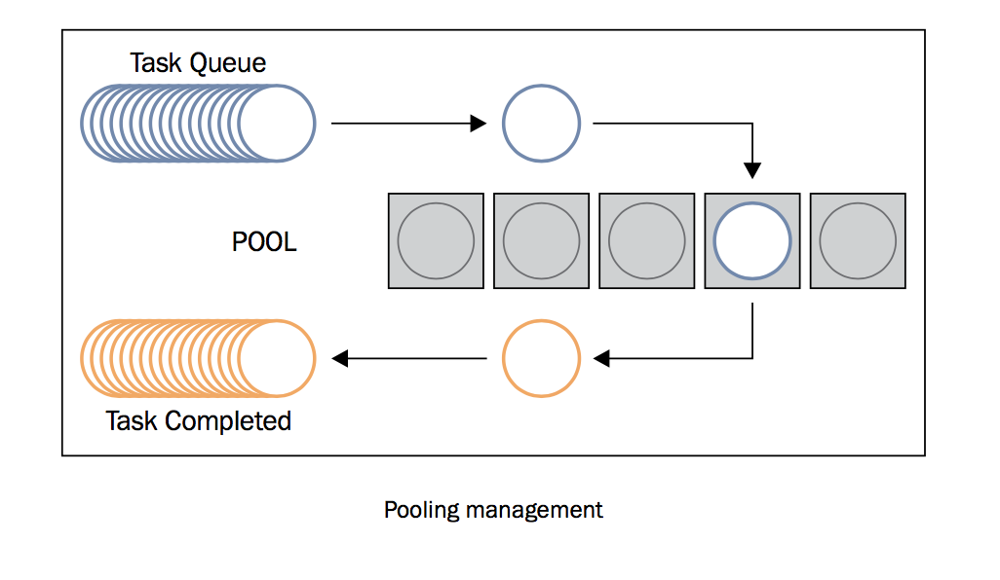

使用Python的 ``concurrent.futures`` 模块
========================================

Python3.2带来了 ``concurrent.futures`` 模块，这个模块具有线程池和进程池、管理并行编程任务、处理非确定性的执行流程、进程/线程同步等功能。

此模块由以下部分组成：

- ``concurrent.futures.Executor``: 这是一个虚拟基类，提供了异步执行的方法。
- ``submit(function, argument)``: 调度函数（可调用的对象）的执行，将 ``argument`` 作为参数传入。
- ``map(function, argument)``: 将 ``argument`` 作为参数执行函数，以 **异步** 的方式。
- ``shutdown(Wait=True)``: 发出让执行者释放所有资源的信号。
- ``concurrent.futures.Future``: 其中包括函数的异步执行。Future对象是submit任务（即带有参数的functions）到executor的实例。

Executor是抽象类，可以通过子类访问，即线程或进程的 ``ExecutorPools`` 。因为，线程或进程的实例是依赖于资源的任务，所以最好以“池”的形式将他们组织在一起，作为可以重用的launcher或executor。

使用线程池和进程池
------------------

线程池或进程池是用于在程序中优化和简化线程/进程的使用。通过池，你可以提交任务给executor。池由两部分组成，一部分是内部的队列，存放着待执行的任务；另一部分是一系列的进程或线程，用于执行这些任务。池的概念主要目的是为了重用：让线程或进程在生命周期内可以多次使用。它减少了创建创建线程和进程的开销，提高了程序性能。重用不是必须的规则，但它是程序员在应用中使用池的主要原因。

|ready|
-------

``current.Futures`` 模块提供了两种 ``Executor`` 的子类，各自独立操作一个线程池和一个进程池。这两个子类分别是：

- ``concurrent.futures.ThreadPoolExecutor(max_workers)``
- ``concurrent.futures.ProcessPoolExecutor(max_workers)``
 
``max_workers`` 参数表示最多有多少个worker并行执行任务。

|how|
-----

下面的示例代码展示了线程池和进程池的功能。这里的任务是，给一个list ``number_list`` ，包含1到10。对list中的每一个数字，乘以1+2+3...+10000000的和（这个任务只是为了消耗时间）。

下面的代码分别测试了：

- 顺序执行
- 通过有5个worker的线程池执行
- 通过有5个worker的进程池执行

（译者注：原文的代码是错误的，这里贴出的代码以及运行结果是修改后的，详见： `关于第四章第2节书中程序的疑问 #16 <https://github.com/laixintao/python-parallel-programming-cookbook-cn/issues/16>`_ ，感谢 `@Microndgt <https://github.com/Microndgt>`_ 提出）
代码如下：::

		import concurrent.futures
		import time
		number_list = [1, 2, 3, 4, 5, 6, 7, 8, 9, 10]

		def evaluate_item(x):
			# 计算总和，这里只是为了消耗时间
			result_item = count(x)
			# 打印输入和输出结果
			return result_item

		def  count(number) :
			for i in range(0, 10000000):
				i=i+1
			return i * number

		if __name__ == "__main__":
			# 顺序执行
			start_time = time.time()
			for item in number_list:
				print(evaluate_item(item))
			print("Sequential execution in " + str(time.time() - start_time), "seconds")
			# 线程池执行
			start_time_1 = time.time()
			with concurrent.futures.ThreadPoolExecutor(max_workers=5) as executor:
				futures = [executor.submit(evaluate_item, item) for item in number_list]
				for future in concurrent.futures.as_completed(futures):
					print(future.result())
			print ("Thread pool execution in " + str(time.time() - start_time_1), "seconds")
			# 进程池
			start_time_2 = time.time()
			with concurrent.futures.ProcessPoolExecutor(max_workers=5) as executor:
				futures = [executor.submit(evaluate_item, item) for item in number_list]
				for future in concurrent.futures.as_completed(futures):
					print(future.result())
			print ("Process pool execution in " + str(time.time() - start_time_2), "seconds")

运行这个代码，我们可以看到运行时间的输出：::

		$ python3 pool.py
		10000000
		20000000
		30000000
		40000000
		50000000
		60000000
		70000000
		80000000
		90000000
		100000000
		Sequential execution in 7.936585903167725 seconds
		10000000
		30000000
		40000000
		20000000
		50000000
		70000000
		90000000
		100000000
		80000000
		60000000
		Thread pool execution in 7.633088827133179 seconds
		40000000
		50000000
		10000000
		30000000
		20000000
		70000000
		90000000
		60000000
		80000000
		100000000
		Process pool execution in 4.787093639373779 seconds

|work|
------

我们创建了一个list存放10个数字，然后使用一个循环计算从1加到10000000，打印出和与 ``number_list`` 的乘积。::

        def evaluate_item(x):
            # 计算总和，这里只是为了消耗时间
            result_item = count(x)
            # 打印输入和输出结果
            print ("item " + str(x) + " result " + str(result_item))

        def  count(number) :
            for i in range(0, 10000000):
                i=i+1
            return i * number

在主要程序中，我们先使用顺序执行跑了一次程序：::

        if __name__ == "__main__":
            # 顺序执行
            start_time = time.clock()
            for item in number_list:
                evaluate_item(item)
            print("Sequential execution in " + str(time.clock() - start_time), "seconds")

然后，我们使用了 ``futures.ThreadPoolExecutor`` 模块的线程池跑了一次：::

    with concurrent.futures.ThreadPoolExecutor(max_workers=5) as executor:
        for item in number_list:
            executor.submit(evaluate_item,  item)
    print ("Thread pool execution in " + str(time.clock() - start_time_1), "seconds")

``ThreadPoolExecutor`` 使用线程池中的一个线程执行给定的任务。池中一共有5个线程，每一个线程从池中取得一个任务然后执行它。当任务执行完成，再从池中拿到另一个任务。

当所有的任务执行完成后，打印出执行用的时间：::

    print ("Thread pool execution in " + str(time.clock() - start_time_1), "seconds")

最后，我们又用 ``ProcessPoolExecutor`` 跑了一次程序：::

    with concurrent.futures.ProcessPoolExecutor(max_workers=5) as executor:
        for item in number_list:
            executor.submit(evaluate_item,  item)

如同 ``ThreadPoolExecutor`` 一样， ``ProcessPoolExecutor`` 是一个executor，使用一个线程池来并行执行任务。然而，和 ``ThreadPoolExecutor`` 不同的是， ``ProcessPoolExecutor`` 使用了多核处理的模块，让我们可以不受GIL的限制，大大缩短执行时间。

|more|
------

几乎所有需要处理多个客户端请求的服务应用都会使用池。然而，也有一些应用要求任务需要立即执行，或者要求对任务的线程有更多的控制权，这种情况下，池不是一个最佳选择。
