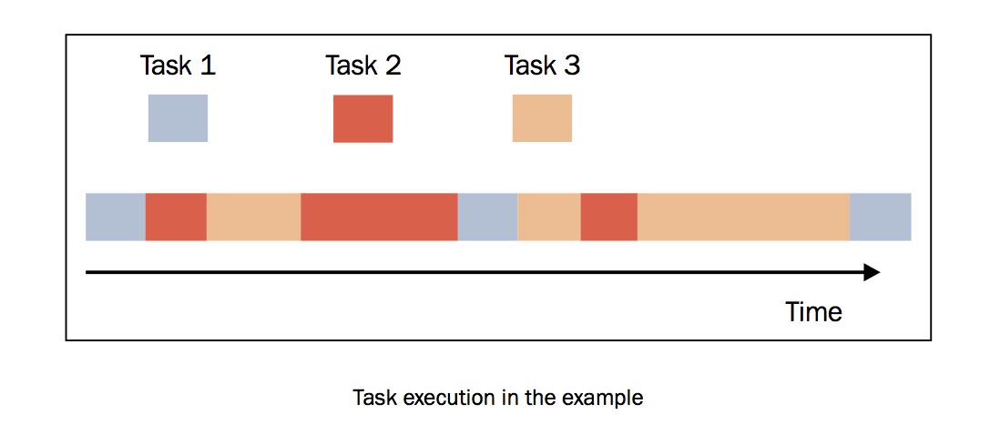

使用Asyncio管理事件循环
=======================

Python的Asyncio模块提供了管理事件、协程、任务和线程的方法，以及编写并发代码的原语。此模块的主要组件和概念包括：

- **事件循环**: 在Asyncio模块中，每一个进程都有一个事件循环。
- **协程**: 这是子程序的泛化概念。协程可以在执行期间暂停，这样就可以等待外部的处理（例如IO）完成之后，从之前暂停的地方恢复执行。
- **Futures**: 定义了 ``Future`` 对象，和 ``concurrent.futures`` 模块一样，表示尚未完成的计算。
- **Tasks**: 这是Asyncio的子类，用于封装和管理并行模式下的协程。

本节中重点讨论事件，事实上，异步编程的上下文中，事件无比重要。因为事件的本质就是异步。

什么是事件循环
--------------

在计算系统中，可以产生事件的实体叫做事件源，能处理事件的实体叫做事件处理者。此外，还有一些第三方实体叫做事件循环。它的作用是管理所有的事件，在整个程序运行过程中不断循环执行，追踪事件发生的顺序将它们放到队列中，当主线程空闲的时候，调用相应的事件处理者处理事件。最后，我们可以通过下面的伪代码来理解事件循环：::

		while (1) {
		    events = getEvents();
		    for (e in events)
		    	processEvent(e);
		}

所有的事件都在 ``while`` 循环中捕捉，然后经过事件处理者处理。事件处理的部分是系统唯一活跃的部分，当一个事件处理完成，流程继续处理下一个事件。

|ready|
-------

Asyncio提供了一下方法来管理事件循环：

- ``loop = get_event_loop()``: 得到当前上下文的事件循环。
- ``loop.call_later(time_delay, callback, argument)``: 延后 ``time_delay`` 秒再执行 ``callback`` 方法。
- ``loop.call_soon(callback, argument)``: 尽可能快调用 ``callback``, ``call_soon()`` 函数结束，主线程回到事件循环之后就会马上调用 ``callback`` 。
- ``loop.time()``: 以float类型返回当前时间循环的内部时间。
- ``asyncio.set_event_loop()``: 为当前上下文设置事件循环。
- ``asyncio.new_event_loop()``: 根据此策略创建一个新的时间循环并返回。
- ``loop.run_forever()``: 在调用 ``stop()`` 之前将一直运行。

|how|
-----

下面的代码中，我们将展示如何使用Asyncio库提供的时间循环创建异步模式的应用。 ::

        import asyncio
        import datetime
        import time

        def function_1(end_time, loop):
            print ("function_1 called")
            if (loop.time() + 1.0) < end_time:
                loop.call_later(1, function_2, end_time, loop)
            else:
                loop.stop()

        def function_2(end_time, loop):
            print ("function_2 called ")
            if (loop.time() + 1.0) < end_time:
                loop.call_later(1, function_3, end_time, loop)
            else:
                loop.stop()

        def function_3(end_time, loop):
            print ("function_3 called")
            if (loop.time() + 1.0) < end_time:
                loop.call_later(1, function_1, end_time, loop)
            else:
                loop.stop()

        def function_4(end_time, loop):
            print ("function_5 called")
            if (loop.time() + 1.0) < end_time:
                loop.call_later(1, function_4, end_time, loop)
            else:
                loop.stop()

        loop = asyncio.get_event_loop()

        end_loop = loop.time() + 9.0
        loop.call_soon(function_1, end_loop, loop)
        # loop.call_soon(function_4, end_loop, loop)
        loop.run_forever()
        loop.close()

运行结果如下：::

        python3 event.py
        function_1 called
        function_2 called
        function_3 called
        function_1 called
        function_2 called
        function_3 called
        function_1 called
        function_2 called
        function_3 called

|work|
------

在这个例子中，我们定义了三个异步的任务，相继执行，入下图所示的顺序。

首先，我们要得到这个事件循环：::

    loop = asyncio.get_event_loop()

然后我们通过 ``call_soon`` 方法调用了 ``function_1()`` 函数。 ::

    end_loop = loop.time() + 9.0
    loop.call_soon(function_1, end_loop, loop)

让我们来看一下 ``function_1()`` 的定义：::

        def function_1(end_time, loop):
            print ("function_1 called")
            if (loop.time() + 1.0) < end_time:
                loop.call_later(1, function_2, end_time, loop)
            else:
                loop.stop()

这个函数通过以下参数定义了应用的异步行为：

- ``end_time``: 定义了 ``function_1()`` 可以运行的最长时间，并通过 ``call_later`` 方法传入到 ``function_2()`` 中作为参数
- ``loop``: 之前通过 ``get_event_loop()`` 方法得到的事件循环

``function_1()`` 的任务非常简单，只是打印出函数名字。当然，里面也可以写非常复杂的操作。 ::

     print ("function_1 called")

任务执行结束之后，它将会比较 ``loop.time()`` +1s和设定的运行时间，如果没有超过，使用 ``call_later`` 在1秒之后执行 ``function_2()`` 。 ::

    if (loop.time() + 1.0) < end_time:
        loop.call_later(1, function_2, end_time, loop)
    else:
        loop.stop()

``function_2()`` 和 ``function_3()`` 的作用类似。

如果运行的时间超过了设定，时间循环终止。 ::

    loop.run_forever()
    loop.close()
