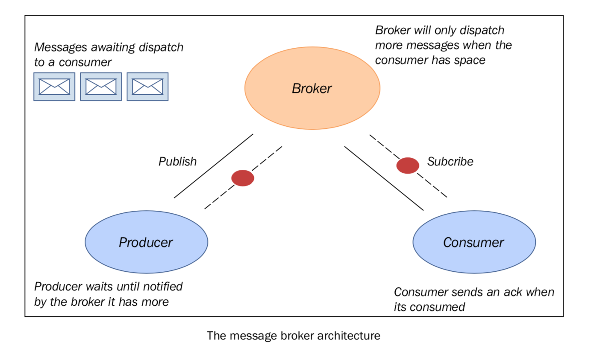

使用Celery实现分布式任务
========================

Celery 是一个 Python 框架，用来管理分布式任务的，遵循面向对象的中间件方法。它的主要 feature 是可以将许多小任务分布到一个大型的计算集群中，最后将任务的结果收集起来，组成整体的解决方案。

要使用 Celery，我们需要下面几种组件：

- Celery 模块（废话！！）
- 一个消息代理(Message Broker)。这是一个独立于 Celery 的一个中间件，用来和分布式的 worker 收发消息。它会处理在通讯网络中的信息交换。这种中间件的消息发送方案不再是点对点的，而是面向消息的方式，最终名的是发布者/订阅者的范式。

Celery 支持很多消息代理，最有名的是 RebbitMQ 和 Redis。

|how|
-----

安装 Celery，我们需要 `pip` 包管理器。在命令行通过以下命令安装： ::

    pip install celery

之后，我们必须安装消息代理。在本书中，我们使用 RabbitMQ 来做消息代理，这是一个面向消息的中间件（也叫做代理人消息），它实现了 **高级消息队列协议（AMQP）** 。RabbitMQ 服务端使用 Erlang 写的，基于 **Open Telecom Platform(OPT)** 框架来管理集群和故障转移。安装 RabbitMQ 的步骤如下：

1. 下载安装 Erlang：http://www.erlang.org/download.html
2. 下载并运行 RabbitMQ 安装器：http://www.rabbitmq.com/download.html

下载完成后，安装好 RabbitMQ 然后用默认配置运行即可。

最后，我们会安装 Flower（ http://flower.readthedocs.org/ ），这是一个基于 web 的任务监控和管理工具（进行中的任务，任务细节和图表、状态等）。安装方法和 Celery 一样，在命令行输入： ::

    pip install -U flower

然后，我们可以验证一下 Celery 的安装，在命令行输入: ::

    celery --version

会出现(译者使用的版本比原书高): ::
    
    4.2.1 (windowlicker)

Celery 的用法非常简单，和显示的一样： ::
    
    Usage: celery <command> [options]

显示的配置如下： ::

    usage: celery <command> [options]

    Show help screen and exit.

    positional arguments:
      args

    optional arguments:
      -h, --help            show this help message and exit
      --version             show program's version number and exit

    Global Options:
      -A APP, --app APP
      -b BROKER, --broker BROKER
      --result-backend RESULT_BACKEND
      --loader LOADER
      --config CONFIG
      --workdir WORKDIR
      --no-color, -C
      --quiet, -q

    ---- -- - - ---- Commands- -------------- --- ------------

    + Main:
    |    celery worker
    |    celery events
    |    celery beat
    |    celery shell
    |    celery multi
    |    celery amqp

    + Remote Control:
    |    celery status

    |    celery inspect --help
    |    celery inspect active
    |    celery inspect active_queues
    |    celery inspect clock
    |    celery inspect conf [include_defaults=False]
    |    celery inspect memdump [n_samples=10]
    |    celery inspect memsample
    |    celery inspect objgraph [object_type=Request] [num=200 [max_depth=10]]
    |    celery inspect ping
    |    celery inspect query_task [id1 [id2 [... [idN]]]]
    |    celery inspect registered [attr1 [attr2 [... [attrN]]]]
    |    celery inspect report
    |    celery inspect reserved
    |    celery inspect revoked
    |    celery inspect scheduled
    |    celery inspect stats

    |    celery control --help
    |    celery control add_consumer <queue> [exchange [type [routing_key]]]
    |    celery control autoscale [max [min]]
    |    celery control cancel_consumer <queue>
    |    celery control disable_events
    |    celery control election
    |    celery control enable_events
    |    celery control heartbeat
    |    celery control pool_grow [N=1]
    |    celery control pool_restart
    |    celery control pool_shrink [N=1]
    |    celery control rate_limit <task_name> <rate_limit (e.g., 5/s | 5/m | 5/h)>
    |    celery control revoke [id1 [id2 [... [idN]]]]
    |    celery control shutdown
    |    celery control terminate <signal> [id1 [id2 [... [idN]]]]
    |    celery control time_limit <task_name> <soft_secs> [hard_secs]

    + Utils:
    |    celery purge
    |    celery list
    |    celery call
    |    celery result
    |    celery migrate
    |    celery graph
    |    celery upgrade

    + Debugging:
    |    celery report
    |    celery logtool
    ---- -- - - --------- -- - -------------- --- ------------

    Type 'celery <command> --help' for help using a specific command.

|more|
------

有关 Celery 的更多细节，可以访问官方主页： http://www.celeryproject.org/
