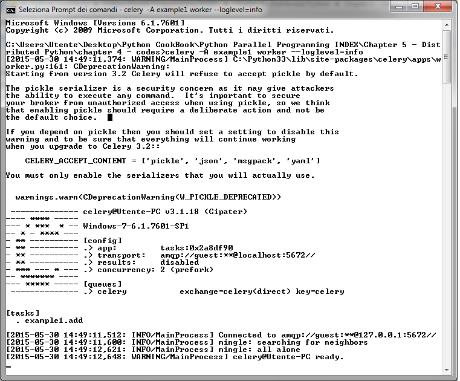
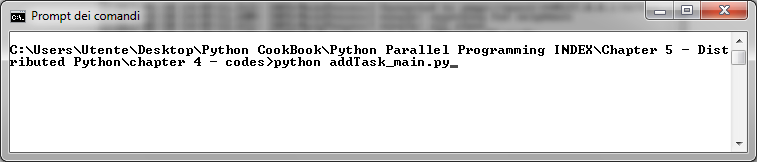
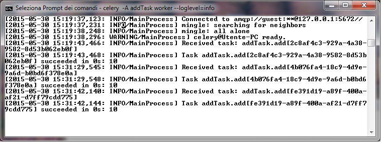

如何使用Celery创建任务
======================

在本节中，我们将展示如何使用 Celery 模块创建一个任务。Celery 提供了下面的方法来调用任务：

- ``apply_async(args[, kwargs[, ...]])``: 发送一个任务消息
- ``delay(*args, **kwargs)``: 发送一个任务消息的快捷方式，但是不支持设置一些执行信息

``delay`` 方法用起来更方便，因为它可以像普通函数一样被调用： ::

    task.delay(arg1, arg2, kwarg1='x', kwarg2='y')

如果要使用 ``apply_async`` 的话，你需要这样写： ::

    task.apply_async (args=[arg1, arg2] kwargs={'kwarg1': 'x','kwarg2': 'y'})

|how|
-----

我们通过以下简单的两个脚本来执行一个任务： ::

    # addTask.py: Executing a simple task
    from celery import Celery
    app = Celery('addTask', broker='amqp://guest@localhost//')
    @app.task
    def add(x, y):
        return x + y

第二个脚本如下： ::

    # addTask_main.py : RUN the AddTask example with

    import addTask
    if __name__ == '__main__':
        result = addTask.add.delay(5,5)

这里重申以下，RabbitMQ 服务会在安装之后自动启动，所以这里我们只需要启动 Celery 服务就可以了，启动的命令如下： ::

    celery -A addTask worker --loglevel=info

命令的输出如下：

其中，有个警告告诉我们关闭 pickle 序列化工具，可以避免一些安全隐患。pickle 作为默认的序列化工作是因为它用起来很方便(通过它可以将很复杂的 Python 对象当做函数变量传给任务)。不管你用不用 pickle ，如果想要关闭警告的话，可以设置 ``CELERY_ACCEPT_CONTENT`` 变量。详细信息可以参考：http://celery.readthedocs.org/en/latest/configuration.html 。

现在，让我们执行 ``addTask_main.py`` 脚本来添加一个任务：

最后，第一个命令的输出会显示：

在最后一行，可以看到结果是10，和我们的期望一样。

|work|
------

让我们先来看 ``addTask.py`` 这个脚本。在前两行的代码中，我们创建了一个 Celery 的应用实例，然后用 RabbitMQ 服务作为消息代理： ::

    from celery import Celery
    app = Celery('addTask', broker='amqp://guest@localhost//')

Celery 函数的第一个变量是当前 module 的名字（ ``addTask.py`` ) 第二个变量是消息代理的信息，一个可以连接代理的 broker(RabbitMQ). 然后，我们声明了任务。每一个任务必须用 ``@app.task`` 来装饰。

这个装饰器帮助 Celery 标明了哪些函数可以通过任务队列调度。在装饰器后面，我们定义了 worker 可以执行的任务。我们的第一个任务很简单，只是计算两个数的和： ::

    @app.task
    def add(x, y):
        return x + y

在第二个脚本中， ``AddTask_main.py`` ，我们通过 ``delay()`` 方法来调用任务： ::

    if __name__ == '__main__':
        result = addTask.add.delay(5,5)
 
记住，这个方法只是 ``apply_async()`` 的一个快捷方式，通过 ``apply_async()`` 方法我们可以更精确地控制任务执行。

|more|
------

如果 RabbitMQ 是默认配置的话，Celery 也可以通过 ``amqp://scheme`` 来连接。
