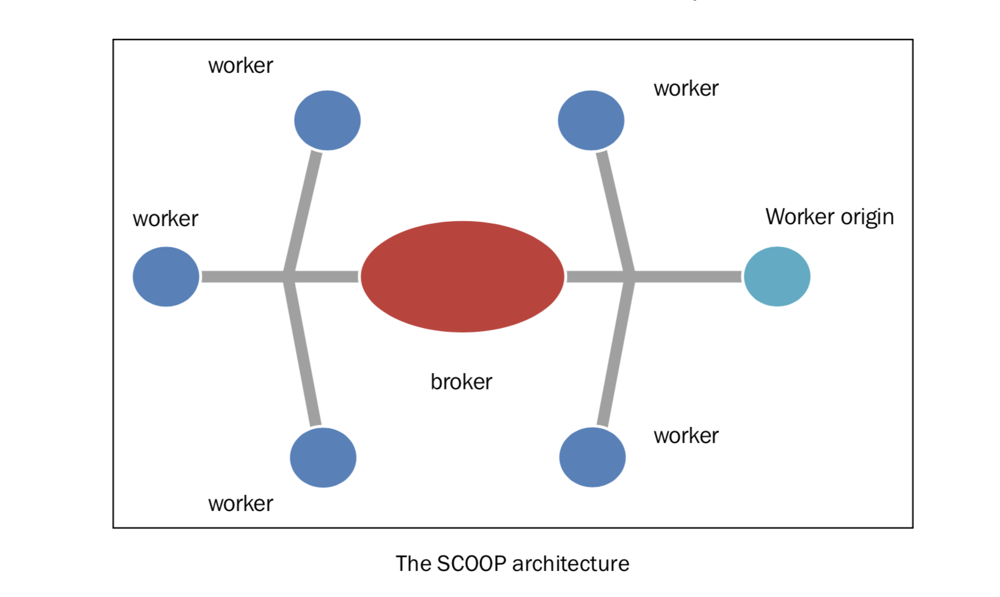
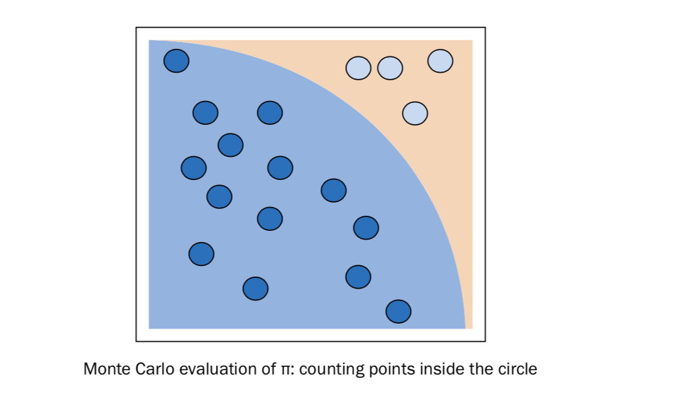

使用SCOOP进行科学计算
=====================
Scalable Concurrent Operations in Python (SCOOP) 是一个可扩展的 Python 并行计算库，可以将并行的任务（Python 的 ``Futures`` ）放到各种各样的计算节点上执行。它基于 ØMQ 架构，提供了一种在分布式系统中管理 Futures 的方法。SCOOP 主要的应用场景是科学计算，尽可能利用所有的结算资源来执行大量的分布式任务。

在将 Futures 分发这方面，SCOOP 使用了 Broker 模式的变体。

这个通信系统的中心是 Broker，Broker 和所有的节点通讯，在它们之间传输信息。Futures 由各个节点创建，而不是由中心化的 Broker 创建。这种方案让系统的拓扑结构更加可靠，性能更高。事实上，Broker 占用的主要资源是 I/O ，CPU 使用很小。

|ready|
-------

SCOOP 的源代码在 https://github.com/soravux/scoop/ 。这个库的依赖如下：

- Python >= 2.6 or >= 3.2
- Distribute >= 0.6.2 or setuptools >= 0.7
- Greenlet >= 0.3.4
- pyzmq >= 13.1.0 and libzmq >= 3.2.0
- SSH for remote execution

SCOOP 支持 Linux, Mac, 和 Windows 平台。和 Disco 一样，它的远程访问需要 SSH 的支持，而且必须在每个节点上都可以免密登陆。有关 SCOOP 完整的安装说明，可以参考文档： http://scoop.readthedocs.org/en/0.7/install.html 。

在 Window 上安装 SCOOP ，简单的使用 pip 命令就可以了: ::
   
   pip install SCOOP

或者直接在 SCOOP 的源代码文件夹中使用： ::

   Python setup.py install

|how|
-----

SCOOP 内置了很多适用于科学计算场景的功能，可以解决很多需要很多算力的科学问题。本文将以蒙特卡罗算法为例子。要说明白这个算法将占用很大的篇幅，但是在本例子中，只是想以并行执行一个蒙卡特罗算法解决问题展示 SCOOP。下面以计算 π 为例： ::

    import math
    from random import random
    from scoop import futures
    from time import time

    def evaluate_points_in_circle(attempts):
      points_fallen_in_unit_disk = 0
         for i in range (0,attempts) :
              x = random()
              y = random()
              radius = math.sqrt(x*x + y*y)
              #the test is ok if the point fall in the unit circle
              if radius < 1 :
                  #if ok the number of points in a disk is increased
                  points_fallen_in_unit_disk = \
                          points_fallen_in_unit_disk + 1
          return points_fallen_in_unit_disk

    def pi_calculus_with_Montecarlo_Method(workers, attempts):
        print("number of workers %i - number of attempts %i" % (workers,attempts))
        bt = time()
        #in this point we call scoop.futures.map function
        #the evaluate_number_of_points_in_unit_circle \
        #function is executed in an asynchronously way
        #and several call this function can be made concurrently
        evaluate_task = \
                    futures.map(evaluate_points_in_circle,
                           [attempts] * workers)
        taskresult= sum(evaluate_task)
        print ("%i points fallen in a unit disk after " \
               %(taskresult/attempts))
        piValue = (4. * taskresult/ float(workers * attempts))
        computationalTime = time() - bt
        print("value of pi = " + str(piValue))
        print ("error percentage = " + \
               str((((abs(piValue - math.pi)) * 100) / math.pi)))
        print("total time: " + str(computationalTime))

    if __name__ == "__main__":
      for i in range (1,4):
         # let's fix the numbers of workers...only two,
         # but it could be much greater
         pi_calculus_with_Montecarlo_Method(i*1000, i*1000)
         print(" ")

运行这短代码的命令如下： ::

   python –m scoop name_file.py

这段代码的输出如下： ::

   C:\Python CookBook\Chapter 5 - Distributed Python\chapter 5 - codes>python -m scoop pi_calculus_with_montecarlo_method.py
   [2015-06-01 15:16:32,685] launcher  INFO    SCOOP 0.7.2 dev on win32 using Python 3.3.0 (v3.3.0:bd8afb90ebf2, Sep 29 2012, 10:55:48) [MSC v.1600 32 bit (Intel)], API: 1013
   [2015-06-01 15:16:32,685] launcher  INFO Deploying 2 worker(s) over 1 host(s).
   [2015-06-01 15:16:32,685] launcher  INFO Worker d--istribution:
   [2015-06-01 15:16:32,686] launcher  INFO 127.0.0.1:1 + origin
   Launching 2 worker(s) using an unknown shell.
   number of workers 1000 - number of attempts 1000
   785 points fallen in a unit disk after
   value of pi = 3.140636
   error percentage = 0.03045122952842962
   total time: 10.258585929870605

   number of workers 2000 - number of attempts 2000
   1570 points fallen in a unit disk after
   value of pi = 3.141976
   error percentage = 0.012202295220195048
   total time: 20.451170206069946

   number of workers 3000 - number of attempts 3000
   2356 points fallen in a unit disk after
   value of pi = 3.1413777777777776
   error percentage = 0.006839709526630775
   total time: 32.3558509349823

   [2015-06-01 15:17:36,894] launcher  (127.0.0.1:59239) INFO
   process is done.
   [2015-06-01 15:17:36,896] launcher  (127.0.0.1:59239) INFO
   cleaning spawned subprocesses.

如果我们增加 attempts 的次数和 worker 的数量，就可以提高 π 的精度。

|how|
-----

前面的代码只是蒙卡特罗方法计算 π 的一种实现。 ``evaluate_points_in_circle()`` 函数随机的产生点的坐标 ``(x, y)`` ，然后判断此点是否落在单位面积的内切圆内。

每当判断点落在圆的面积内的时候， ``points_fallen_in_unit_disk`` 变量的值加 1. 当内循环结束的时候，这个值就表示最终落在圆的面积内点的数量。这个数字足够计算 pi 的值了。事实上，点落在圆内的实际概率是 π / 4 ，这是圆的面积和单位面积的比例。圆的面积是 π，单位面积是 4.

最后，通过计算落在圆内的点的数量 ``taskresult`` ，和尝试的次数 ``workers * attempts`` 的比例，就可以得到 ``π / 4`` 的值，当然也就得到最终 π 的值了。 ::

   piValue = (4. * Taskresult/ float(workers * attempts))

SCOOP 函数如下： ::

     futures.map(evaluate_points_in_circle, [attempts] * workers)

这行代码会交给 SCOOP 来将计算任务分发给多个节点，并收集计算结果。它将会并发地调用 ``evaluate_points_in_circle`` 。
