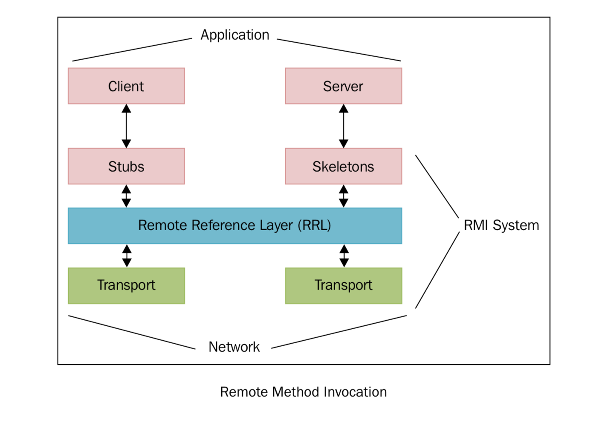
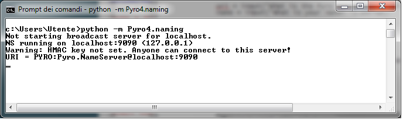
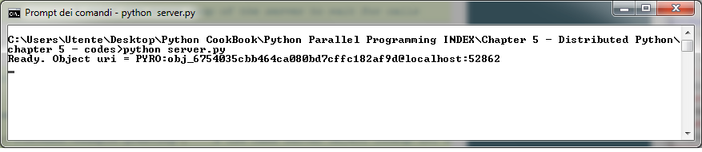
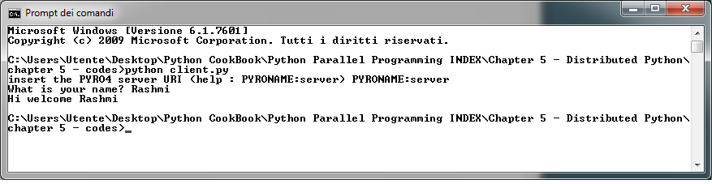

使用Pyro4进行远程方法调用
=========================

Python Remote Objects (Pyro4) 实现了类似 Java 的远程方法调用（Remote Method Invocation, RMI). 可以调用一个远程对象（存在于另一个进程中，甚至是另一台机器上），就像调用本地对象一样（处于和调用者一样的进程）。从概念的角度讲，RMI 的技术可以追溯到远程过程调用（remote procedure call，RPC），RMI 是远程过程调用技术针对面向对象范式进行改造——方法替换过程。在面向对象系统中，对远程方法调用使用这样一种机制可以在项目的统一性和对称性上有很多优势，因为这样我们可以复用同一应用不同对象或方法之间调用的模型。

从图中可以看出，Pyro4 用客户端/服务器的方式来管理和分发对象。Pyro4 可以将客户端调用转换为远程对象调用。在调用的过程中，有两个重要的角色，一个是客户端，一个是服务客户端调用的服务器。Pyro4 以分布式的形式提供这种服务。

|ready|
-------

安装非常简单，使用 pip 即可： ::

    pip install pyro

或者可以从 https://github.com/irmen/Pyro4 下载源代码，使用 ``setup.py`` 安装。

本例中将使用 Python3.3 版本和 Windows 系统。

|how|
-----

在本例中，我们将使用 Pyro4 构建简单的服务器客户端通信。其中， ``server`` 部分的代码如下： ::

   import Pyro4

   class Server(object):
       def welcomeMessage(self, name):
           return ("Hi welcome " + str (name))

   def startServer():
       server = Server()
       daemon = Pyro4.Daemon()
       ns = Pyro4.locateNS()
       uri = daemon.register(server)
       ns.register("server", uri)
       print("Ready. Object uri =", uri)
       daemon.requestLoop()

   if __name__ == "__main__":
       startServer()

``client.py`` 的代码如下： ::

   import Pyro4
   uri = input("What is the Pyro uri of the greeting object? ").strip()
   name = input("What is your name? ").strip()
   server = Pyro4.Proxy("PYRONAME:server")
   print(server.welcomeMessage(name))

我们需要跑一个 name server 来运行这段代码，从命令行输入： ::

   python  -m Pyro4.naming

将看到一下信息：

看到这样的输入就表示 name server 已经成功运行了。接下来要分别在两个窗口中启动 Server 和 Client。运行 Server，使用下面的命令： ::

   python server.py

可以看到类似下面的输出：

然后使用下面的命令运行客户端： ::

   python client.py

将会看到类似下面的输出： ::

   insert the PYRO4 server URI (help : PYRONAME:server)

这表示你需要输入 Pyro4 服务的名字，输入 ``PYRONAME: server`` 即可。 ::

   insert the PYRO4 server URI (help : PYRONAME:server) PYRONAME:server

然后将会看到以下命令要求输入名字： ::

   What is your name? Rashmi

最后，你将会看到欢迎信息： ``Hi welcome Rashmi`` .类似下面这样。

|work|
------

Server 中包含可以被远程调用的对象，在我们的例子中，这个对象只有一个方法 ``welcomeMessage()`` 返回一个字符串。 ::

   class Server(object):
       def welcomeMessage(self, name):
           return ("Hi welcome " + str (name))

要启动这个 Server，必须按照以下步骤：

1. 实例化一个 Server 对象（名字叫 ``server`` ): ``server = Server()`` 。
2. 启动 Pyro4 守护进程： ``daemon = Pyro4.Daemon()`` . Pyro4 的守护进程对象将收到的请求分发到合适的对象。每一个 Server 都必须有一个守护进程，来管理对象的调用。每一个 Server 的守护进程都知道其他进程的可调用对象。
3. 然后我们必须运行一个 name server，并且拿到这个 name server 的地址： ``ns = Pyro4.locateNS()`` 。
4. 然后将这个 server 注册为 Pyro4 的对象，只有 Pyro4 的守护进程才知道这个对象： ``uri = daemon.register(server)`` . 它返回注册对象的 URI。
5. 最后，我们可以在 name server 中给这个对象注册一个名字。
6. 这个函数的最后是调用守护进程的 ``eventloop`` ,它会启动 server 的事件循环，等待调用。

Pyro4 的 API 让开发者可以通过透明的方式分发对象。客户端请求服务器执行 ``welcomeMessage()`` 方法。远程调用先会创建一个代理对象，Pyro4 的客户端会通过代理对象将方法调用转发到远程对象，并将结果转发回调用的代码。 ::

   server = Pyro4.Proxy("PYRONAME:server")

现在，我们就可以调用 server 的方法，打印欢迎信息了。 ::

   print(server.welcomeMessage(name))
