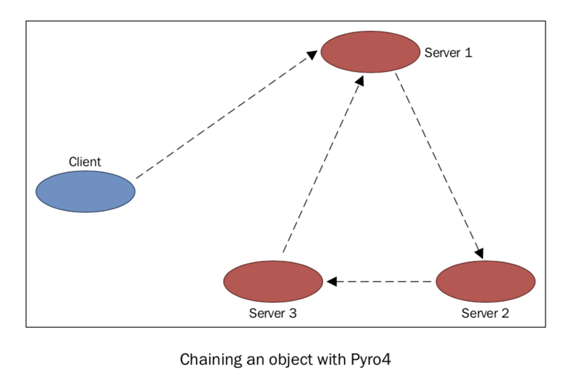

使用 Pyro4 链接对象
===================

在本章中，我们将展示如何使用 Pyro4 创建互相调用的对象链。假设我们想创建如下的分布式架构：

如图所示，我们有四个对象：一个客户端，和依照三个链式拓扑配置的 Server。客户端将请求转发到 Server1 开始链式调用，然后转发到 Server2。然后调用对象链中的下一个对象 Server3. Server3 最后调用 Server1 结束。

通过我们将要展示的这个例子，可以看出管理远程对象多么容易，可以很方便地拓扑出更加复杂的架构。

|how|
-----

使用 Pyro4 实现这样一个对象链，我们需要 5 个 Python 脚本。第一个是客户端 Client, 代码如下。 ::

    from __future__ import print_function
    import Pyro4
    obj = Pyro4.core.Proxy("PYRONAME:example.chain.A")
    print("Result=%s" % obj.process(["hello"]))

在 Server 的代码中，当前 Server 用 ``this`` 变量表示，下一个要调用的 Server 用变量 ``that`` 表示。

``server_1.py`` 的代码如下： ::

    from __future__ import print_function
    import Pyro4
    import chainTopology
    this = "1"
    next = "2"
    servername = "example.chainTopology." + this
    daemon = Pyro4.core.Daemon()
    obj = chainTopology.Chain(this, next)
    uri = daemon.register(obj)
    ns = Pyro4.naming.locateNS()
    ns.register(servername, uri)
    # enter the service loop.
    print("server_%s started " % this)
    daemon.requestLoop()

``server_2.py`` 的代码如下： ::

    from __future__ import print_function
    import Pyro4
    import chainTopology
    this = "2"
    next = "3"
    servername = "example.chainTopology." + this
    daemon = Pyro4.core.Daemon()
    obj = chain.chainTopology(this, next)
    uri = daemon.register(obj)
    ns = Pyro4.naming.locateNS()
    ns.register(servername, uri)
    # enter the service loop.
    print("server_%s started " % this)
    daemon.requestLoop()

``server_3.py`` 的代码如下： ::

    from __future__ import print_function
    import Pyro4
    import chainTopology
    this = "3"
    next = "1"
    servername = "example.chainTopology." + this
    daemon = Pyro4.core.Daemon()
    obj = chain.chainTopology(this, next)
    uri = daemon.register(obj)
    ns = Pyro4.naming.locateNS()
    ns.register(servername, uri)
    # enter the service loop.
    print("server_%s started " % this)
    daemon.requestLoop()
