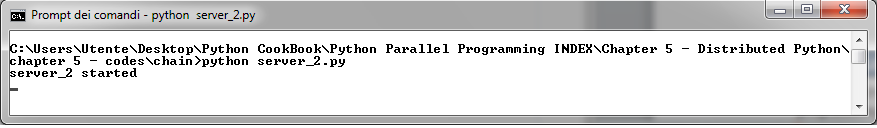
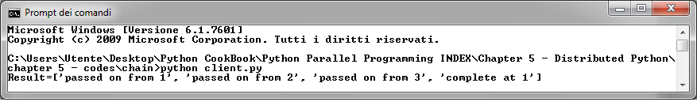
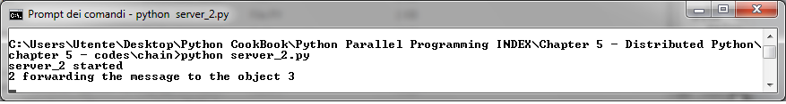

使用 Pyro4 链接对象
===================

在本章中，我们将展示如何使用 Pyro4 创建互相调用的对象链。假设我们想创建如下的分布式架构：

如图所示，我们有四个对象：一个客户端，和依照三个链式拓扑配置的 Server。客户端将请求转发到 Server1 开始链式调用，然后转发到 Server2。然后调用对象链中的下一个对象 Server3. Server3 最后调用 Server1 结束。

通过我们将要展示的这个例子，可以看出管理远程对象多么容易，可以很方便地拓扑出更加复杂的架构。

|how|
-----

使用 Pyro4 实现这样一个对象链，我们需要 5 个 Python 脚本。第一个是客户端 Client, 代码如下。 ::

    from __future__ import print_function
    import Pyro4
    obj = Pyro4.core.Proxy("PYRONAME:example.chain.A")
    print("Result=%s" % obj.process(["hello"]))

在 Server 的代码中，当前 Server 用 ``this`` 变量表示，下一个要调用的 Server 用变量 ``that`` 表示。

``server_1.py`` 的代码如下： ::

    from __future__ import print_function
    import Pyro4
    import chainTopology
    this = "1"
    next = "2"
    servername = "example.chainTopology." + this
    daemon = Pyro4.core.Daemon()
    obj = chainTopology.Chain(this, next)
    uri = daemon.register(obj)
    ns = Pyro4.naming.locateNS()
    ns.register(servername, uri)
    # enter the service loop.
    print("server_%s started " % this)
    daemon.requestLoop()

``server_2.py`` 的代码如下： ::

    from __future__ import print_function
    import Pyro4
    import chainTopology
    this = "2"
    next = "3"
    servername = "example.chainTopology." + this
    daemon = Pyro4.core.Daemon()
    obj = chain.chainTopology(this, next)
    uri = daemon.register(obj)
    ns = Pyro4.naming.locateNS()
    ns.register(servername, uri)
    # enter the service loop.
    print("server_%s started " % this)
    daemon.requestLoop()

``server_3.py`` 的代码如下： ::

    from __future__ import print_function
    import Pyro4
    import chainTopology
    this = "3"
    next = "1"
    servername = "example.chainTopology." + this
    daemon = Pyro4.core.Daemon()
    obj = chain.chainTopology(this, next)
    uri = daemon.register(obj)
    ns = Pyro4.naming.locateNS()
    ns.register(servername, uri)
    # enter the service loop.
    print("server_%s started " % this)
    daemon.requestLoop()

最后是 ``chain`` 对象，代码如下： ::

    chainTopology.py:

    from __future__ import print_function
    import Pyro4
    class Chain(object):
        def __init__(self, name, next):
            self.name = name
            self.nextName = next
            self.next = None
        def process(self, message):
            if self.next is None:
                self.next = Pyro4.core.Proxy("PYRONAME:example.chain." + self.nextName)
            if self.name in message:
                print("Back at %s; the chain is closed!" % self.name)
                return ["complete at " + self.name]
            else:
                print("%s forwarding the message to the object %s" \
                      % (self.name, self.nextName))
                message.append(self.name)
                result = self.next.process(message)
                result.insert(0, "passed on from " + self.name)
                return result

执行这段代码，首先要启动 Pyro4 name server： ::

    C:>python -m Pyro4.naming
    Not starting broadcast server for localhost.
    NS running on localhost:9090 (127.0.0.1)
    Warning: HMAC key not set. Anyone can connect to this server!
    URI = PYRO:Pyro.NameServer@localhost:9090

然后运行其他三个 server，在三个不同的命令行中运行 ``python server_name.py`` 命令。

server_1 的信息如下：

.. image:: ../images/Page-196-Image-30.png

server_2 的信息如下:

server_3 的信息如下：

.. image:: ../images/Page-196-Image-32.png

最后可以运行 ``client.py`` 了：

上面的的信息中显示出对象被在三个服务器中转发，最后回到 ``server_1`` 的时候任务完成。当对象被转发到下一个服务器时，我们可以关注一下对象服务器的行为。通过在 ``server_1`` 的输出中，我们可以观察发生了什么。

.. image:: ../images/Page-196-Image-34.png

以及 ``server_2`` 的输出：

和 ``server_3`` 的输出：

|work|
------

在这个例子中的核心是我们在 ``chainTopology.py`` 中定义的 ``Chain`` 类。通过它三个服务器可以互相通讯，每一个 server 可以调用 class 来确定链中的下一个元素是谁（参考 ``chainTopology.py`` 中的 ``process`` 方法）。同时，它通过 ``Pyro4.core.proxy`` 来调用下一个元素： ::

    if self.next is None:
        self.next = Pyro4.core.Proxy("PYRONAME:example.chainTopology." + self.nextName)

如果调用链结束（在 ``server_3`` 调用 ``server_1`` 的时候），结束信息将会打印出来。 ::

    if self.name in message:
        print("Back at %s; the chain is closed!" % self.name)
        return ["complete at " + self.name]

如果有下一个元素，就打印出以下的信息： ::

    print("%s forwarding the message to the object %s" \
          % (self.name, self.nextName))
    message.append(self.name)
    result = self.next.process(message)
    result.insert(0, "passed on from " + self.name)
    return result

Server 的代码除了链中上一个元素和下一个元素的位置不同，其他的都是相同的，比如，下面是 ``server_1`` 的代码： ::

    this = "1"
    next = "2"

剩下的代码和之前的例子相同，是如何和链中下一个节点通讯的： ::

    servername = "example.chainTopology." + this
    daemon = Pyro4.core.Daemon()
    obj = chain.chainTopology(this, next)
    uri = daemon.register(obj)
    ns = Pyro4.naming.locateNS()
    ns.register(servername, uri)
    # enter the service loop.
    print("server_%s started " % this)
    daemon.requestLoop()

最后，在客户端的代码中，我们通过调用链中 ``server_1`` 的代码来触发整个调用： ::

   obj = Pyro4.core.Proxy("PYRONAME:example.chainTopology.1")
