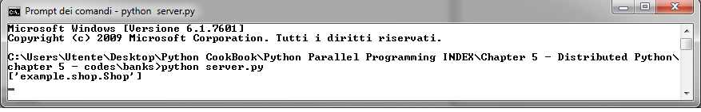

使用Pyro4部署客户端-服务器应用
==============================

在本节中，我们会用 Pyro4 学习如何写一个简单的客户端-服务器应用。这里提供的示例并不完整，但是可以成功运行。

一个客户端-服务器程序就是，在一个网络内，客户端连接上服务器来请求特定的服务，可以与其他的客户端共享软件/硬件资源，并使用相同的协议。在本节的系统中，server 管理一个在线购物网站，客户端负责已注册的用户连接到 server 来购物。

|how|
-----

为了让例子尽量简单一些，本例只有三个脚本。第一个代表 ``client`` 对象，用来管理用户。第二个脚本是 ``shop`` 对象，第二个脚本是 ``server`` .

Server 端的代码如下（ ``server.py`` ): ::

   """The Shops server"""

   from __future__ import print_function
   import Pyro4
   import shop

   ns = Pyro4.naming.locateNS()
   daemon = Pyro4.core.Daemon()
   uri = daemon.register(shop.Shop())
   ns.register("example.shop.Shop", uri)
   print(list(ns.list(prefix="example.shop.").keys()))
   daemon.requestLoop()

Client 端的代码如下 ( ``client.py`` ): ::

   from __future__ import print_function
   import sys
   import Pyro4

   # A Shop client.
   class client(object):
       def __init__(self, name, cash):
           self.name = name
           self.cash = cash

       def doShopping_deposit_cash(self, Shop):
           print("\n*** %s is doing shopping with %s:" % (self.name, Shop.name()))
           print("Log on")
           Shop.logOn(self.name)
           print("Deposit money %s" % self.cash)
           Shop.deposit(self.name, self.cash)
           print("balance=%.2f" % Shop.balance(self.name))
           print("Deposit money %s" % self.cash)
           Shop.deposit(self.name, 50)
           print("balance=%.2f" % Shop.balance(self.name))
           print("Log out")
           Shop.logOut(self.name)

       def doShopping_buying_a_book(self, Shop):
           print("\n*** %s is doing shopping with %s:" % (self.name, Shop.name()))
           print("Log on")
           Shop.logOn(self.name)
           print("Deposit money %s" % self.cash)
           Shop.deposit(self.name, self.cash)
           print("balance=%.2f" % Shop.balance(self.name))
           print("%s is buying a book for %s$" % (self.name, 37))
           Shop.buy(self.name, 37)
           print("Log out")
           Shop.logOut(self.name)

   if __name__ == "__main__":
       ns = Pyro4.naming.locateNS()
       uri = ns.lookup("example.shop.Shop")
       print(uri)
       Shop = Pyro4.core.Proxy(uri)
       meeta = client("Meeta", 50)
       rashmi = client("Rashmi", 100)
       rashmi.doShopping_buying_a_book(Shop)
       meeta.doShopping_deposit_cash(Shop)
       print("")
       print("")
       print("")
       print("")
       print("The accounts in the %s:" % Shop.name())
       accounts = Shop.allAccounts()
       for name in accounts.keys():
           print("  %s : %.2f" % (name, accounts[name]))

Shop 对象的代码如下 ( ``shop.py`` ): ::

   class Account(object):
       def __init__(self):
           self._balance = 0.0

       def pay(self, price):
           self._balance -= price

       def deposit(self, cash):
           self._balance += cash

       def balance(self):
           return self._balance

   class Shop(object):
       def __init__(self):
           self.accounts = {}
           self.clients = ["Meeta", "Rashmi", "John", "Ken"]

       def name(self):
           return "BuyAnythingOnline"

       def logOn(self, name):
           if name in self.clients:
               self.accounts[name] = Account()
           else:
               self.clients.append(name)
               self.accounts[name] = Account()

       def logOut(self, name):
           print("logout %s" % name)

       def deposit(self, name, amount):
           try:
               return self.accounts[name].deposit(amount)
           except KeyError:
               raise KeyError("unknown account")

       def balance(self, name):
           try:
               return self.accounts[name].balance()
           except KeyError:
               raise KeyError("unknown account")

       def allAccounts(self):
           accs = {}
           for name in self.accounts.keys():
               accs[name] = self.accounts[name].balance()
           return accs

       def buy(self, name, price):
           balance = self.accounts[name].balance()
           self.accounts[name].pay(price)

下面开始执行这段代码，首先启动 Pyro4 的 name server: ::

   C:>python -m Pyro4.naming
   Not starting broadcast server for localhost.
   NS running on localhost:9090 (127.0.0.1)
   Warning: HMAC key not set. Anyone can connect to this server!
   URI = PYRO:Pyro.NameServer@localhost:9090

然后，使用 ``python server.py`` 命令启动 Server. 命令行的显示如下图所示。

最后，用下面的命令启动客户端，模拟用户的动作。 ::

   python client.py

命令行的输出将如下所示： ::

   C:\Users\Utente\Desktop\Python CookBook\Python Parallel Programming
   INDEX\Chapter 5 - Distributed Python\
    chapter 5 - codes\banks>python client.py
   PYRO:obj_8c4a5b4ae7554c2c9feee5b0113902e0@localhost:59225
   *** Rashmi is doing shopping with BuyAnythingOnline:
   Log on
   Deposit money 100
   balance=100.00
   Rashmi is buying a book for 37$
   Log out
   *** Meeta is doing shopping with BuyAnythingOnline:
   Log on
   Deposit money 50
   balance=50.00
   Deposit money 50
   balance=100.00
   Log out
   The accounts in the BuyAnythingOnline:
     Meeta : 100.00
     Rashmi : 63.00

输出表示两个用户的会话， ``Meeta`` 和 ``Rashmi`` .

|work|
------

客户端应用必须找到 ``Shop()`` 对象，通过如下的调用： ::

   ns = Pyro4.naming.locateNS()

然后打开一个通讯的 channel: ::

   daemon = Pyro4.core.Daemon()
   uri = daemon.register(shop.Shop())
   ns.register("example.shop.Shop", uri)
   daemon.requestLoop()

``shop.py`` 有处理账户和购物的脚本。 ``shop`` 类将会管理每一个账户，它提供了登陆登出，管理用户的余额，以及处理购买动作： ::

   class Shop(object):
       def logOn(self, name):
           if name in self.clients:
               self.accounts[name] = Account()
           else:
               self.clients.append(name)
               self.accounts[name] = Account()

       def logOut(self, name):
           print("logout %s" % name)

       def deposit(self, name, amount):
           try:
               return self.accounts[name].deposit(amount)
           except KeyError:
               raise KeyError("unknown account")

       def balance(self, name):
           try:
               return self.accounts[name].balance()
           except KeyError:
               raise KeyError("unknown account")

       def buy(self, name, price):
           balance = self.accounts[name].balance()
           self.accounts[name].pay(price)

每一个顾客都有自己的 ``Account`` 对象，提供存款管理。 ::

   class Account(object):
       def __init__(self):
           self._balance = 0.0
       def pay(self, price):
           self._balance -= price
       def deposit(self, cash):
           self._balance += cash
       def balance(self):
           return self._balance

最后， ``client.py`` 有一个启动模拟客户行为的类。在 main 函数中，我们模拟了两个用户， ``Rashmi`` 和 ``Meeta`` : ::

    meeta = client('Meeta',50)
    rashmi = client('Rashmi',100)
    rashmi.doShopping_buying_a_book(Shop)
    meeta.doShopping_deposit_cash(Shop)

他们在网站上存上一些现金，然后开始购物：

Rashmi 买了一本书： ::

   def doShopping_buying_a_book(self, Shop):
        Shop.logOn(self.name)
        Shop.deposit(self.name, self.cash)
        Shop.buy(self.name,37)
        Shop.logOut(self.name) 

Meeta 分两次充了 $100 到账户中： ::

    def doShopping_deposit_cash(self, Shop):
        Shop.logOn(self.name)
        Shop.deposit(self.name, self.cash)
        Shop.deposit(self.name, 50)
        Shop.logOut(self.name)

最后程序打印出两个用户的存款： ::

    print("The accounts in the %s:" % Shop.name())
    accounts = Shop.allAccounts()
    for name in accounts.keys():
        print("  %s : %.2f" % (name, accounts[name]))
