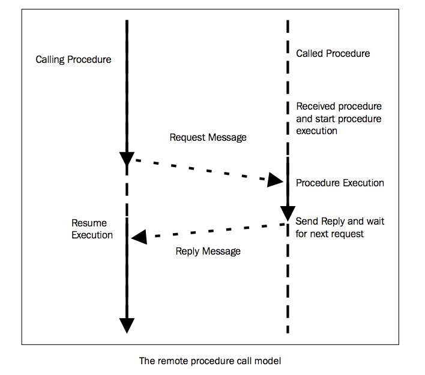

使用RPyC远程调用
================

Remote Python Call(RPyC)是一个用作远程过程调用，同时也可以用作分布式计算的Python模块。其基础RPC主要是提供一种将控制从当前程序(客户端)转移到其他程序(服务器)的机制，类似于在一个主程序里去调用一个子程序。这种方式的优点是它拥有非常简单的语义，知识以及熟悉的集中式函数调用。在一个过程调用里，客户端在服务器已经完成计算并且返回计算结果之后才会停止。这种方法的有效性是由于客户端-服务器的通信表现为一个过程调用而不是传输层的调用，因此所有网络操作的细节是通过将应用程序置于被称作存根(stubs)的本地过程中而对应用程序隐藏的。RPyC的主要特性是：

- 语法透明，一个远程过程调用和本地调用有一样的语法
- 语义透明，一个远程过程调用和本地调用是语义一致的
- 可以处理同步和异步通信
- 对称通信协议意味着不论是客户端还是服务器都可以处理一个请求



准备
---

使用pip来安装是非常容易的。在你的命令行终端里，键入下面的命令：`pip install rpyc`

另外你可以去[https://github.com/tomerfiliba/rpyc](https://github.com/tomerfiliba/rpyc)下载完整的包(是一个`.zip`文件)。下载完成之后在包的根目录里执行以下命令：`python setup.py install`

安装完成之后，你可以浏览这个库。在我们的例子里，我们将在同一台机器`localhost`上运行一个客户端和服务器。使用`rpyc`运行一个服务器是非常简单的：在rpyc包的目录`../rpyc-master/bin`里执行`rpyc_classic.py`:`python rpyc_classic.py`

在运行这个脚本之后，你可以看到在命令提示符上有如下信息：

`INFO:SLAVE/18812:server started on [0.0.0.0]:18812`

如何
---

我们现在已经可以开始我们第一个例子了：重定向一个远程处理的stdout

```
import rpyc
import sys
c = rpyc.classic.connect("localhost")
c.execute("print('hi python cookbook')")
c.modules.sys.stdout = sys.stdout
c.execute("print('hi here')")
```

通过运行这个脚本，你会在服务器端看到重定向的输出：

```
INFO:SLAVE/18812:server started on [0.0.0.0]:18812
INFO:SLAVE/18812:accepted 127.0.0.1:6279
INFO:SLAVE/18812:welcome [127.0.0.1]:6279
hi python cookbook
```

译者注：在执行`c.modules.sys.stdout = sys.stdout`之后，print将会输出到客户端的命令行里

如何工作
---

第一步是执行一个客户端去连接服务器：

```
import rpyc
c = rpyc.classic.connect("localhost")
```

这里，客户端的语句`rpyc.classic.connect(host, port)`根据给定的host和port来创建一个套接字。套接字定义了连接的端点。`rpyc`使用套接字和其他程序通信，其可以分布在不同的计算机上。

下来，我们执行了这条语句：`c.execute("print('hi python cookbook')")`

这条语句就会在服务器上执行print语句(远程的`exec`语句)