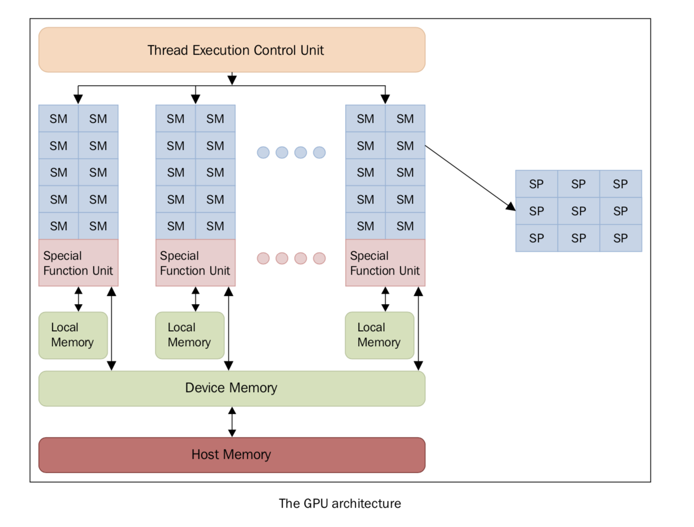

介绍
====

图形处理器是一种擅长渲染多边形单元的图像的电子元件。虽然GPU原先的设计目的是渲染图像，但随着不断优化，GPU已经变得越来越复杂，在实时渲染和离线渲染方面的效率也更高。除此之外，GPU也逐渐开始应用在科学计算领域。GPU 的特点是架构高度并行，所以擅长快速处理超大数据集。随着近几年硬件性能的快速提升，以及它的可编程性，GPU 很快引起了学术界的注意。GPU 不再仅仅用于图形渲染领域，人们开始探索它在其他方面的可能性。传统的 GPU 是固定的功能设备，渲染流程是固定于硬件上的。这就限制了图形程序员去使用不同的、更高效、质量更高的渲染算法。所以，现代 GPU 都是建立在百万个轻量级并行核心上的，可以使用 **shaders** 来编程定义图形渲染。这在图形渲染和游戏方面是划时代的进步。有了这么多可以编程的核心，GPU 厂商逐渐开始开发并行编程模型。每个 GPU 由多个流式处理器（Streaming Multiprocessor， SM）组成，它代表并行的第一层逻辑级别，每一个 SM 都是并行独立、互不干扰地工作。

每个 SM 又被分成一组流处理器(Stream Processors, SP)，每一个 SP 都有一个可以执行的核心，可以运行一个线程。SP 是执行逻辑的最小单位，表示更精细的并行度。SM和SP的概念本质上是结构性的，但这可以概述 GPU 的 SP 的组织逻辑，即以特定执行模式为特征的逻辑单元组合在一起。一组中所有核心同时运行相同的指令，属于我们在本书第一章中描述的单指令多数据（SIMD）模型。

每一个 SM 都有多个寄存器，寄存器可以被认为是一小块读写速度很快的、临时的、本地的（不同核心之间无法共享）的内存。每个核心可以使用这些寄存器来存储常用的值。有一个学科叫做图形处理单元上的通用计算（general-purpose computing on graphics processing units, GP-GPU），致力于研究 GPU 的高速并行计算能力。之前介绍过，GPU 和传统的处理器架构很不同，所以它们也面临不同性质的问题，需要不同的编程技术。GPU 最亮眼的特点是有大量的核心，我们可以同时执行很多个线程计算单元，它们同时执行相同的操作。想象这样一个场景，你需要把数据分成很多小的部分，然后在这些小的部分上执行相同的操作，这时候这种计算模式就效率很高。相反，如果你的操作必须严格按照一定的顺序来执行，这种架构的发挥余地就不大了。在其他不能将计算平均地分成很多小的部分的情况，也不适用于这种架构。GPU 的这种编程范式被称为流计算（Stream Processing), 因为数据可以看做是一个巨大的数据流，相同的操作不断在这个流上面操作。

目前，能发挥 GPU 的这种计算能力最好的解决方案是 CUDA 和 OpenCL 这两个库。下面几节中，我们将用 Python 来展示这些库的用法。
