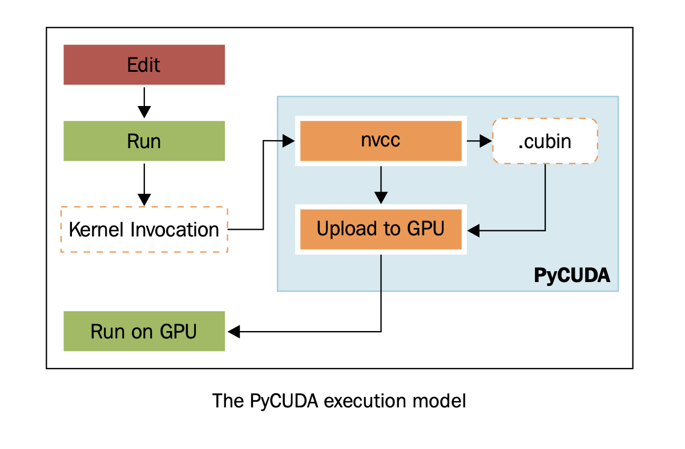
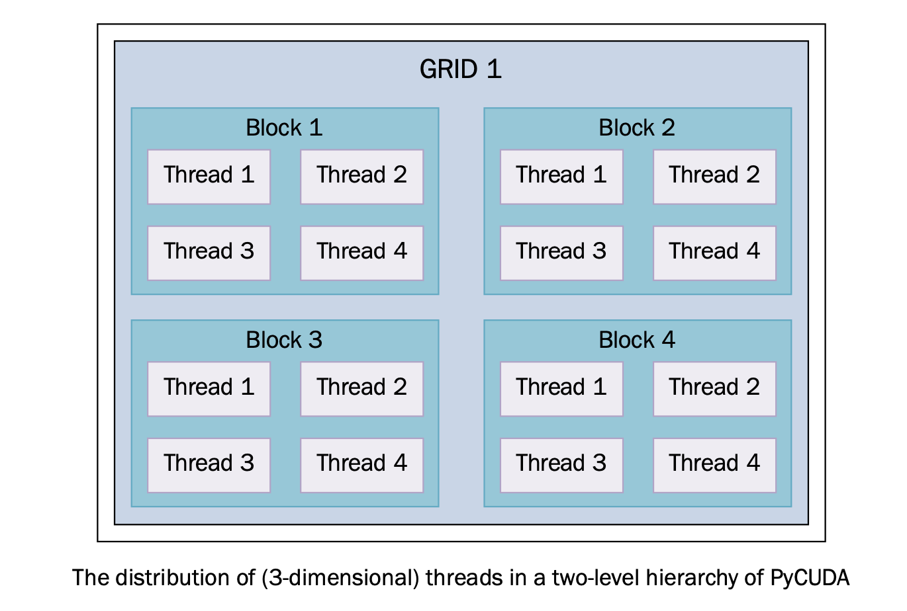

使用PyCUDA模块
==============

PyCUDA 是对 CUDA 的封装, CUDA 的全称是 Compute Unified Device Architecture，统一计算架构。理解 CUDA 的编程模型是用 PyCUDA 进行 GPU 编程的关键。在理解一些深入的话题之前，要先理解和吸收一些基本的概念。

一种混合编程模型
----------------

CUDA （PyCUDA 同理，因为它只是对 CUDA 的一个 Python 封装）的“混合”编程模型是通过对 C 语言标准库的扩展来实现的。这些扩展就像 C 语言的普通函数一样，基于此，CUDA 构建了一种非常简单的混合编程模型，包括 host 代码和 device 代码。这两部分都是由 NVCC 编译器管理的，以下是对这个编译器的工作方式的简单介绍：

1. 它将 device 代码从 host 代码的设备上分开；
2. 使用默认的编译器（比如 GCC）编译 host 代码；
3. 将 device 代码编译成一个二进制（Cubin 对象）或者汇编（PTX 代码）；
4. 在 host 上生成一个包含 PTX 代码的 "global" key；
 
编译之后的 CUDA 代码是在运行时由 driver 来编译成针对特定设备的二进制的。上述所有步骤都是 PyCUDA 在运行时完成的，所以它是一个即时编译器(Just-in-time, JIT).  此方法带来的缺点是，提高了应用的加载时间，但这也是唯一一种保持“向前兼容”的方法（向前兼容简单来说就是你写的代码可以运行在未来的设备上）。所以，JIT 编译不生成任何二进制代码，但是能使我们能够让应用兼容未来更加强大的设备。

Kernel 和 thread 的分层
-----------------------

CUDA 编程中最重要的概念是 **Kernel**. 它代表了符合规范（后面将会介绍）的可以并行执行的代码。每一个 Kernel 都由计算单元完成，计算单元叫做 **Threads**. 这里的 Thread 跟 CPU 中的 Thread 不同，GPU 的 threads 更加轻量，切换上下文的速度非常快，开销几乎可以忽略。为了组织执行一个 kernel 所需要的 threads 的数量，CUDA 又定义了两层概念，上面一层是 block 组成的 grid，每一个 block 又由 thread 组成，一共是三层结构。

基于这种架构，kernel 函数在执行的时候必须指定好 grid 和 block 的数量。

|ready|
-------

PyCUDA 的 wiki 页面上有安装的说明： http://wiki.tiker.net/PyCuda/Installation .

下面是 build Python2.7 发行版上的，32位 PyCUDA 库的方法：

1. 
